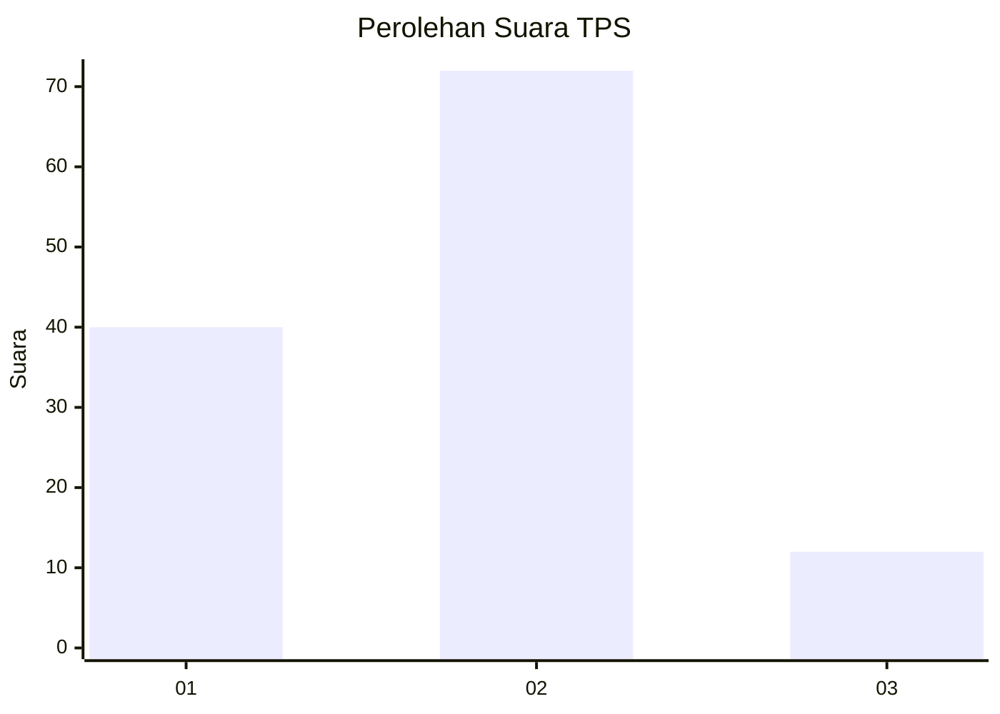
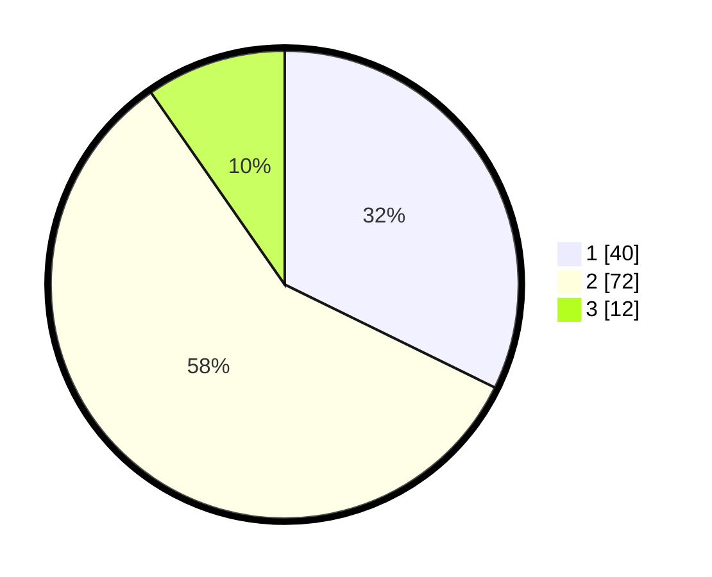

# Hasil

## Grafik

## Tabel

| No. | Nama Paslon    | Suara | Suara (raw) | Persentase |
|:--- |:-------------- | -----:| -----------:| ----------:|
| 1   | ANIES MUHAIMIN | 40    | [40][p-1]   | 32,26      |
| 2   | PRABOWO GIBRAN | 72    | [72][p-2]   | 58,06      |
| 3   | GANJAR MAHFUD  | 12    | [12][p-3]   | 9,68       |

[p-1]: https://github.com/gigit-pemilu/pemilu-2024-35-jawa-timur/blob/main/pilpres/hitung-suara/sub/35-jawa-timur/sub/25-gresik/sub/18-tambak/sub/2009-tanjungori/sub/017-tps/sub/paslon-1.txt
[p-2]: https://github.com/gigit-pemilu/pemilu-2024-35-jawa-timur/blob/main/pilpres/hitung-suara/sub/35-jawa-timur/sub/25-gresik/sub/18-tambak/sub/2009-tanjungori/sub/017-tps/sub/paslon-2.txt
[p-3]: https://github.com/gigit-pemilu/pemilu-2024-35-jawa-timur/blob/main/pilpres/hitung-suara/sub/35-jawa-timur/sub/25-gresik/sub/18-tambak/sub/2009-tanjungori/sub/017-tps/sub/paslon-3.txt

## Foto C Plano

https://sirekap-obj-formc.kpu.go.id/46d6/pemilu/ppwp/35/25/18/20/09/3525182009017-20240215-015715--8b423f50-3198-4e36-9dce-135b71e33bef.jpg

https://sirekap-obj-formc.kpu.go.id/46d6/pemilu/ppwp/35/25/18/20/09/3525182009017-20240215-015748--5982fe19-8ec9-4664-a944-ee0c659ea91a.jpg

https://sirekap-obj-formc.kpu.go.id/46d6/pemilu/ppwp/35/25/18/20/09/3525182009017-20240215-015803--09a2bceb-2cbd-4ac3-8771-f88d6ee02641.jpg

## Metadata

| Key        | Value               |
| ---------- | ------------------- |
| Time Stamp | 2024-02-15 15:00:29 |

