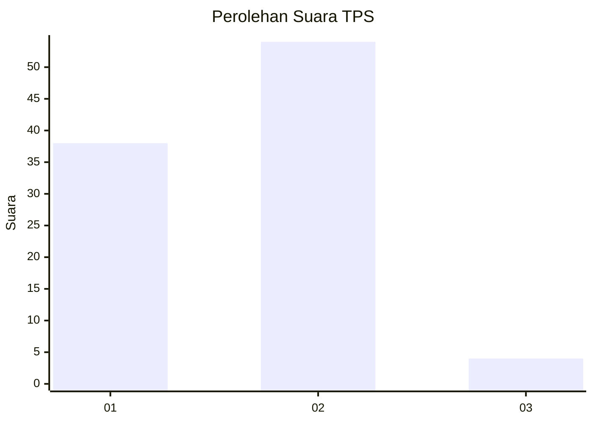
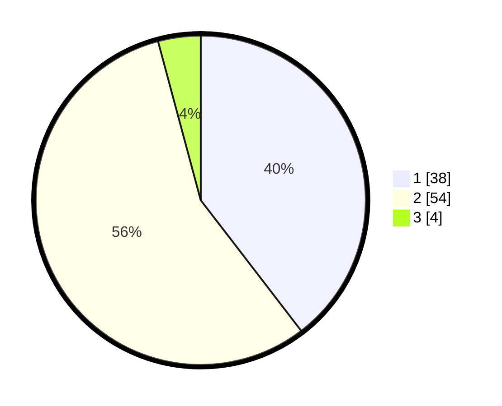

# Hasil

## Grafik

## Tabel

| No. | Nama Paslon    | Suara | Suara (raw) | Persentase |
|:--- |:-------------- | -----:| -----------:| ----------:|
| 1   | ANIES MUHAIMIN | 38    | [38][p-1]   | 39,58      |
| 2   | PRABOWO GIBRAN | 54    | [54][p-2]   | 56,25      |
| 3   | GANJAR MAHFUD  | 4     | [4][p-3]    | 4,17       |

[p-1]: https://github.com/gigit-pemilu/pemilu-2024-35-jawa-timur/blob/main/pilpres/hitung-suara/sub/35-jawa-timur/sub/25-gresik/sub/18-tambak/sub/2010-peromaan/sub/001-tps/sub/paslon-1.txt
[p-2]: https://github.com/gigit-pemilu/pemilu-2024-35-jawa-timur/blob/main/pilpres/hitung-suara/sub/35-jawa-timur/sub/25-gresik/sub/18-tambak/sub/2010-peromaan/sub/001-tps/sub/paslon-2.txt
[p-3]: https://github.com/gigit-pemilu/pemilu-2024-35-jawa-timur/blob/main/pilpres/hitung-suara/sub/35-jawa-timur/sub/25-gresik/sub/18-tambak/sub/2010-peromaan/sub/001-tps/sub/paslon-3.txt

## Foto C Plano

https://sirekap-obj-formc.kpu.go.id/91e7/pemilu/ppwp/35/25/18/20/10/3525182010001-20240214-214755--afffe67c-43a5-4fe1-9066-303471e6ed13.jpg

https://sirekap-obj-formc.kpu.go.id/91e7/pemilu/ppwp/35/25/18/20/10/3525182010001-20240214-214912--bd0f3b28-ea2c-4c65-9768-38907504f483.jpg

https://sirekap-obj-formc.kpu.go.id/91e7/pemilu/ppwp/35/25/18/20/10/3525182010001-20240214-215016--971225fc-71a9-477a-bd33-285c4fefc2e5.jpg

## Metadata

| Key        | Value               |
| ---------- | ------------------- |
| Time Stamp | 2024-02-16 16:25:10 |

