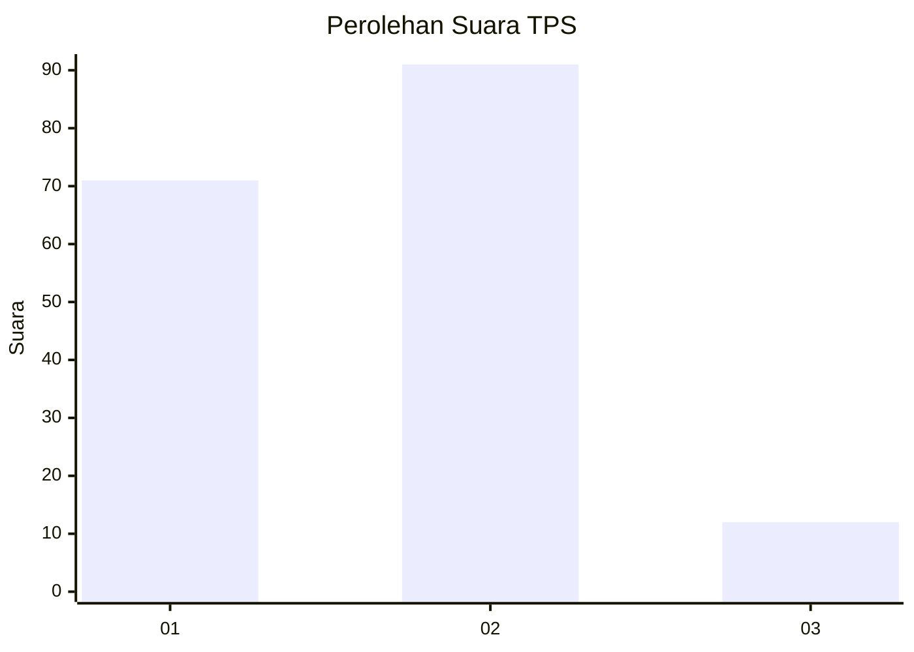
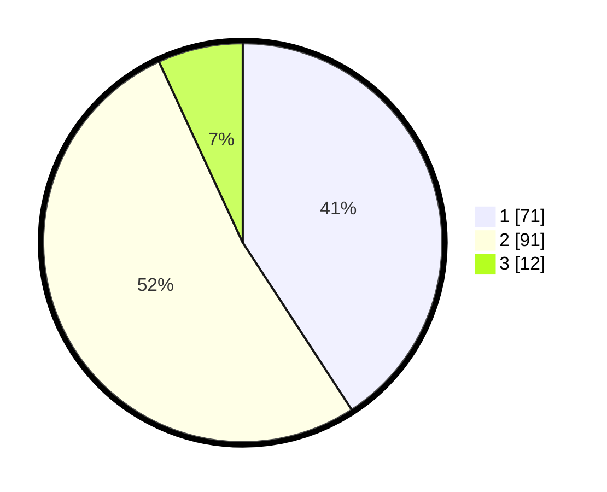

# Hasil

## Grafik

## Tabel

| No. | Nama Paslon    | Suara | Suara (raw) | Persentase |
|:--- |:-------------- | -----:| -----------:| ----------:|
| 1   | ANIES MUHAIMIN | 71    | [71][p-1]   | 40,80      |
| 2   | PRABOWO GIBRAN | 91    | [91][p-2]   | 52,30      |
| 3   | GANJAR MAHFUD  | 12    | [12][p-3]   | 6,90       |

[p-1]: https://github.com/gigit-pemilu/pemilu-2024-35-jawa-timur/blob/main/pilpres/hitung-suara/sub/35-jawa-timur/sub/25-gresik/sub/18-tambak/sub/2010-peromaan/sub/003-tps/sub/paslon-1.txt
[p-2]: https://github.com/gigit-pemilu/pemilu-2024-35-jawa-timur/blob/main/pilpres/hitung-suara/sub/35-jawa-timur/sub/25-gresik/sub/18-tambak/sub/2010-peromaan/sub/003-tps/sub/paslon-2.txt
[p-3]: https://github.com/gigit-pemilu/pemilu-2024-35-jawa-timur/blob/main/pilpres/hitung-suara/sub/35-jawa-timur/sub/25-gresik/sub/18-tambak/sub/2010-peromaan/sub/003-tps/sub/paslon-3.txt

## Foto C Plano

https://sirekap-obj-formc.kpu.go.id/73d4/pemilu/ppwp/35/25/18/20/10/3525182010003-20240215-092049--6a461c7a-331d-4e11-b0be-92d3196bcedd.jpg

https://sirekap-obj-formc.kpu.go.id/73d4/pemilu/ppwp/35/25/18/20/10/3525182010003-20240215-092224--984002e9-eb5c-463d-8457-8f81994c88d8.jpg

https://sirekap-obj-formc.kpu.go.id/73d4/pemilu/ppwp/35/25/18/20/10/3525182010003-20240215-092341--4d251415-38e7-40a0-ab3f-f1d860472e12.jpg

## Metadata

| Key        | Value               |
| ---------- | ------------------- |
| Time Stamp | 2024-02-16 16:25:10 |

