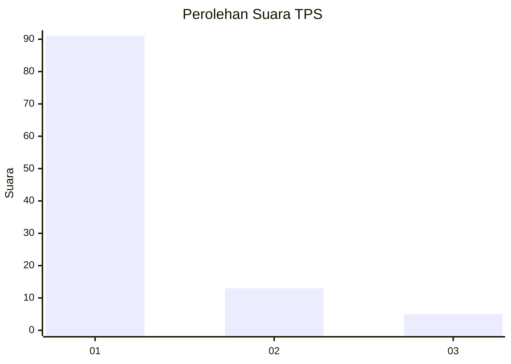
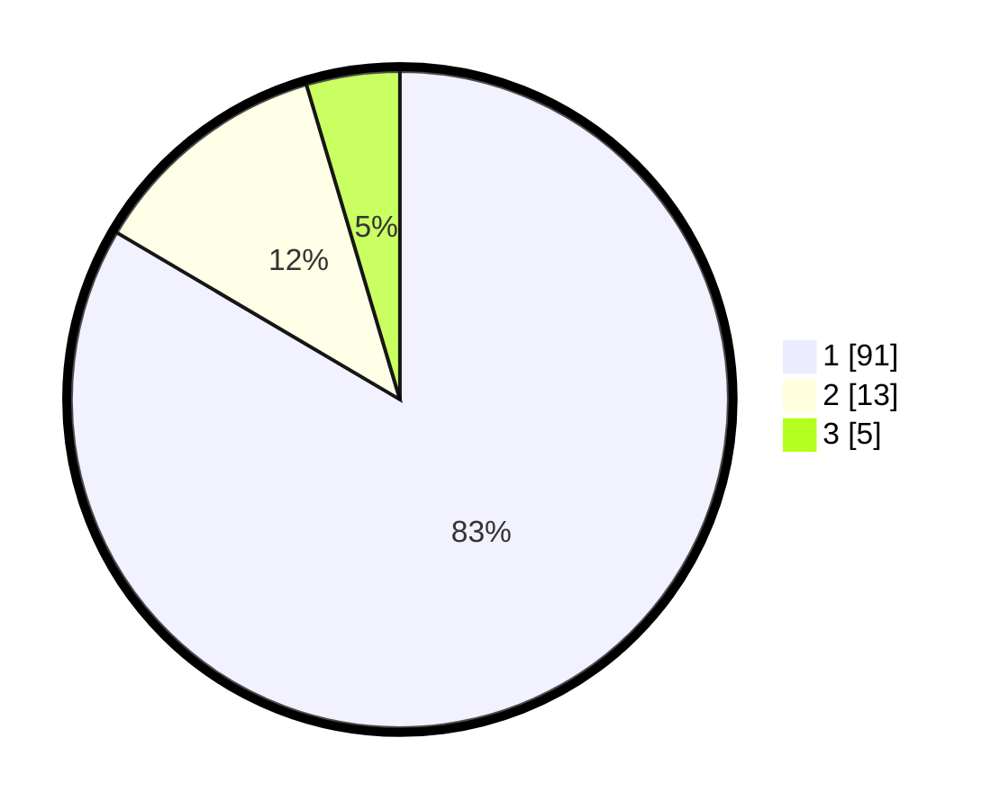

# Hasil

## Grafik

## Tabel

| No. | Nama Paslon    | Suara | Suara (raw) | Persentase |
|:--- |:-------------- | -----:| -----------:| ----------:|
| 1   | ANIES MUHAIMIN | 91    | [91][p-1]   | 83,49      |
| 2   | PRABOWO GIBRAN | 13    | [13][p-2]   | 11,93      |
| 3   | GANJAR MAHFUD  | 5     | [5][p-3]    | 4,59       |

[p-1]: https://github.com/gigit-pemilu/pemilu-2024-35-jawa-timur/blob/main/pilpres/hitung-suara/sub/35-jawa-timur/sub/25-gresik/sub/18-tambak/sub/2010-peromaan/sub/009-tps/sub/paslon-1.txt
[p-2]: https://github.com/gigit-pemilu/pemilu-2024-35-jawa-timur/blob/main/pilpres/hitung-suara/sub/35-jawa-timur/sub/25-gresik/sub/18-tambak/sub/2010-peromaan/sub/009-tps/sub/paslon-2.txt
[p-3]: https://github.com/gigit-pemilu/pemilu-2024-35-jawa-timur/blob/main/pilpres/hitung-suara/sub/35-jawa-timur/sub/25-gresik/sub/18-tambak/sub/2010-peromaan/sub/009-tps/sub/paslon-3.txt

## Foto C Plano

https://sirekap-obj-formc.kpu.go.id/f25c/pemilu/ppwp/35/25/18/20/10/3525182010009-20240218-215535--db427f8a-2b35-4aed-b587-70eefd06764a.jpg

https://sirekap-obj-formc.kpu.go.id/f25c/pemilu/ppwp/35/25/18/20/10/3525182010009-20240218-215901--dd923312-dec4-49bc-81cc-be501976f45e.jpg

https://sirekap-obj-formc.kpu.go.id/f25c/pemilu/ppwp/35/25/18/20/10/3525182010009-20240218-215938--13124f14-86d1-465d-a19f-712ed0400ed5.jpg

## Metadata

| Key        | Value               |
| ---------- | ------------------- |
| Time Stamp | 2024-02-20 16:00:00 |

