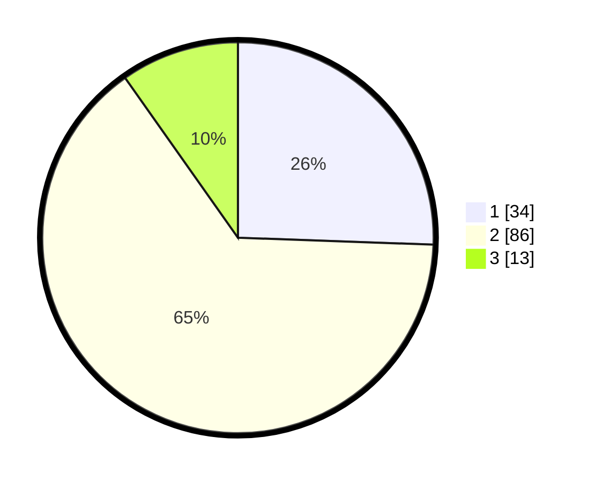

# Hasil

## Grafik

## Tabel

| No. | Nama Paslon    | Suara | Suara (raw) | Persentase |
|:--- |:-------------- | -----:| -----------:| ----------:|
| 1   | ANIES MUHAIMIN | 34    | [34][p-1]   | 25,56      |
| 2   | PRABOWO GIBRAN | 86    | [86][p-2]   | 64,66      |
| 3   | GANJAR MAHFUD  | 13    | [13][p-3]   | 9,77       |

[p-1]: https://github.com/gigit-pemilu/pemilu-2024-35-jawa-timur/blob/main/pilpres/hitung-suara/sub/35-jawa-timur/sub/25-gresik/sub/18-tambak/sub/2011-diponggo/sub/002-tps/sub/paslon-1.txt
[p-2]: https://github.com/gigit-pemilu/pemilu-2024-35-jawa-timur/blob/main/pilpres/hitung-suara/sub/35-jawa-timur/sub/25-gresik/sub/18-tambak/sub/2011-diponggo/sub/002-tps/sub/paslon-2.txt
[p-3]: https://github.com/gigit-pemilu/pemilu-2024-35-jawa-timur/blob/main/pilpres/hitung-suara/sub/35-jawa-timur/sub/25-gresik/sub/18-tambak/sub/2011-diponggo/sub/002-tps/sub/paslon-3.txt

## Foto C Plano

https://sirekap-obj-formc.kpu.go.id/43ea/pemilu/ppwp/35/25/18/20/11/3525182011002-20240215-091418--2e7e1dde-b0b3-4f5c-aa6f-c04f2ac16dd8.jpg

https://sirekap-obj-formc.kpu.go.id/43ea/pemilu/ppwp/35/25/18/20/11/3525182011002-20240215-031419--69ec9e02-9aa6-4ef7-a040-df25b5249679.jpg

https://sirekap-obj-formc.kpu.go.id/43ea/pemilu/ppwp/35/25/18/20/11/3525182011002-20240215-031425--45630d25-bf05-4612-92bf-35bea9ad787d.jpg

## Metadata

| Key        | Value               |
| ---------- | ------------------- |
| Time Stamp | 2024-02-16 16:25:10 |

