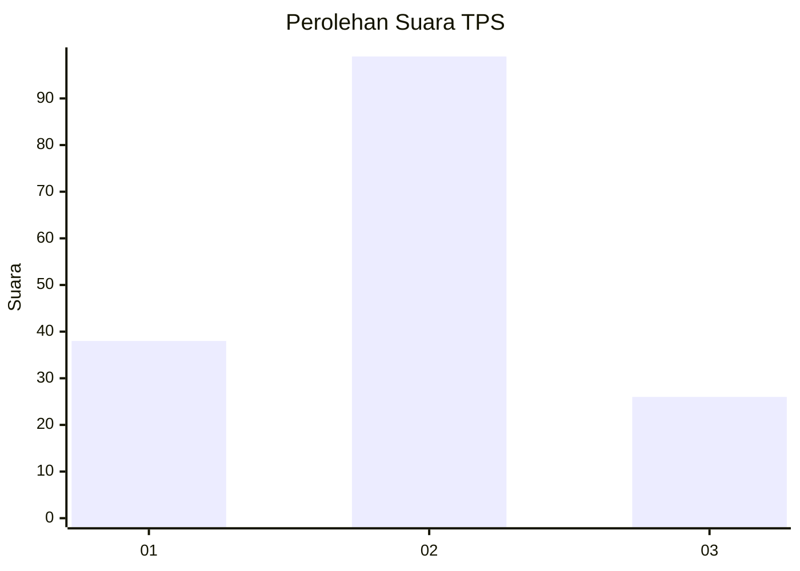
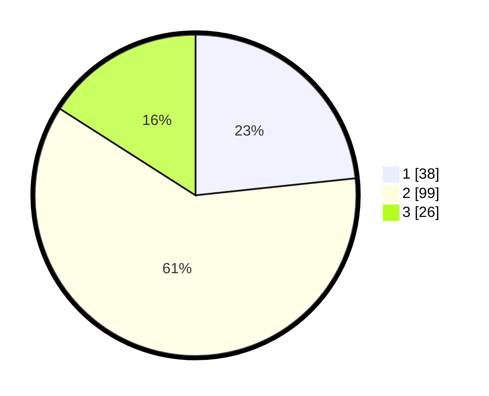

# Hasil

## Grafik

## Tabel

| No. | Nama Paslon    | Suara | Suara (raw) | Persentase |
|:--- |:-------------- | -----:| -----------:| ----------:|
| 1   | ANIES MUHAIMIN | 38    | [38][p-1]   | 23,31      |
| 2   | PRABOWO GIBRAN | 99    | [99][p-2]   | 60,74      |
| 3   | GANJAR MAHFUD  | 26    | [26][p-3]   | 15,95      |

[p-1]: https://github.com/gigit-pemilu/pemilu-2024/blob/main/pilpres/hitung-suara/sub/35-jawa-timur/sub/25-gresik/sub/18-tambak/sub/2011-diponggo/sub/003-tps/sub/paslon-1.txt
[p-2]: https://github.com/gigit-pemilu/pemilu-2024/blob/main/pilpres/hitung-suara/sub/35-jawa-timur/sub/25-gresik/sub/18-tambak/sub/2011-diponggo/sub/003-tps/sub/paslon-2.txt
[p-3]: https://github.com/gigit-pemilu/pemilu-2024/blob/main/pilpres/hitung-suara/sub/35-jawa-timur/sub/25-gresik/sub/18-tambak/sub/2011-diponggo/sub/003-tps/sub/paslon-3.txt

## Foto C Plano

https://sirekap-obj-formc.kpu.go.id/1b7b/pemilu/ppwp/35/25/18/20/11/3525182011003-20240215-104541--caf83619-48df-4d79-a4fa-6d75e5ed0ef2.jpg

https://sirekap-obj-formc.kpu.go.id/1b7b/pemilu/ppwp/35/25/18/20/11/3525182011003-20240215-104836--c2f6896d-42ed-4a37-8dc5-494fd0d17caa.jpg

https://sirekap-obj-formc.kpu.go.id/1b7b/pemilu/ppwp/35/25/18/20/11/3525182011003-20240215-133256--deaa86f5-8e21-4e59-a626-7e4c17b4ec59.jpg

## Metadata

| Key        | Value               |
| ---------- | ------------------- |
| Time Stamp | 2024-02-16 16:25:10 |

