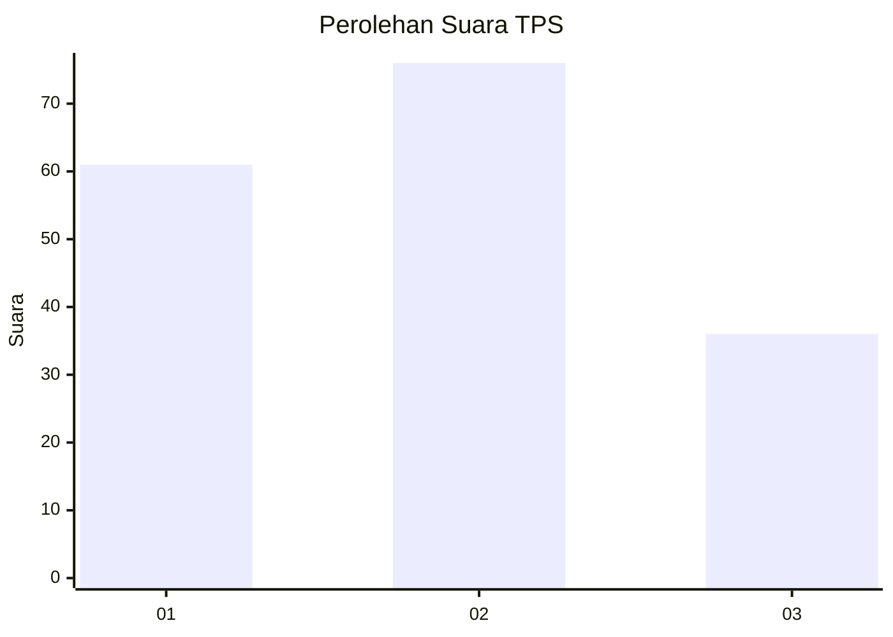
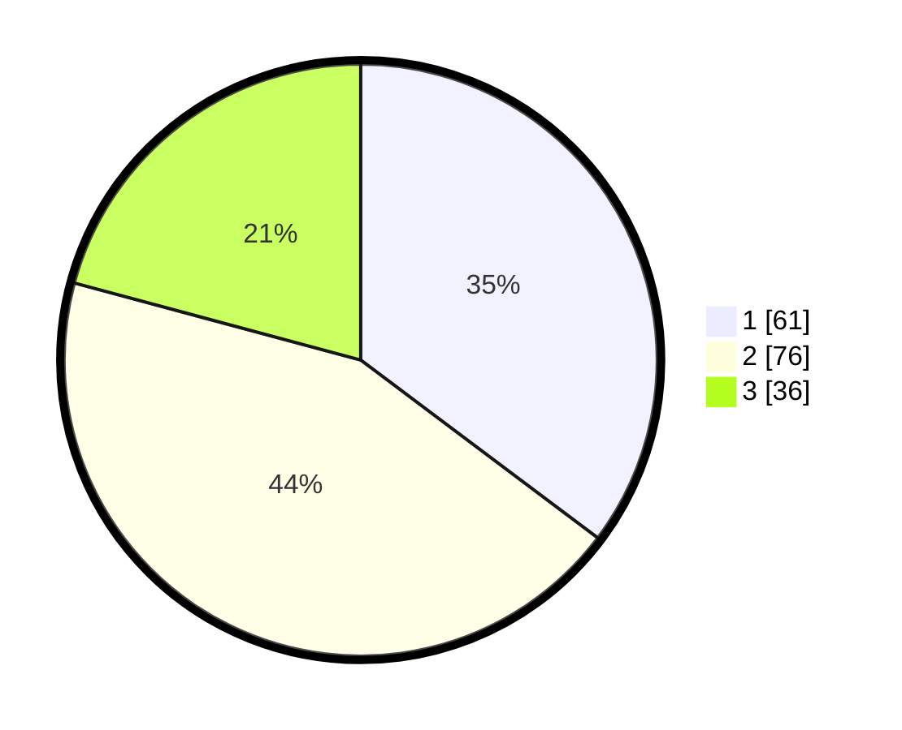

# Hasil

## Grafik

## Tabel

| No. | Nama Paslon    | Suara | Suara (raw) | Persentase |
|:--- |:-------------- | -----:| -----------:| ----------:|
| 1   | ANIES MUHAIMIN | 61    | [61][p-1]   | 35,26      |
| 2   | PRABOWO GIBRAN | 76    | [76][p-2]   | 43,93      |
| 3   | GANJAR MAHFUD  | 36    | [36][p-3]   | 20,81      |

[p-1]: https://github.com/gigit-pemilu/pemilu-2024-35-jawa-timur/blob/main/pilpres/hitung-suara/sub/35-jawa-timur/sub/25-gresik/sub/18-tambak/sub/2012-kepuhteluk/sub/001-tps/sub/paslon-1.txt
[p-2]: https://github.com/gigit-pemilu/pemilu-2024-35-jawa-timur/blob/main/pilpres/hitung-suara/sub/35-jawa-timur/sub/25-gresik/sub/18-tambak/sub/2012-kepuhteluk/sub/001-tps/sub/paslon-2.txt
[p-3]: https://github.com/gigit-pemilu/pemilu-2024-35-jawa-timur/blob/main/pilpres/hitung-suara/sub/35-jawa-timur/sub/25-gresik/sub/18-tambak/sub/2012-kepuhteluk/sub/001-tps/sub/paslon-3.txt

## Foto C Plano

https://sirekap-obj-formc.kpu.go.id/c02c/pemilu/ppwp/35/25/18/20/12/3525182012001-20240214-213939--32e4da3c-57de-46c4-830d-6a95f72e3094.jpg

https://sirekap-obj-formc.kpu.go.id/c02c/pemilu/ppwp/35/25/18/20/12/3525182012001-20240214-214045--ffe56475-8f08-4377-9d00-1f7f8ea7d64b.jpg

https://sirekap-obj-formc.kpu.go.id/c02c/pemilu/ppwp/35/25/18/20/12/3525182012001-20240214-214133--d1d091db-71f9-4cd1-b748-33125bf29627.jpg

## Metadata

| Key        | Value               |
| ---------- | ------------------- |
| Time Stamp | 2024-02-16 16:25:10 |

