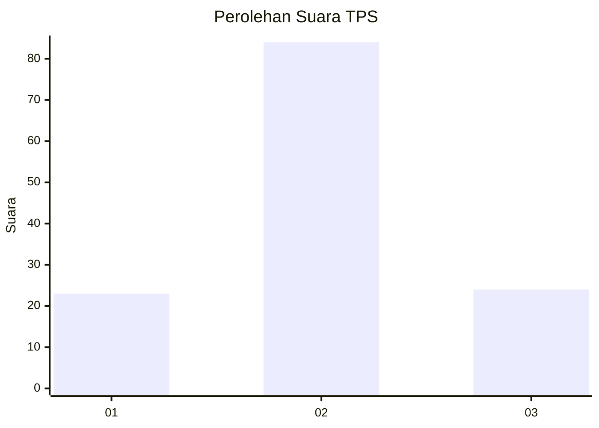
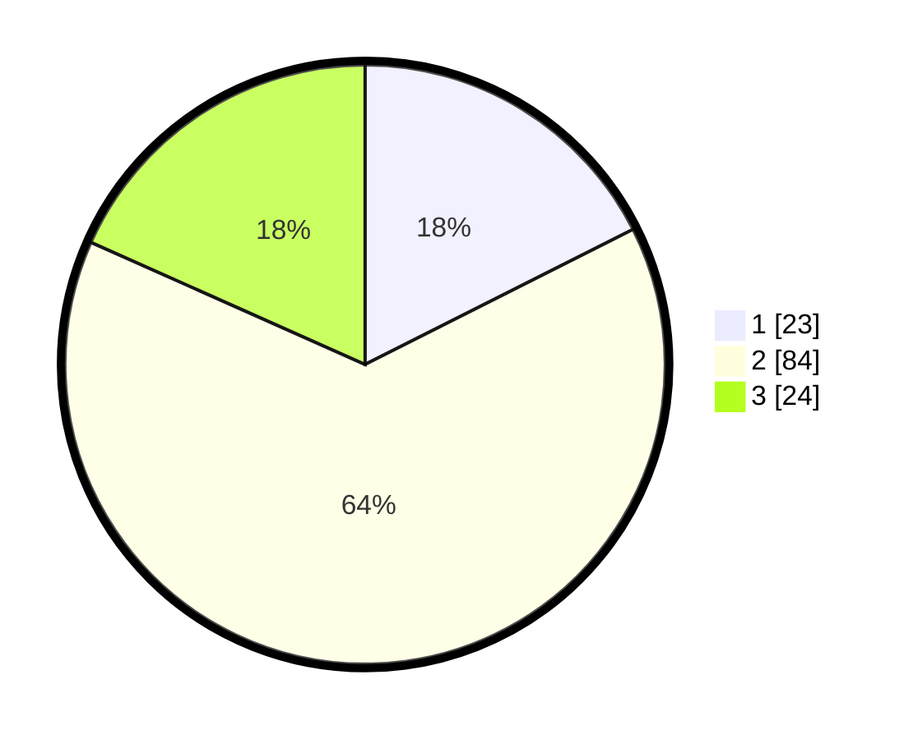

# Hasil

## Grafik

## Tabel

| No. | Nama Paslon    | Suara | Suara (raw) | Persentase |
|:--- |:-------------- | -----:| -----------:| ----------:|
| 1   | ANIES MUHAIMIN | 23    | [23][p-1]   | 17,56      |
| 2   | PRABOWO GIBRAN | 84    | [84][p-2]   | 64,12      |
| 3   | GANJAR MAHFUD  | 24    | [24][p-3]   | 18,32      |

[p-1]: https://github.com/gigit-pemilu/pemilu-2024-35-jawa-timur/blob/main/pilpres/hitung-suara/sub/35-jawa-timur/sub/25-gresik/sub/18-tambak/sub/2012-kepuhteluk/sub/005-tps/sub/paslon-1.txt
[p-2]: https://github.com/gigit-pemilu/pemilu-2024-35-jawa-timur/blob/main/pilpres/hitung-suara/sub/35-jawa-timur/sub/25-gresik/sub/18-tambak/sub/2012-kepuhteluk/sub/005-tps/sub/paslon-2.txt
[p-3]: https://github.com/gigit-pemilu/pemilu-2024-35-jawa-timur/blob/main/pilpres/hitung-suara/sub/35-jawa-timur/sub/25-gresik/sub/18-tambak/sub/2012-kepuhteluk/sub/005-tps/sub/paslon-3.txt

## Foto C Plano

https://sirekap-obj-formc.kpu.go.id/1757/pemilu/ppwp/35/25/18/20/12/3525182012005-20240215-033817--d6cb4deb-61fe-486c-a7c8-72b5f6cc27ef.jpg

https://sirekap-obj-formc.kpu.go.id/1757/pemilu/ppwp/35/25/18/20/12/3525182012005-20240215-033937--57bc1e0e-9004-4d34-95c2-a250036f0a43.jpg

https://sirekap-obj-formc.kpu.go.id/1757/pemilu/ppwp/35/25/18/20/12/3525182012005-20240215-034103--3b354a18-10ac-4ead-be78-63c3c495c664.jpg

## Metadata

| Key        | Value               |
| ---------- | ------------------- |
| Time Stamp | 2024-02-16 16:25:10 |

