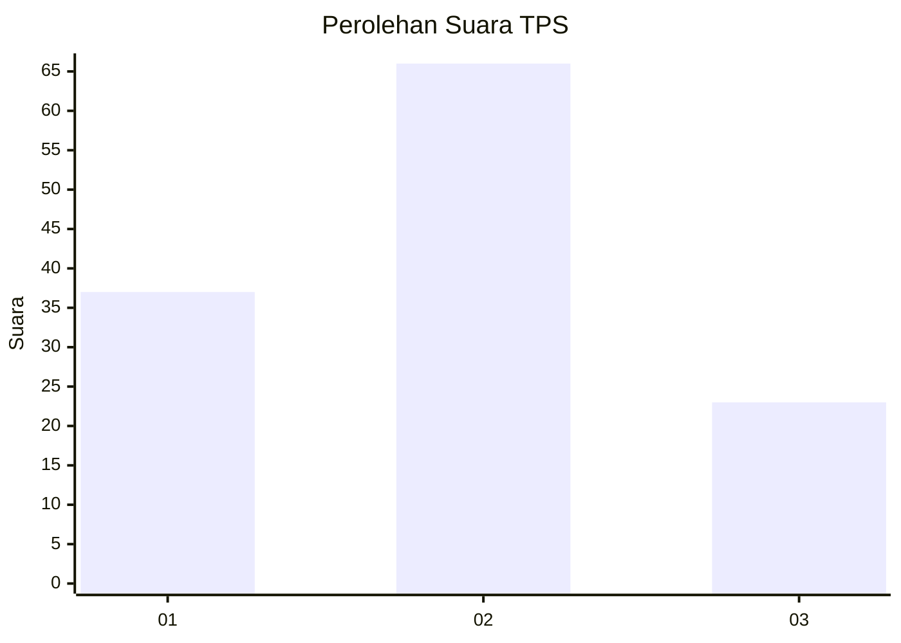
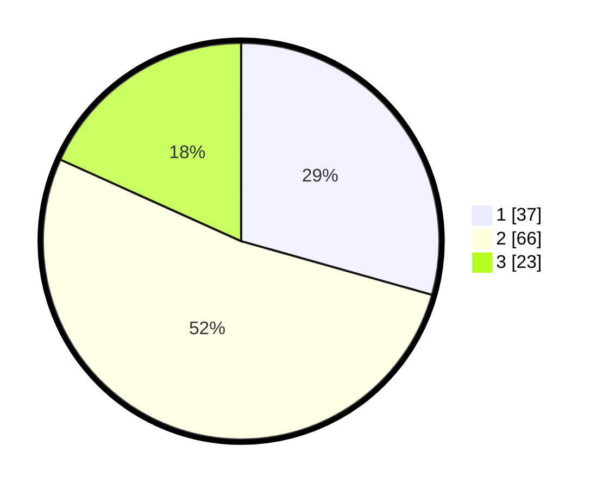

# Hasil

## Grafik

## Tabel

| No. | Nama Paslon    | Suara | Suara (raw) | Persentase |
|:--- |:-------------- | -----:| -----------:| ----------:|
| 1   | ANIES MUHAIMIN | 37    | [37][p-1]   | 29,37      |
| 2   | PRABOWO GIBRAN | 66    | [66][p-2]   | 52,38      |
| 3   | GANJAR MAHFUD  | 23    | [23][p-3]   | 18,25      |

[p-1]: https://github.com/gigit-pemilu/pemilu-2024-35-jawa-timur/blob/main/pilpres/hitung-suara/sub/35-jawa-timur/sub/25-gresik/sub/18-tambak/sub/2012-kepuhteluk/sub/010-tps/sub/paslon-1.txt
[p-2]: https://github.com/gigit-pemilu/pemilu-2024-35-jawa-timur/blob/main/pilpres/hitung-suara/sub/35-jawa-timur/sub/25-gresik/sub/18-tambak/sub/2012-kepuhteluk/sub/010-tps/sub/paslon-2.txt
[p-3]: https://github.com/gigit-pemilu/pemilu-2024-35-jawa-timur/blob/main/pilpres/hitung-suara/sub/35-jawa-timur/sub/25-gresik/sub/18-tambak/sub/2012-kepuhteluk/sub/010-tps/sub/paslon-3.txt

## Foto C Plano

https://sirekap-obj-formc.kpu.go.id/cf63/pemilu/ppwp/35/25/18/20/12/3525182012010-20240214-141040--a650624c-972e-4367-9667-596899589db6.jpg

https://sirekap-obj-formc.kpu.go.id/cf63/pemilu/ppwp/35/25/18/20/12/3525182012010-20240214-141151--25389181-ede6-4d4b-a606-162858a29ade.jpg

https://sirekap-obj-formc.kpu.go.id/cf63/pemilu/ppwp/35/25/18/20/12/3525182012010-20240214-141249--dea84417-3ce7-466e-9a70-c9b550e2d319.jpg

## Metadata

| Key        | Value               |
| ---------- | ------------------- |
| Time Stamp | 2024-02-16 16:25:10 |

