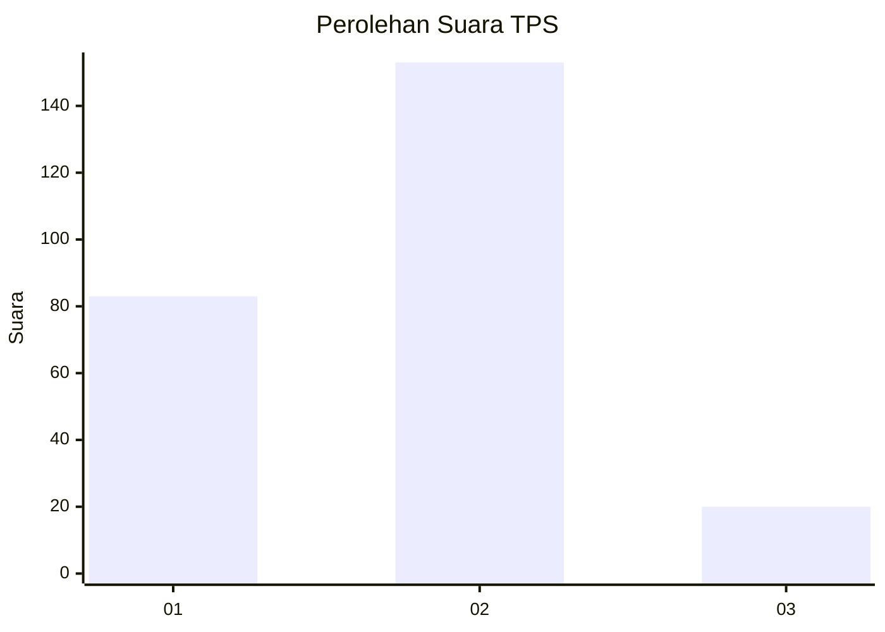
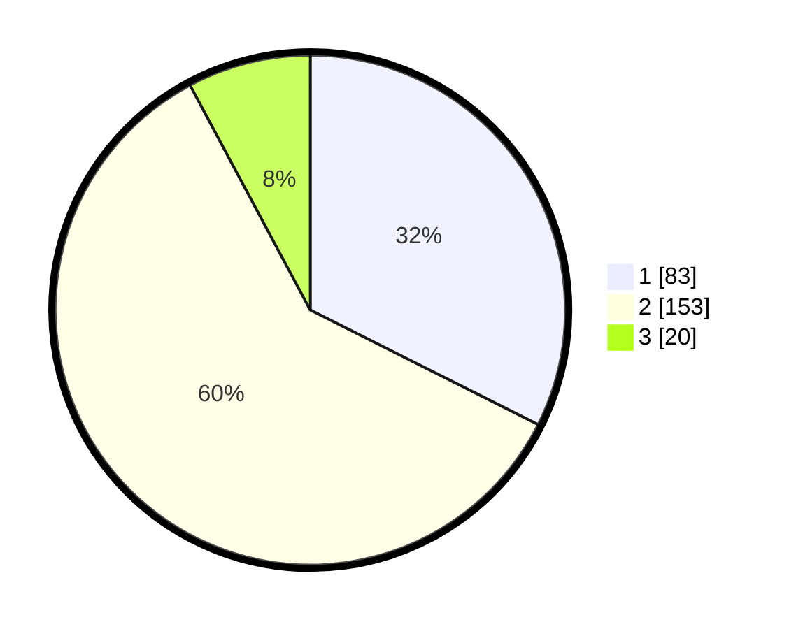

# Hasil

## Grafik

## Tabel

| No. | Nama Paslon    | Suara | Suara (raw) | Persentase |
|:--- |:-------------- | -----:| -----------:| ----------:|
| 1   | ANIES MUHAIMIN | 83    | [83][p-1]   | 32,42      |
| 2   | PRABOWO GIBRAN | 153   | [153][p-2]  | 59,77      |
| 3   | GANJAR MAHFUD  | 20    | [20][p-3]   | 7,81       |

[p-1]: https://github.com/gigit-pemilu/pemilu-2024/blob/main/pilpres/hitung-suara/sub/35-jawa-timur/sub/26-bangkalan/sub/01-bangkalan/sub/1001-mlajah/sub/002-tps/sub/paslon-1.txt
[p-2]: https://github.com/gigit-pemilu/pemilu-2024/blob/main/pilpres/hitung-suara/sub/35-jawa-timur/sub/26-bangkalan/sub/01-bangkalan/sub/1001-mlajah/sub/002-tps/sub/paslon-2.txt
[p-3]: https://github.com/gigit-pemilu/pemilu-2024/blob/main/pilpres/hitung-suara/sub/35-jawa-timur/sub/26-bangkalan/sub/01-bangkalan/sub/1001-mlajah/sub/002-tps/sub/paslon-3.txt

## Foto C Plano

https://sirekap-obj-formc.kpu.go.id/48ff/pemilu/ppwp/35/26/01/10/01/3526011001002-20240214-211701--dc678831-fafd-4f86-b64b-653fbbc624e9.jpg

https://sirekap-obj-formc.kpu.go.id/48ff/pemilu/ppwp/35/26/01/10/01/3526011001002-20240214-211817--c689a137-5ed3-4b2e-b1ef-f560b1fecb98.jpg

https://sirekap-obj-formc.kpu.go.id/48ff/pemilu/ppwp/35/26/01/10/01/3526011001002-20240214-224106--adccc45d-33f8-48ac-baa9-6c3950f99f85.jpg

## Metadata

| Key        | Value               |
| ---------- | ------------------- |
| Time Stamp | 2024-02-19 06:16:00 |

## DATA PEMILIH TETAP

Jumlah pemilih dalam DPT: **272**.
 * L: **133**.
 * P: **139**.

## DATA PENGGUNA HAK PILIH

Jumlah pengguna hak pilih dalam DPT: **260**.
 * L: **125**.
 * P: **135**.

Jumlah pengguna hak pilih dalam DPTb: **0**.
 * L: **0**.
 * P: **0**.

Jumlah pengguna hak pilih dalam DPK: **0**.
 * L: **0**.
 * P: **0**.

Jumlah pengguna hak pilih: **260**.
 * L: **125**.
 * P: **135**.

## JUMLAH SUARA SAH DAN TIDAK SAH

JUMLAH SELURUH SUARA SAH: **256**.

JUMLAH SUARA TIDAK SAH: **4**.

JUMLAH SELURUH SUARA SAH DAN SUARA TIDAK SAH: **260**.

