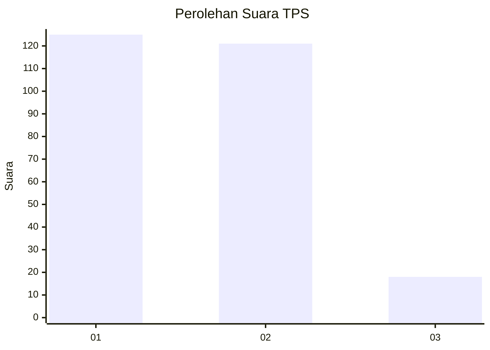
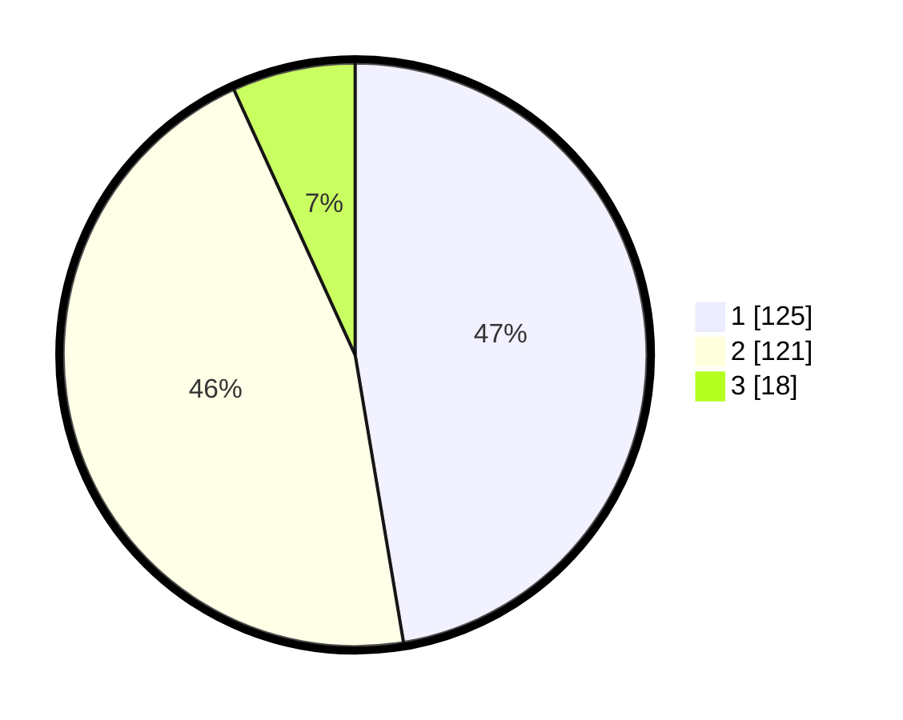

# Hasil

## Grafik

## Tabel

| No. | Nama Paslon    | Suara | Suara (raw) | Persentase |
|:--- |:-------------- | -----:| -----------:| ----------:|
| 1   | ANIES MUHAIMIN | 125   | [125][p-1]  | 47,35      |
| 2   | PRABOWO GIBRAN | 121   | [121][p-2]  | 45,83      |
| 3   | GANJAR MAHFUD  | 18    | [18][p-3]   | 6,82       |

[p-1]: https://github.com/gigit-pemilu/pemilu-2024/blob/main/pilpres/hitung-suara/sub/35-jawa-timur/sub/26-bangkalan/sub/01-bangkalan/sub/1001-mlajah/sub/007-tps/sub/paslon-1.txt
[p-2]: https://github.com/gigit-pemilu/pemilu-2024/blob/main/pilpres/hitung-suara/sub/35-jawa-timur/sub/26-bangkalan/sub/01-bangkalan/sub/1001-mlajah/sub/007-tps/sub/paslon-2.txt
[p-3]: https://github.com/gigit-pemilu/pemilu-2024/blob/main/pilpres/hitung-suara/sub/35-jawa-timur/sub/26-bangkalan/sub/01-bangkalan/sub/1001-mlajah/sub/007-tps/sub/paslon-3.txt

## Foto C Plano

https://sirekap-obj-formc.kpu.go.id/38b8/pemilu/ppwp/35/26/01/10/01/3526011001007-20240214-155333--086f13e5-2f94-494b-8182-1da5244ebf47.jpg

https://sirekap-obj-formc.kpu.go.id/38b8/pemilu/ppwp/35/26/01/10/01/3526011001007-20240214-155504--8728aac1-e643-49c1-8ca6-6268305c3527.jpg

https://sirekap-obj-formc.kpu.go.id/38b8/pemilu/ppwp/35/26/01/10/01/3526011001007-20240214-155621--6a3f6af7-eabd-4d71-b2d5-80d5b5df4bf0.jpg

## Metadata

| Key        | Value               |
| ---------- | ------------------- |
| Time Stamp | 2024-02-15 12:00:28 |

## DATA PEMILIH TETAP

Jumlah pemilih dalam DPT: **265**.
 * L: **121**.
 * P: **144**.

## DATA PENGGUNA HAK PILIH

Jumlah pengguna hak pilih dalam DPT: **258**.
 * L: **118**.
 * P: **140**.

Jumlah pengguna hak pilih dalam DPTb: **2**.
 * L: **1**.
 * P: **1**.

Jumlah pengguna hak pilih dalam DPK: **5**.
 * L: **3**.
 * P: **2**.

Jumlah pengguna hak pilih: **265**.
 * L: **122**.
 * P: **143**.

## JUMLAH SUARA SAH DAN TIDAK SAH

JUMLAH SELURUH SUARA SAH: **264**.

JUMLAH SUARA TIDAK SAH: **1**.

JUMLAH SELURUH SUARA SAH DAN SUARA TIDAK SAH: **265**.

