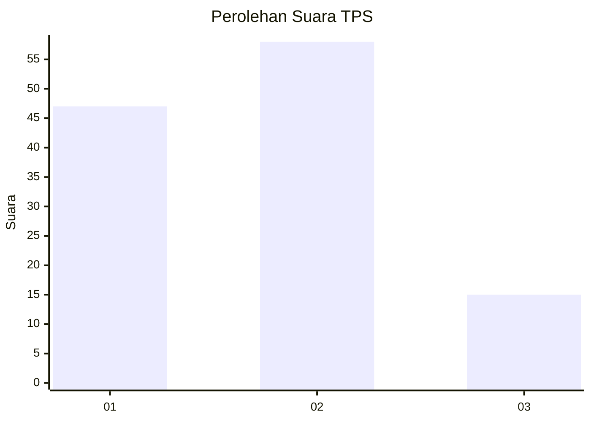
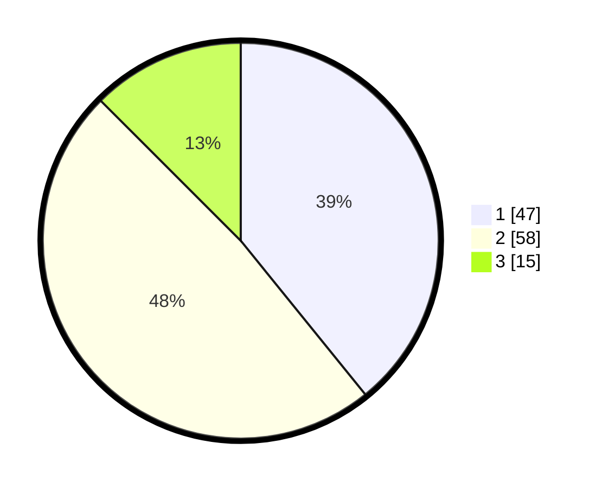

# Hasil

## Grafik

## Tabel

| No. | Nama Paslon    | Suara | Suara (raw) | Persentase |
|:--- |:-------------- | -----:| -----------:| ----------:|
| 1   | ANIES MUHAIMIN | 47    | [47][p-1]   | 39,17      |
| 2   | PRABOWO GIBRAN | 58    | [58][p-2]   | 48,33      |
| 3   | GANJAR MAHFUD  | 15    | [15][p-3]   | 12,50      |

[p-1]: https://github.com/gigit-pemilu/pemilu-2024-35-jawa-timur/blob/main/pilpres/hitung-suara/sub/35-jawa-timur/sub/26-bangkalan/sub/01-bangkalan/sub/1001-mlajah/sub/008-tps/sub/paslon-1.txt
[p-2]: https://github.com/gigit-pemilu/pemilu-2024-35-jawa-timur/blob/main/pilpres/hitung-suara/sub/35-jawa-timur/sub/26-bangkalan/sub/01-bangkalan/sub/1001-mlajah/sub/008-tps/sub/paslon-2.txt
[p-3]: https://github.com/gigit-pemilu/pemilu-2024-35-jawa-timur/blob/main/pilpres/hitung-suara/sub/35-jawa-timur/sub/26-bangkalan/sub/01-bangkalan/sub/1001-mlajah/sub/008-tps/sub/paslon-3.txt

## Foto C Plano

https://sirekap-obj-formc.kpu.go.id/1b0a/pemilu/ppwp/35/26/01/10/01/3526011001008-20240214-210024--846e2366-69be-4a78-a321-64f61b7a2052.jpg

https://sirekap-obj-formc.kpu.go.id/1b0a/pemilu/ppwp/35/26/01/10/01/3526011001008-20240214-210157--9b4ebdbd-55cc-4b17-bc80-229403d22dce.jpg

https://sirekap-obj-formc.kpu.go.id/1b0a/pemilu/ppwp/35/26/01/10/01/3526011001008-20240214-210240--437b498e-08fb-44cc-990c-509f3f7a9f0d.jpg

## Metadata

| Key        | Value               |
| ---------- | ------------------- |
| Time Stamp | 2024-02-15 15:00:29 |

## DATA PEMILIH TETAP

Jumlah pemilih dalam DPT: **149**.
 * L: **69**.
 * P: **80**.

## DATA PENGGUNA HAK PILIH

Jumlah pengguna hak pilih dalam DPT: **119**.
 * L: **55**.
 * P: **64**.

Jumlah pengguna hak pilih dalam DPTb: **3**.
 * L: **2**.
 * P: **1**.

Jumlah pengguna hak pilih dalam DPK: **0**.
 * L: **0**.
 * P: **0**.

Jumlah pengguna hak pilih: **122**.
 * L: **57**.
 * P: **65**.

## JUMLAH SUARA SAH DAN TIDAK SAH

JUMLAH SELURUH SUARA SAH: **120**.

JUMLAH SUARA TIDAK SAH: **2**.

JUMLAH SELURUH SUARA SAH DAN SUARA TIDAK SAH: **122**.

