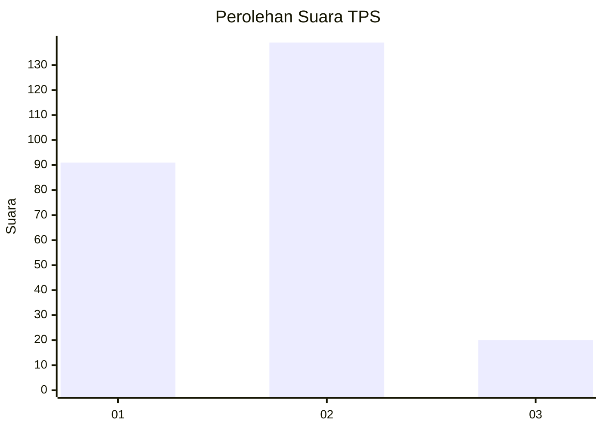

# Hasil

## Grafik

## Tabel

| No. | Nama Paslon    | Suara | Suara (raw) | Persentase |
|:--- |:-------------- | -----:| -----------:| ----------:|
| 1   | ANIES MUHAIMIN | 91    | [91][p-1]   | 36,40      |
| 2   | PRABOWO GIBRAN | 139   | [139][p-2]  | 55,60      |
| 3   | GANJAR MAHFUD  | 20    | [20][p-3]   | 8,00       |

[p-1]: https://github.com/gigit-pemilu/pemilu-2024/blob/main/pilpres/hitung-suara/sub/35-jawa-timur/sub/26-bangkalan/sub/01-bangkalan/sub/1001-mlajah/sub/012-tps/sub/paslon-1.txt
[p-2]: https://github.com/gigit-pemilu/pemilu-2024/blob/main/pilpres/hitung-suara/sub/35-jawa-timur/sub/26-bangkalan/sub/01-bangkalan/sub/1001-mlajah/sub/012-tps/sub/paslon-2.txt
[p-3]: https://github.com/gigit-pemilu/pemilu-2024/blob/main/pilpres/hitung-suara/sub/35-jawa-timur/sub/26-bangkalan/sub/01-bangkalan/sub/1001-mlajah/sub/012-tps/sub/paslon-3.txt

## Foto C Plano

https://sirekap-obj-formc.kpu.go.id/1a65/pemilu/ppwp/35/26/01/10/01/3526011001012-20240215-030340--6ce9d271-869b-48f9-8344-e641aa0ddde3.jpg

https://sirekap-obj-formc.kpu.go.id/1a65/pemilu/ppwp/35/26/01/10/01/3526011001012-20240215-030759--35a74889-ba8a-4dd0-a492-7cf1aa2366f2.jpg

https://sirekap-obj-formc.kpu.go.id/1a65/pemilu/ppwp/35/26/01/10/01/3526011001012-20240215-030924--8334733a-5703-4e2a-acfc-07ab5156611b.jpg

## Metadata

| Key        | Value               |
| ---------- | ------------------- |
| Time Stamp | 2024-02-21 20:00:00 |

## DATA PEMILIH TETAP

## DATA PENGGUNA HAK PILIH

Jumlah pengguna hak pilih dalam DPT: **284**.
 * L: **139**.
 * P: **145**.

Jumlah pengguna hak pilih dalam DPTb: **5**.
 * L: **5**.
 * P: **0**.

Jumlah pengguna hak pilih dalam DPK: **0**.
 * L: **0**.
 * P: **0**.

Jumlah pengguna hak pilih: **289**.
 * L: **144**.
 * P: **145**.

## JUMLAH SUARA SAH DAN TIDAK SAH

JUMLAH SELURUH SUARA SAH: **250**.

JUMLAH SUARA TIDAK SAH: **3**.

JUMLAH SELURUH SUARA SAH DAN SUARA TIDAK SAH: **253**.

