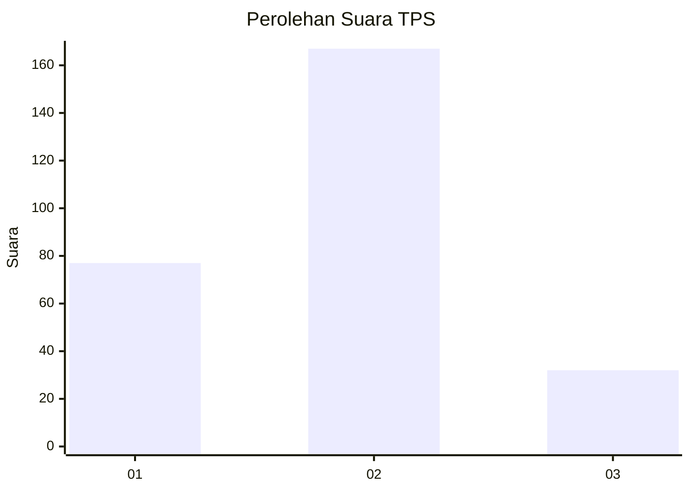
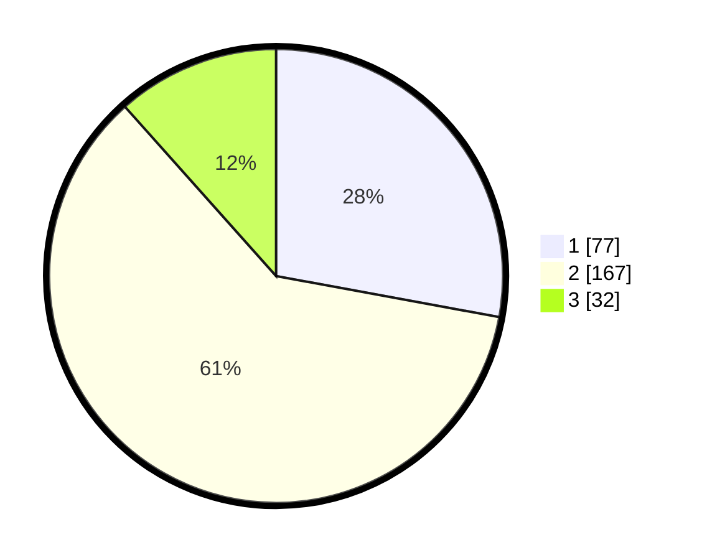

# Hasil

## Grafik

## Tabel

| No. | Nama Paslon    | Suara | Suara (raw) | Persentase |
|:--- |:-------------- | -----:| -----------:| ----------:|
| 1   | ANIES MUHAIMIN | 77    | [77][p-1]   | 27,90      |
| 2   | PRABOWO GIBRAN | 167   | [167][p-2]  | 60,51      |
| 3   | GANJAR MAHFUD  | 32    | [32][p-3]   | 11,59      |

[p-1]: https://github.com/gigit-pemilu/pemilu-2024-35-jawa-timur/blob/main/pilpres/hitung-suara/sub/35-jawa-timur/sub/26-bangkalan/sub/01-bangkalan/sub/1003-pangeranan/sub/016-tps/sub/paslon-1.txt
[p-2]: https://github.com/gigit-pemilu/pemilu-2024-35-jawa-timur/blob/main/pilpres/hitung-suara/sub/35-jawa-timur/sub/26-bangkalan/sub/01-bangkalan/sub/1003-pangeranan/sub/016-tps/sub/paslon-2.txt
[p-3]: https://github.com/gigit-pemilu/pemilu-2024-35-jawa-timur/blob/main/pilpres/hitung-suara/sub/35-jawa-timur/sub/26-bangkalan/sub/01-bangkalan/sub/1003-pangeranan/sub/016-tps/sub/paslon-3.txt

## Foto C Plano

https://sirekap-obj-formc.kpu.go.id/43f5/pemilu/ppwp/35/26/01/10/03/3526011003016-20240215-013320--66f1b239-2627-4fe1-bf11-3702df9cebab.jpg

https://sirekap-obj-formc.kpu.go.id/43f5/pemilu/ppwp/35/26/01/10/03/3526011003016-20240214-200742--1afcb9f5-5110-431e-ad0d-05c377cc96e4.jpg

https://sirekap-obj-formc.kpu.go.id/43f5/pemilu/ppwp/35/26/01/10/03/3526011003016-20240215-013509--d9608153-202c-4800-b037-1ba0c44c35dc.jpg

## Metadata

| Key        | Value               |
| ---------- | ------------------- |
| Time Stamp | 2024-02-15 12:00:28 |

