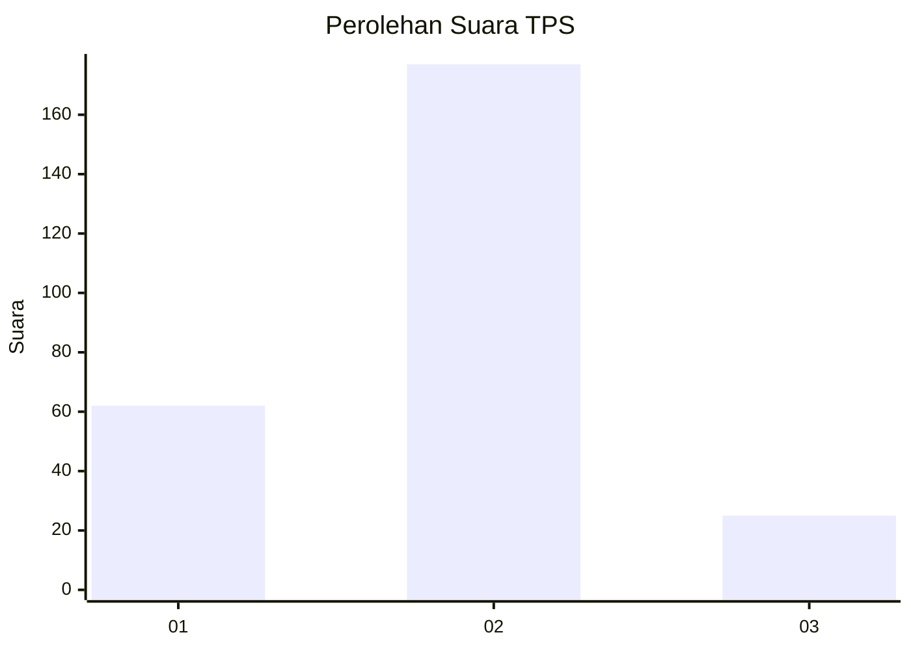

# Hasil

## Grafik

## Tabel

| No. | Nama Paslon    | Suara | Suara (raw) | Persentase |
|:--- |:-------------- | -----:| -----------:| ----------:|
| 1   | ANIES MUHAIMIN | 62    | [62][p-1]   | 23,48      |
| 2   | PRABOWO GIBRAN | 177   | [177][p-2]  | 67,05      |
| 3   | GANJAR MAHFUD  | 25    | [25][p-3]   | 9,47       |

[p-1]: https://github.com/gigit-pemilu/pemilu-2024/blob/main/pilpres/hitung-suara/sub/35-jawa-timur/sub/26-bangkalan/sub/01-bangkalan/sub/1005-kraton/sub/012-tps/sub/paslon-1.txt
[p-2]: https://github.com/gigit-pemilu/pemilu-2024/blob/main/pilpres/hitung-suara/sub/35-jawa-timur/sub/26-bangkalan/sub/01-bangkalan/sub/1005-kraton/sub/012-tps/sub/paslon-2.txt
[p-3]: https://github.com/gigit-pemilu/pemilu-2024/blob/main/pilpres/hitung-suara/sub/35-jawa-timur/sub/26-bangkalan/sub/01-bangkalan/sub/1005-kraton/sub/012-tps/sub/paslon-3.txt

## Foto C Plano

https://sirekap-obj-formc.kpu.go.id/7e65/pemilu/ppwp/35/26/01/10/05/3526011005012-20240214-212201--9371c13c-3a3d-45e4-a73c-b3b112f9f8c7.jpg

https://sirekap-obj-formc.kpu.go.id/7e65/pemilu/ppwp/35/26/01/10/05/3526011005012-20240214-214935--b0326c98-f886-499e-bfda-073d4dfbfba8.jpg

https://sirekap-obj-formc.kpu.go.id/7e65/pemilu/ppwp/35/26/01/10/05/3526011005012-20240214-213419--e7e1669f-d0a9-4f1d-a8cb-cdd48508fb47.jpg

## Metadata

| Key        | Value               |
| ---------- | ------------------- |
| Time Stamp | 2024-02-17 14:45:18 |

