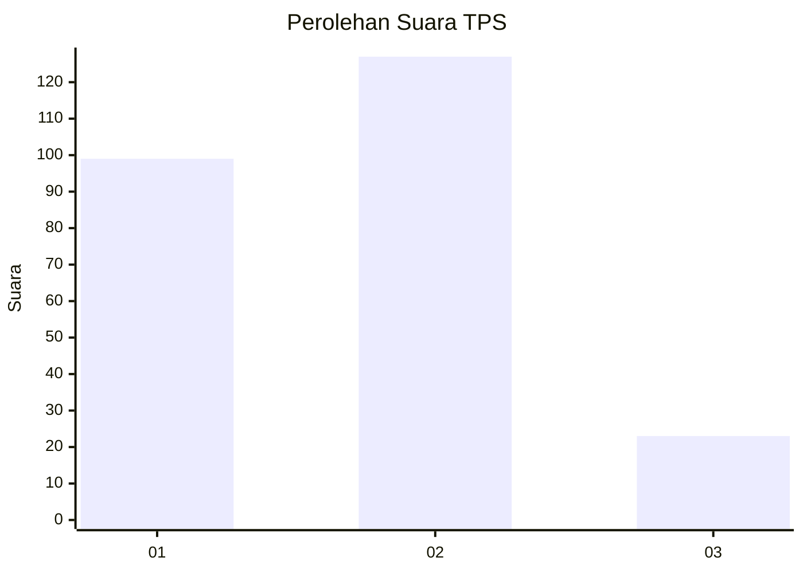
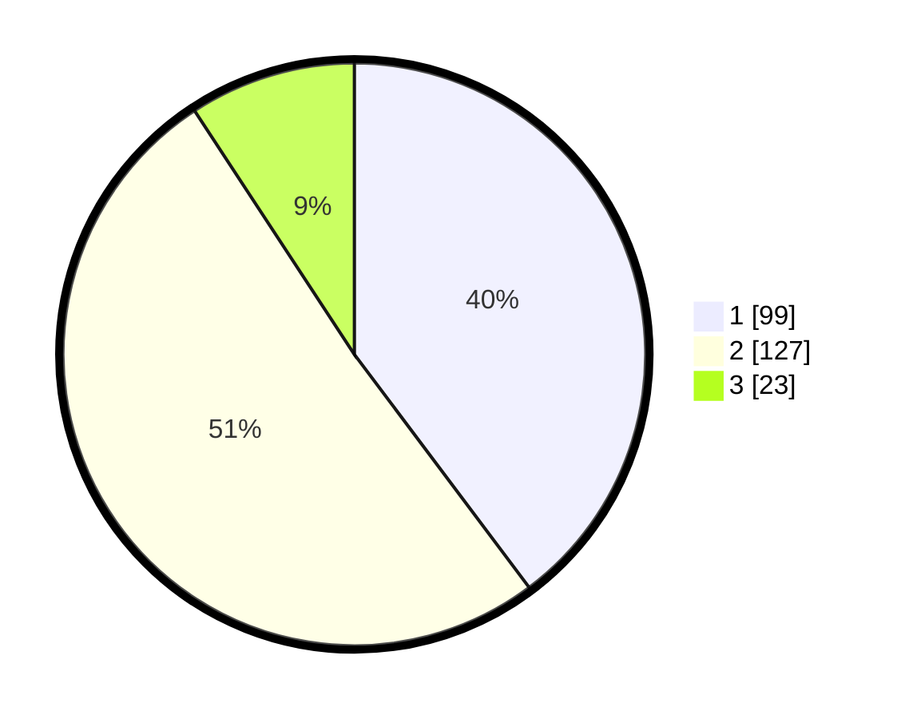

# Hasil

## Grafik

## Tabel

| No. | Nama Paslon    | Suara | Suara (raw) | Persentase |
|:--- |:-------------- | -----:| -----------:| ----------:|
| 1   | ANIES MUHAIMIN | 99    | [99][p-1]   | 39,76      |
| 2   | PRABOWO GIBRAN | 127   | [127][p-2]  | 51,00      |
| 3   | GANJAR MAHFUD  | 23    | [23][p-3]   | 9,24       |

[p-1]: https://github.com/gigit-pemilu/pemilu-2024-35-jawa-timur/blob/main/pilpres/hitung-suara/sub/35-jawa-timur/sub/26-bangkalan/sub/01-bangkalan/sub/1006-pejagan/sub/009-tps/sub/paslon-1.txt
[p-2]: https://github.com/gigit-pemilu/pemilu-2024-35-jawa-timur/blob/main/pilpres/hitung-suara/sub/35-jawa-timur/sub/26-bangkalan/sub/01-bangkalan/sub/1006-pejagan/sub/009-tps/sub/paslon-2.txt
[p-3]: https://github.com/gigit-pemilu/pemilu-2024-35-jawa-timur/blob/main/pilpres/hitung-suara/sub/35-jawa-timur/sub/26-bangkalan/sub/01-bangkalan/sub/1006-pejagan/sub/009-tps/sub/paslon-3.txt

## Foto C Plano

https://sirekap-obj-formc.kpu.go.id/1f2d/pemilu/ppwp/35/26/01/10/06/3526011006009-20240214-233124--8d345719-6993-4468-adcf-7e3fd7a9e0a0.jpg

https://sirekap-obj-formc.kpu.go.id/1f2d/pemilu/ppwp/35/26/01/10/06/3526011006009-20240214-233248--a113e1ee-3b73-49a7-98d0-b2884d4b6f5b.jpg

https://sirekap-obj-formc.kpu.go.id/1f2d/pemilu/ppwp/35/26/01/10/06/3526011006009-20240214-233359--1ded88bd-ccd0-4809-aa36-b728a4707d0e.jpg

## Metadata

| Key        | Value               |
| ---------- | ------------------- |
| Time Stamp | 2024-02-17 16:00:02 |

