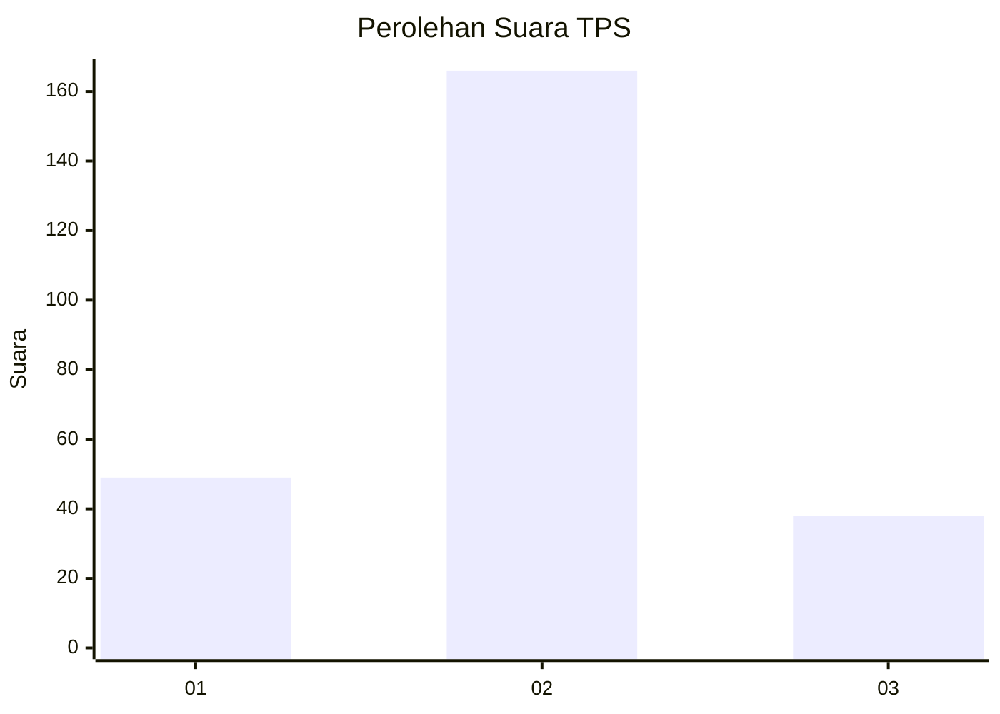
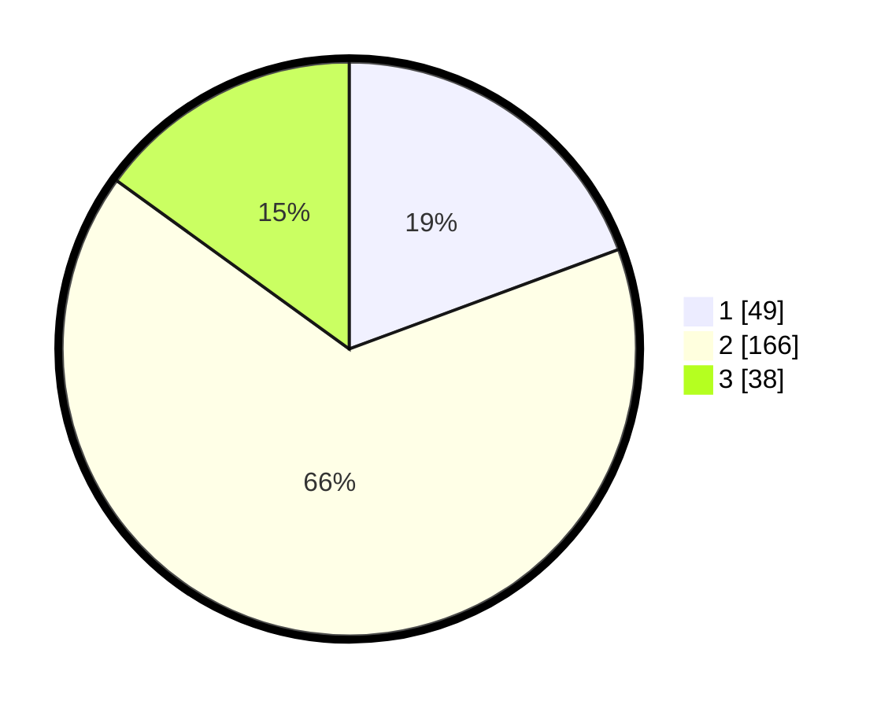

# Hasil

## Grafik

## Tabel

| No. | Nama Paslon    | Suara | Suara (raw) | Persentase |
|:--- |:-------------- | -----:| -----------:| ----------:|
| 1   | ANIES MUHAIMIN | 49    | [49][p-1]   | 19,37      |
| 2   | PRABOWO GIBRAN | 166   | [166][p-2]  | 65,61      |
| 3   | GANJAR MAHFUD  | 38    | [38][p-3]   | 15,02      |

[p-1]: https://github.com/gigit-pemilu/pemilu-2024/blob/main/pilpres/hitung-suara/sub/35-jawa-timur/sub/26-bangkalan/sub/01-bangkalan/sub/1006-pejagan/sub/036-tps/sub/paslon-1.txt
[p-2]: https://github.com/gigit-pemilu/pemilu-2024/blob/main/pilpres/hitung-suara/sub/35-jawa-timur/sub/26-bangkalan/sub/01-bangkalan/sub/1006-pejagan/sub/036-tps/sub/paslon-2.txt
[p-3]: https://github.com/gigit-pemilu/pemilu-2024/blob/main/pilpres/hitung-suara/sub/35-jawa-timur/sub/26-bangkalan/sub/01-bangkalan/sub/1006-pejagan/sub/036-tps/sub/paslon-3.txt

## Foto C Plano

https://sirekap-obj-formc.kpu.go.id/6ac4/pemilu/ppwp/35/26/01/10/06/3526011006036-20240216-203718--83dc4752-b4b4-45f7-9d43-9ed26af7f3d4.jpg

https://sirekap-obj-formc.kpu.go.id/6ac4/pemilu/ppwp/35/26/01/10/06/3526011006036-20240216-203831--0da4758a-a573-4c16-8b88-63618f7ee17d.jpg

https://sirekap-obj-formc.kpu.go.id/6ac4/pemilu/ppwp/35/26/01/10/06/3526011006036-20240216-203957--0671e682-6212-4e6f-b22a-cd170eaff1bd.jpg

## Metadata

| Key        | Value               |
| ---------- | ------------------- |
| Time Stamp | 2024-02-19 06:16:00 |

