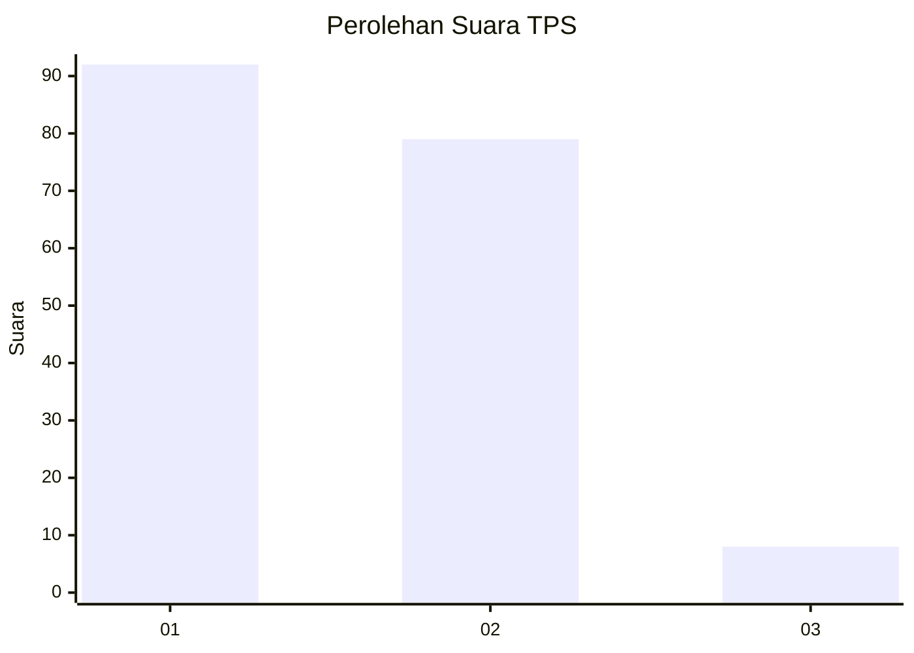
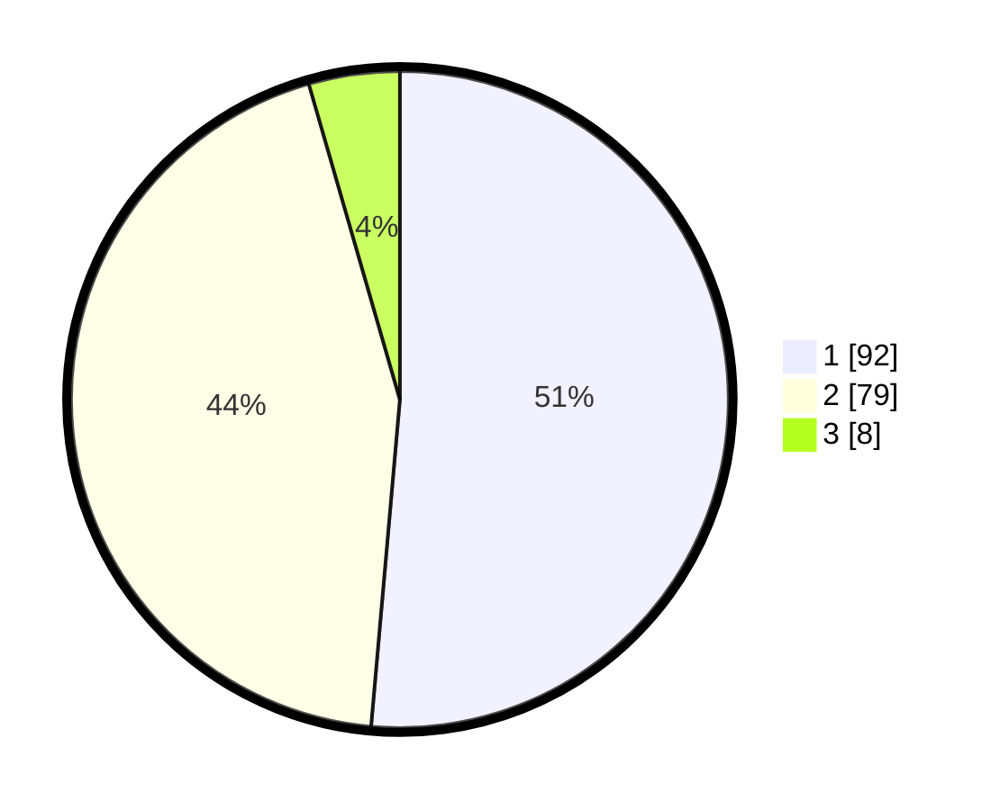

# Hasil

## Grafik

## Tabel

| No. | Nama Paslon    | Suara | Suara (raw) | Persentase |
|:--- |:-------------- | -----:| -----------:| ----------:|
| 1   | ANIES MUHAIMIN | 92    | [92][p-1]   | 51,40      |
| 2   | PRABOWO GIBRAN | 79    | [79][p-2]   | 44,13      |
| 3   | GANJAR MAHFUD  | 8     | [8][p-3]    | 4,47       |

[p-1]: https://github.com/gigit-pemilu/pemilu-2024/blob/main/pilpres/hitung-suara/sub/35-jawa-timur/sub/26-bangkalan/sub/01-bangkalan/sub/1007-bancaran/sub/028-tps/sub/paslon-1.txt
[p-2]: https://github.com/gigit-pemilu/pemilu-2024/blob/main/pilpres/hitung-suara/sub/35-jawa-timur/sub/26-bangkalan/sub/01-bangkalan/sub/1007-bancaran/sub/028-tps/sub/paslon-2.txt
[p-3]: https://github.com/gigit-pemilu/pemilu-2024/blob/main/pilpres/hitung-suara/sub/35-jawa-timur/sub/26-bangkalan/sub/01-bangkalan/sub/1007-bancaran/sub/028-tps/sub/paslon-3.txt

## Foto C Plano

https://sirekap-obj-formc.kpu.go.id/6058/pemilu/ppwp/35/26/01/10/07/3526011007028-20240214-214134--da0d0e65-7762-4d69-a715-11fa70f7c602.jpg

https://sirekap-obj-formc.kpu.go.id/6058/pemilu/ppwp/35/26/01/10/07/3526011007028-20240214-214635--02e3fad2-7735-4f6f-ae29-784dc6a034dd.jpg

https://sirekap-obj-formc.kpu.go.id/6058/pemilu/ppwp/35/26/01/10/07/3526011007028-20240214-214653--6f47d461-a2d3-4307-92fa-5705f1276b60.jpg

## Metadata

| Key        | Value               |
| ---------- | ------------------- |
| Time Stamp | 2024-02-17 16:00:02 |

