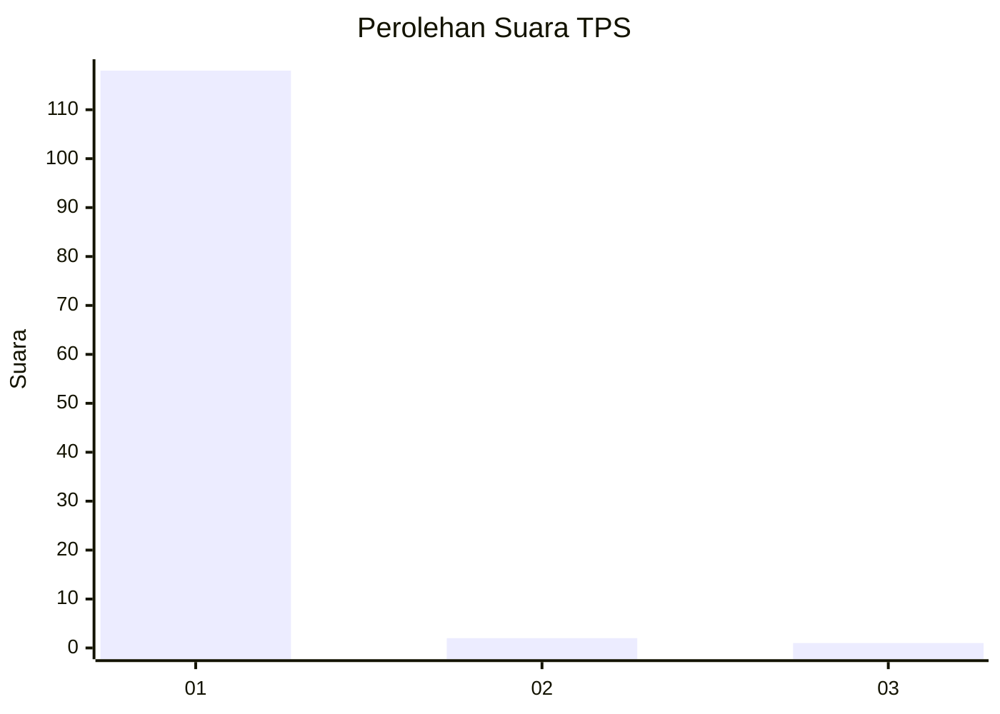
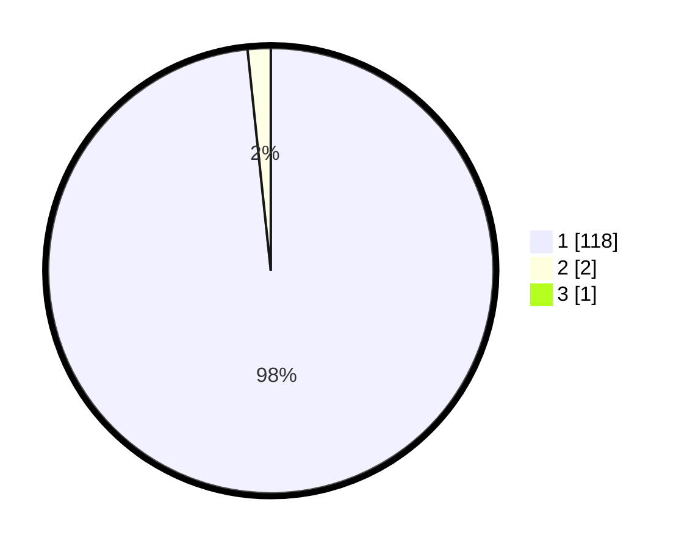

# Hasil

## Grafik

## Tabel

| No. | Nama Paslon    | Suara | Suara (raw) | Persentase |
|:--- |:-------------- | -----:| -----------:| ----------:|
| 1   | ANIES MUHAIMIN | 118   | [118][p-1]  | 97,52      |
| 2   | PRABOWO GIBRAN | 2     | [2][p-2]    | 1,65       |
| 3   | GANJAR MAHFUD  | 1     | [1][p-3]    | 0,83       |

[p-1]: https://github.com/gigit-pemilu/pemilu-2024-35-jawa-timur/blob/main/pilpres/hitung-suara/sub/35-jawa-timur/sub/26-bangkalan/sub/01-bangkalan/sub/1007-bancaran/sub/902-tps/sub/paslon-1.txt
[p-2]: https://github.com/gigit-pemilu/pemilu-2024-35-jawa-timur/blob/main/pilpres/hitung-suara/sub/35-jawa-timur/sub/26-bangkalan/sub/01-bangkalan/sub/1007-bancaran/sub/902-tps/sub/paslon-2.txt
[p-3]: https://github.com/gigit-pemilu/pemilu-2024-35-jawa-timur/blob/main/pilpres/hitung-suara/sub/35-jawa-timur/sub/26-bangkalan/sub/01-bangkalan/sub/1007-bancaran/sub/902-tps/sub/paslon-3.txt

## Foto C Plano

https://sirekap-obj-formc.kpu.go.id/568f/pemilu/ppwp/35/26/01/10/07/3526011007902-20240214-193542--85b577bc-1d51-4092-89fb-4578fcaad3d8.jpg

https://sirekap-obj-formc.kpu.go.id/568f/pemilu/ppwp/35/26/01/10/07/3526011007902-20240214-193654--2912c725-8232-4657-960f-f9b51f4a5d69.jpg

https://sirekap-obj-formc.kpu.go.id/568f/pemilu/ppwp/35/26/01/10/07/3526011007902-20240214-193849--c525a0f8-8fe4-4c16-8021-2be98fc4626d.jpg

## Metadata

| Key        | Value               |
| ---------- | ------------------- |
| Time Stamp | 2024-02-19 06:16:00 |

