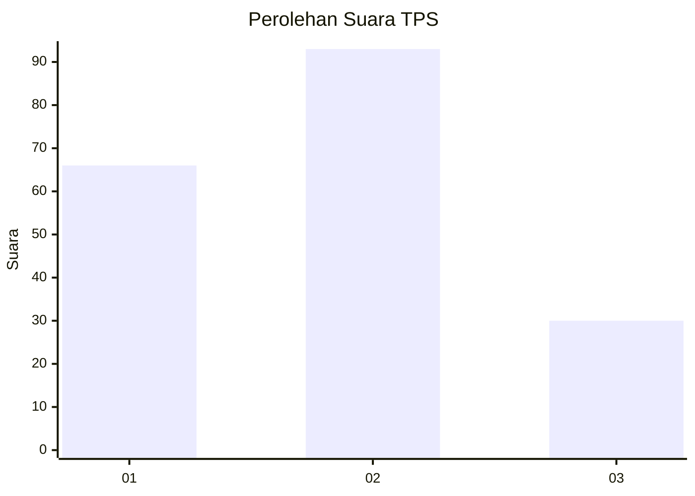
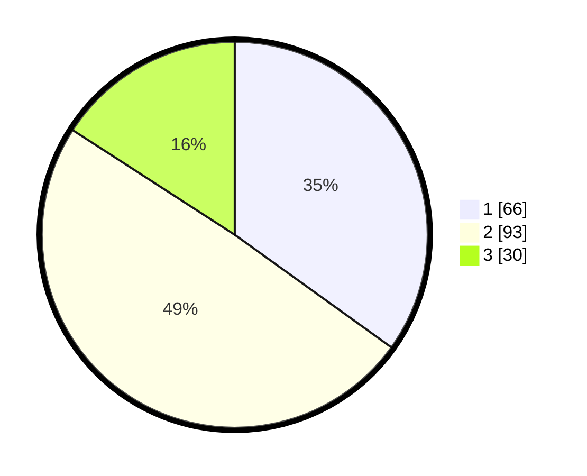

# Hasil

## Grafik

## Tabel

| No. | Nama Paslon    | Suara | Suara (raw) | Persentase |
|:--- |:-------------- | -----:| -----------:| ----------:|
| 1   | ANIES MUHAIMIN | 66    | [66][p-1]   | 34,92      |
| 2   | PRABOWO GIBRAN | 93    | [93][p-2]   | 49,21      |
| 3   | GANJAR MAHFUD  | 30    | [30][p-3]   | 15,87      |

[p-1]: https://github.com/gigit-pemilu/pemilu-2024/blob/main/pilpres/hitung-suara/sub/35-jawa-timur/sub/26-bangkalan/sub/01-bangkalan/sub/2008-sembilangan/sub/003-tps/sub/paslon-1.txt
[p-2]: https://github.com/gigit-pemilu/pemilu-2024/blob/main/pilpres/hitung-suara/sub/35-jawa-timur/sub/26-bangkalan/sub/01-bangkalan/sub/2008-sembilangan/sub/003-tps/sub/paslon-2.txt
[p-3]: https://github.com/gigit-pemilu/pemilu-2024/blob/main/pilpres/hitung-suara/sub/35-jawa-timur/sub/26-bangkalan/sub/01-bangkalan/sub/2008-sembilangan/sub/003-tps/sub/paslon-3.txt

## Foto C Plano

https://sirekap-obj-formc.kpu.go.id/0a51/pemilu/ppwp/35/26/01/20/08/3526012008003-20240214-222309--1112e0d6-5034-43a0-91e5-3b2a46aa7ada.jpg

https://sirekap-obj-formc.kpu.go.id/0a51/pemilu/ppwp/35/26/01/20/08/3526012008003-20240214-222340--8c08a690-18b1-42f9-841d-2b3c9667ee6e.jpg

https://sirekap-obj-formc.kpu.go.id/0a51/pemilu/ppwp/35/26/01/20/08/3526012008003-20240215-220122--fcb93d16-bfb5-40e8-bcc6-ae25fbd702da.jpg

## Metadata

| Key        | Value               |
| ---------- | ------------------- |
| Time Stamp | 2024-02-15 22:30:27 |

