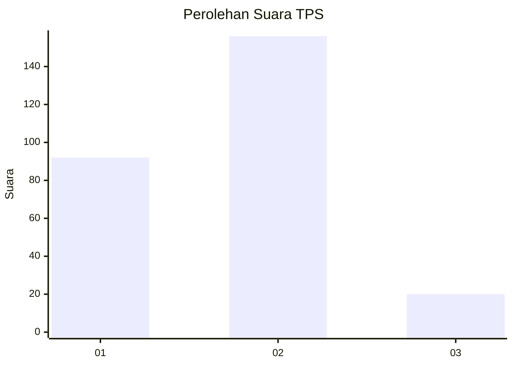
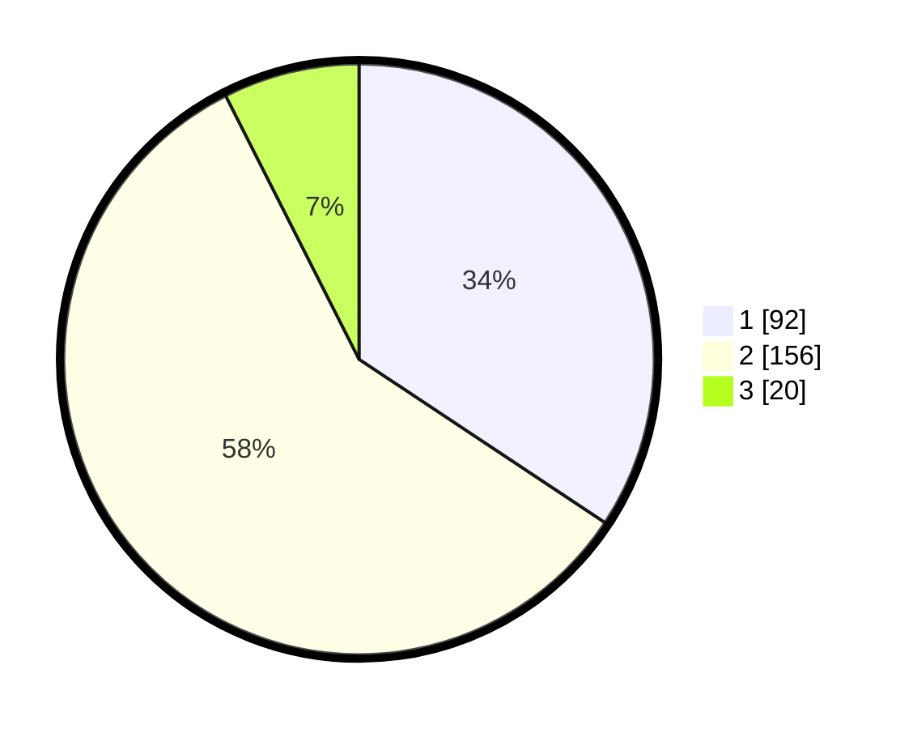

# Hasil

## Grafik

## Tabel

| No. | Nama Paslon    | Suara | Suara (raw) | Persentase |
|:--- |:-------------- | -----:| -----------:| ----------:|
| 1   | ANIES MUHAIMIN | 92    | [92][p-1]   | 34,33      |
| 2   | PRABOWO GIBRAN | 156   | [156][p-2]  | 58,21      |
| 3   | GANJAR MAHFUD  | 20    | [20][p-3]   | 7,46       |

[p-1]: https://github.com/gigit-pemilu/pemilu-2024-35-jawa-timur/blob/main/pilpres/hitung-suara/sub/35-jawa-timur/sub/26-bangkalan/sub/01-bangkalan/sub/2009-ujung-piring/sub/002-tps/sub/paslon-1.txt
[p-2]: https://github.com/gigit-pemilu/pemilu-2024-35-jawa-timur/blob/main/pilpres/hitung-suara/sub/35-jawa-timur/sub/26-bangkalan/sub/01-bangkalan/sub/2009-ujung-piring/sub/002-tps/sub/paslon-2.txt
[p-3]: https://github.com/gigit-pemilu/pemilu-2024-35-jawa-timur/blob/main/pilpres/hitung-suara/sub/35-jawa-timur/sub/26-bangkalan/sub/01-bangkalan/sub/2009-ujung-piring/sub/002-tps/sub/paslon-3.txt

## Foto C Plano

https://sirekap-obj-formc.kpu.go.id/d99a/pemilu/ppwp/35/26/01/20/09/3526012009002-20240214-155635--0ce122f0-9a1b-4615-b639-1ff0853b93f2.jpg

https://sirekap-obj-formc.kpu.go.id/d99a/pemilu/ppwp/35/26/01/20/09/3526012009002-20240214-155817--276c1a91-f597-407f-a7c0-576762b5dd3f.jpg

https://sirekap-obj-formc.kpu.go.id/d99a/pemilu/ppwp/35/26/01/20/09/3526012009002-20240214-155844--bd7cf964-7fc1-4fed-b99c-7e675eec1445.jpg

## Metadata

| Key        | Value               |
| ---------- | ------------------- |
| Time Stamp | 2024-02-24 22:31:28 |

