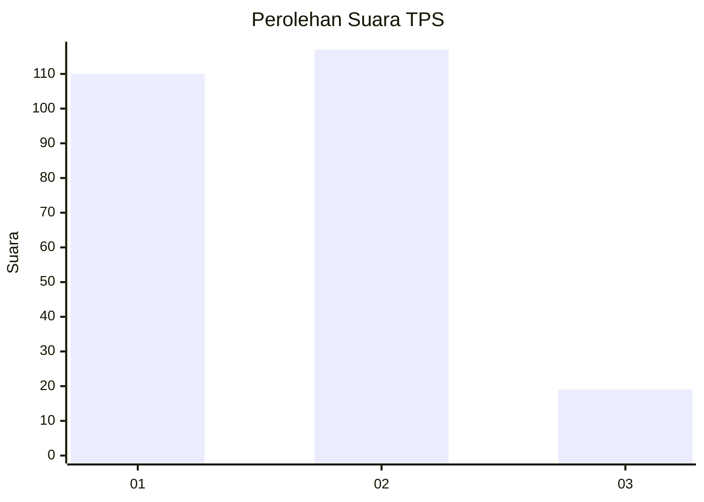
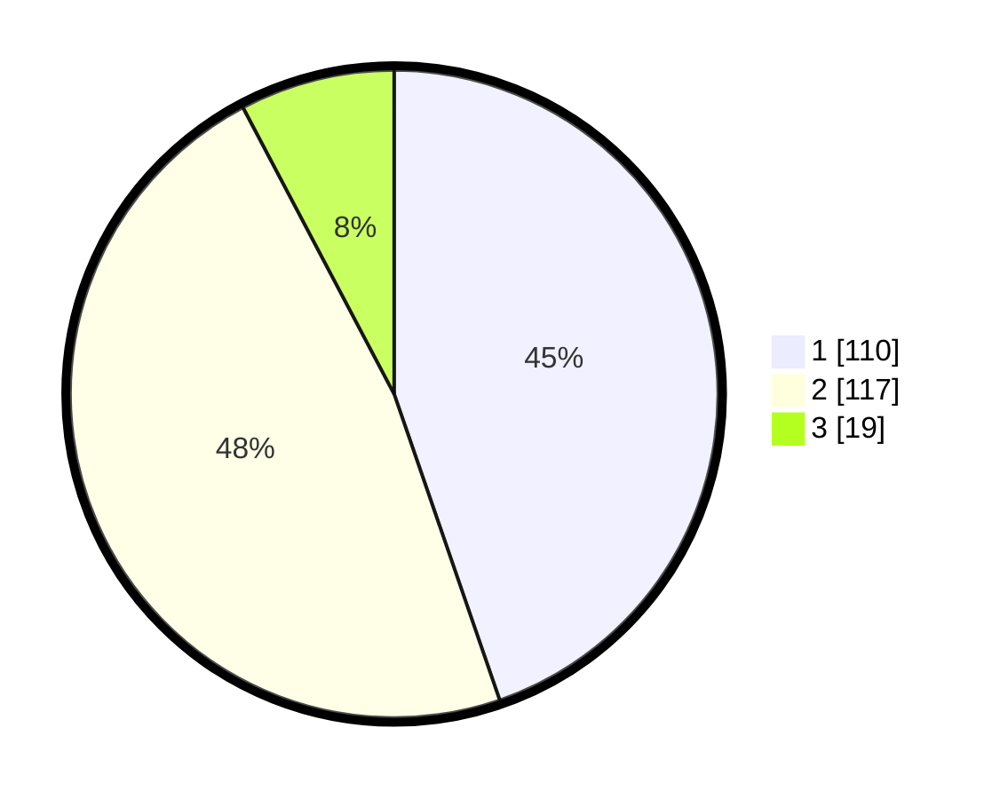

# Hasil

## Grafik

## Tabel

| No. | Nama Paslon    | Suara | Suara (raw) | Persentase |
|:--- |:-------------- | -----:| -----------:| ----------:|
| 1   | ANIES MUHAIMIN | 110   | [110][p-1]  | 44,72      |
| 2   | PRABOWO GIBRAN | 117   | [117][p-2]  | 47,56      |
| 3   | GANJAR MAHFUD  | 19    | [19][p-3]   | 7,72       |

[p-1]: https://github.com/gigit-pemilu/pemilu-2024/blob/main/pilpres/hitung-suara/sub/35-jawa-timur/sub/26-bangkalan/sub/02-socah/sub/2001-socah/sub/010-tps/sub/paslon-1.txt
[p-2]: https://github.com/gigit-pemilu/pemilu-2024/blob/main/pilpres/hitung-suara/sub/35-jawa-timur/sub/26-bangkalan/sub/02-socah/sub/2001-socah/sub/010-tps/sub/paslon-2.txt
[p-3]: https://github.com/gigit-pemilu/pemilu-2024/blob/main/pilpres/hitung-suara/sub/35-jawa-timur/sub/26-bangkalan/sub/02-socah/sub/2001-socah/sub/010-tps/sub/paslon-3.txt

## Foto C Plano

https://sirekap-obj-formc.kpu.go.id/8a62/pemilu/ppwp/35/26/02/20/01/3526022001010-20240215-001543--ad521e7a-86bb-4d51-a15e-fc798f2dad13.jpg

https://sirekap-obj-formc.kpu.go.id/8a62/pemilu/ppwp/35/26/02/20/01/3526022001010-20240215-001729--faa159a6-dca8-4542-a7be-a68c3033d465.jpg

https://sirekap-obj-formc.kpu.go.id/8a62/pemilu/ppwp/35/26/02/20/01/3526022001010-20240215-001922--e0e5b016-8fde-461b-a188-89e95ed18240.jpg

## Metadata

| Key        | Value               |
| ---------- | ------------------- |
| Time Stamp | 2024-02-21 20:00:00 |

