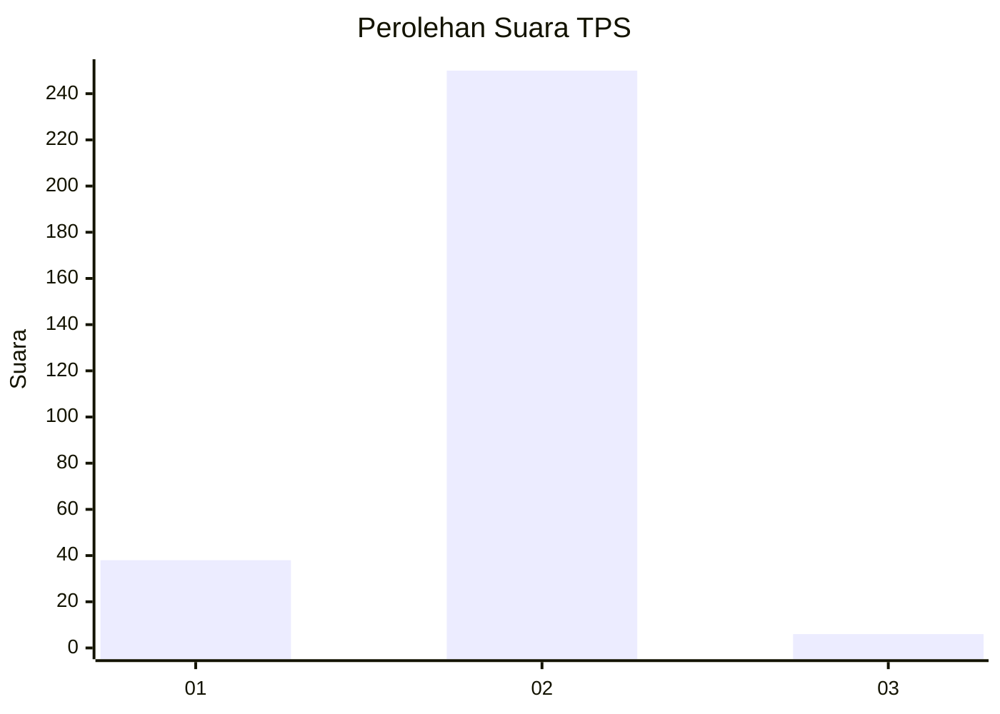
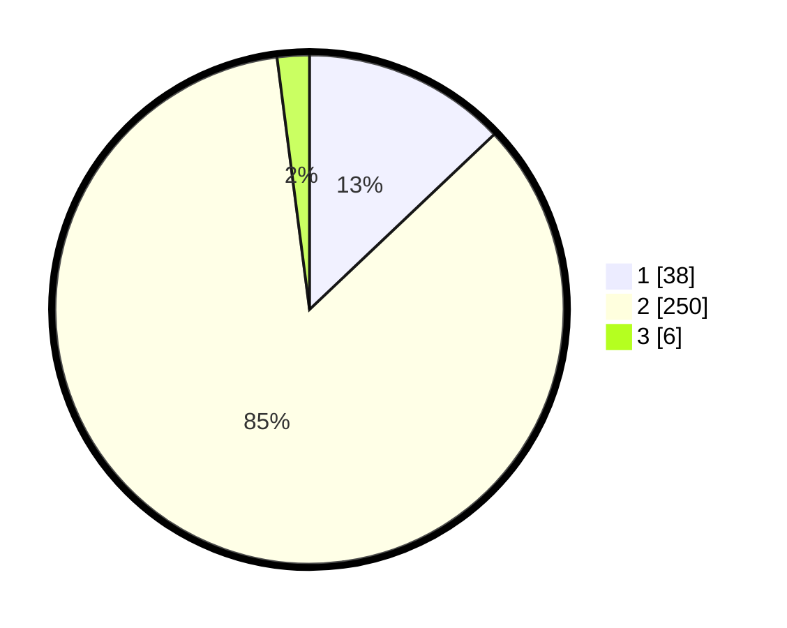

# Hasil

## Grafik

## Tabel

| No. | Nama Paslon    | Suara | Suara (raw) | Persentase |
|:--- |:-------------- | -----:| -----------:| ----------:|
| 1   | ANIES MUHAIMIN | 38    | [38][p-1]   | 12,93      |
| 2   | PRABOWO GIBRAN | 250   | [250][p-2]  | 85,03      |
| 3   | GANJAR MAHFUD  | 6     | [6][p-3]    | 2,04       |

[p-1]: https://github.com/gigit-pemilu/pemilu-2024/blob/main/pilpres/hitung-suara/sub/35-jawa-timur/sub/26-bangkalan/sub/02-socah/sub/2002-keleyan/sub/003-tps/sub/paslon-1.txt
[p-2]: https://github.com/gigit-pemilu/pemilu-2024/blob/main/pilpres/hitung-suara/sub/35-jawa-timur/sub/26-bangkalan/sub/02-socah/sub/2002-keleyan/sub/003-tps/sub/paslon-2.txt
[p-3]: https://github.com/gigit-pemilu/pemilu-2024/blob/main/pilpres/hitung-suara/sub/35-jawa-timur/sub/26-bangkalan/sub/02-socah/sub/2002-keleyan/sub/003-tps/sub/paslon-3.txt

## Foto C Plano

https://sirekap-obj-formc.kpu.go.id/4ba0/pemilu/ppwp/35/26/02/20/02/3526022002003-20240214-203335--8732b91f-b726-43cf-b0ad-79f70e69d46f.jpg

https://sirekap-obj-formc.kpu.go.id/4ba0/pemilu/ppwp/35/26/02/20/02/3526022002003-20240214-203648--7971931e-a8dd-43b5-b25b-d6f365f6da47.jpg

## Metadata

| Key        | Value               |
| ---------- | ------------------- |
| Time Stamp | 2024-02-24 22:31:28 |

