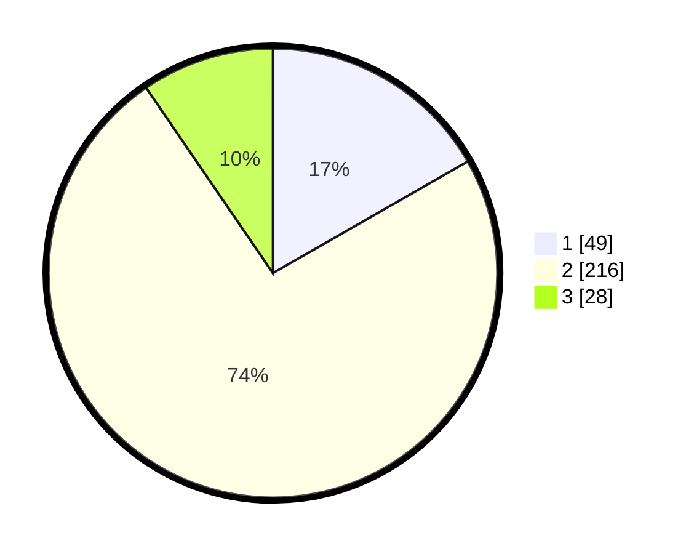

# Hasil

## Grafik

## Tabel

| No. | Nama Paslon    | Suara | Suara (raw) | Persentase |
|:--- |:-------------- | -----:| -----------:| ----------:|
| 1   | ANIES MUHAIMIN | 49    | [49][p-1]   | 16,72      |
| 2   | PRABOWO GIBRAN | 216   | [216][p-2]  | 73,72      |
| 3   | GANJAR MAHFUD  | 28    | [28][p-3]   | 9,56       |

[p-1]: https://github.com/gigit-pemilu/pemilu-2024/blob/main/pilpres/hitung-suara/sub/35-jawa-timur/sub/26-bangkalan/sub/02-socah/sub/2002-keleyan/sub/006-tps/sub/paslon-1.txt
[p-2]: https://github.com/gigit-pemilu/pemilu-2024/blob/main/pilpres/hitung-suara/sub/35-jawa-timur/sub/26-bangkalan/sub/02-socah/sub/2002-keleyan/sub/006-tps/sub/paslon-2.txt
[p-3]: https://github.com/gigit-pemilu/pemilu-2024/blob/main/pilpres/hitung-suara/sub/35-jawa-timur/sub/26-bangkalan/sub/02-socah/sub/2002-keleyan/sub/006-tps/sub/paslon-3.txt

## Foto C Plano

https://sirekap-obj-formc.kpu.go.id/04e7/pemilu/ppwp/35/26/02/20/02/3526022002006-20240214-231240--20f5593e-510a-4af1-8b53-39ddf69820ef.jpg

https://sirekap-obj-formc.kpu.go.id/04e7/pemilu/ppwp/35/26/02/20/02/3526022002006-20240214-231355--51dbea26-8fd6-4a5b-a2dc-7b9ca8875007.jpg

## Metadata

| Key        | Value               |
| ---------- | ------------------- |
| Time Stamp | 2024-02-24 22:31:28 |

