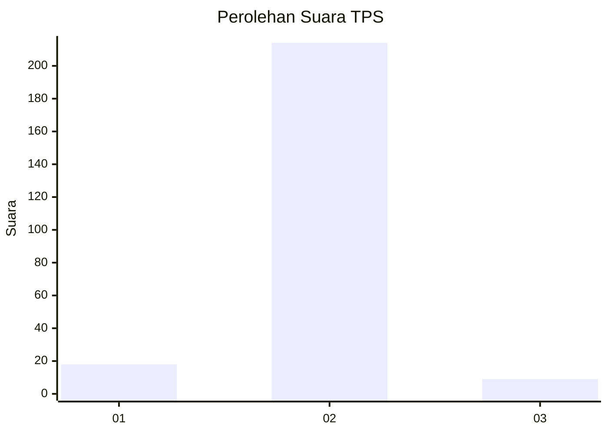
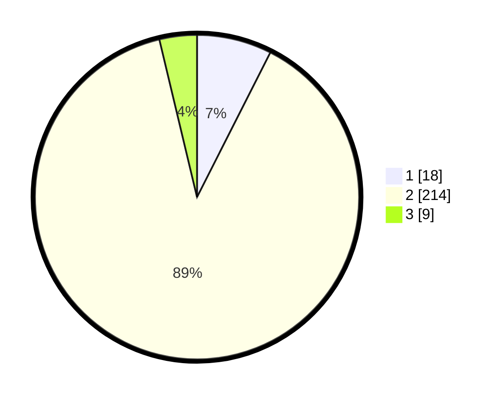

# Hasil

## Grafik

## Tabel

| No. | Nama Paslon    | Suara | Suara (raw) | Persentase |
|:--- |:-------------- | -----:| -----------:| ----------:|
| 1   | ANIES MUHAIMIN | 18    | [18][p-1]   | 7,47       |
| 2   | PRABOWO GIBRAN | 214   | [214][p-2]  | 88,80      |
| 3   | GANJAR MAHFUD  | 9     | [9][p-3]    | 3,73       |

[p-1]: https://github.com/gigit-pemilu/pemilu-2024/blob/main/pilpres/hitung-suara/sub/35-jawa-timur/sub/26-bangkalan/sub/02-socah/sub/2002-keleyan/sub/019-tps/sub/paslon-1.txt
[p-2]: https://github.com/gigit-pemilu/pemilu-2024/blob/main/pilpres/hitung-suara/sub/35-jawa-timur/sub/26-bangkalan/sub/02-socah/sub/2002-keleyan/sub/019-tps/sub/paslon-2.txt
[p-3]: https://github.com/gigit-pemilu/pemilu-2024/blob/main/pilpres/hitung-suara/sub/35-jawa-timur/sub/26-bangkalan/sub/02-socah/sub/2002-keleyan/sub/019-tps/sub/paslon-3.txt

## Foto C Plano

https://sirekap-obj-formc.kpu.go.id/ffcd/pemilu/ppwp/35/26/02/20/02/3526022002019-20240214-210739--bb91716d-7757-4fad-8546-3f6fc98ae387.jpg

https://sirekap-obj-formc.kpu.go.id/ffcd/pemilu/ppwp/35/26/02/20/02/3526022002019-20240214-205040--419f3f71-4581-46a1-9224-74fbc3c3740b.jpg

https://sirekap-obj-formc.kpu.go.id/ffcd/pemilu/ppwp/35/26/02/20/02/3526022002019-20240214-210408--23535d5d-6cb5-49f7-a555-834a4ce6511e.jpg

## Metadata

| Key        | Value               |
| ---------- | ------------------- |
| Time Stamp | 2024-02-21 20:00:00 |

