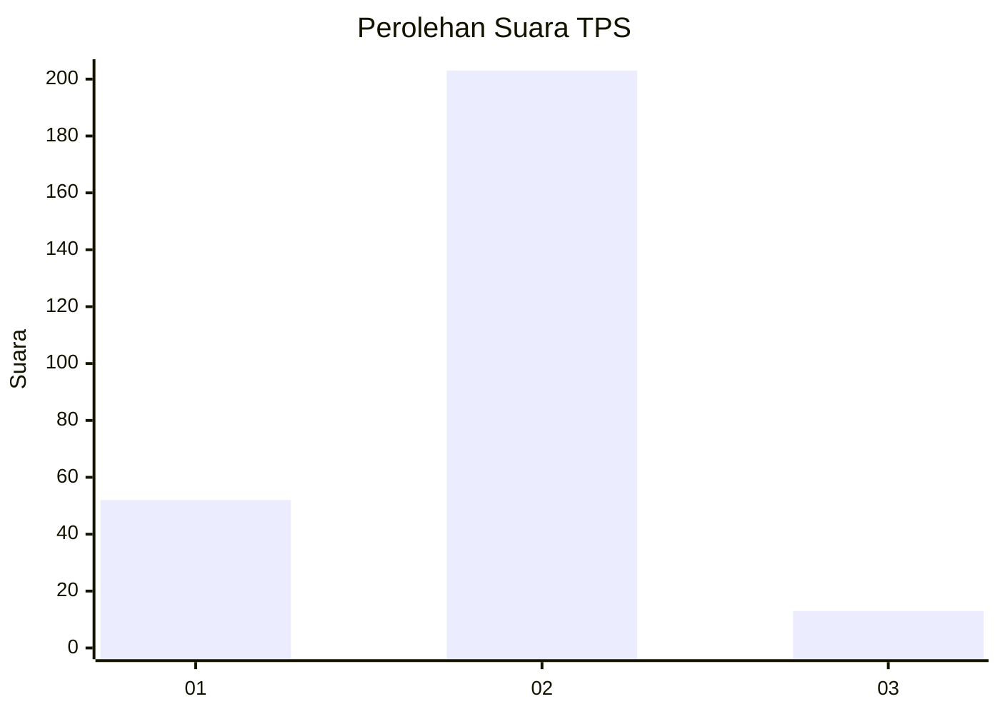
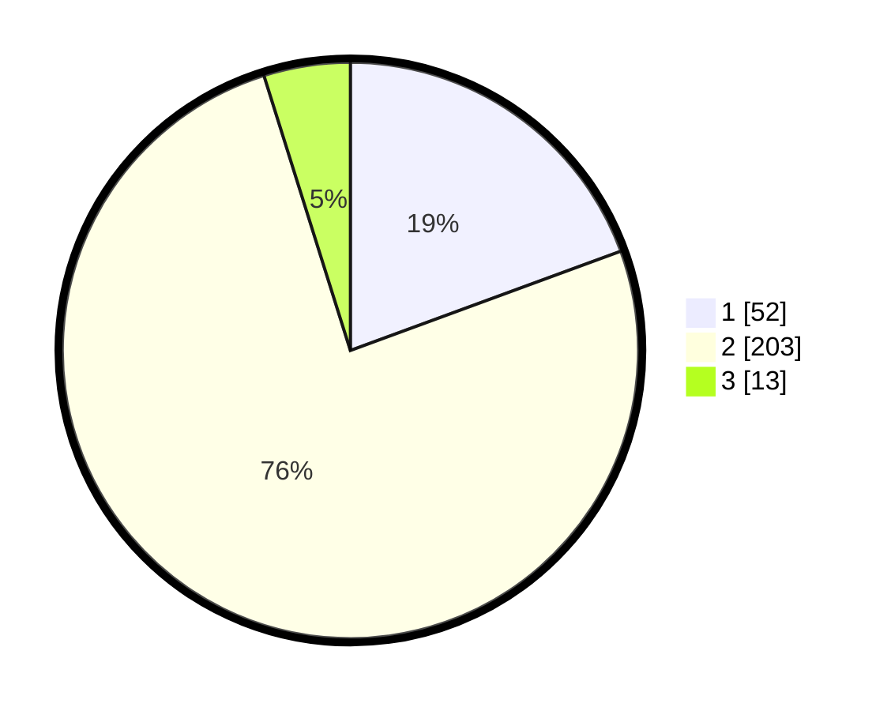

# Hasil

## Grafik

## Tabel

| No. | Nama Paslon    | Suara | Suara (raw) | Persentase |
|:--- |:-------------- | -----:| -----------:| ----------:|
| 1   | ANIES MUHAIMIN | 52    | [52][p-1]   | 19,40      |
| 2   | PRABOWO GIBRAN | 203   | [203][p-2]  | 75,75      |
| 3   | GANJAR MAHFUD  | 13    | [13][p-3]   | 4,85       |

[p-1]: https://github.com/gigit-pemilu/pemilu-2024/blob/main/pilpres/hitung-suara/sub/35-jawa-timur/sub/26-bangkalan/sub/02-socah/sub/2003-bilaporah/sub/009-tps/sub/paslon-1.txt
[p-2]: https://github.com/gigit-pemilu/pemilu-2024/blob/main/pilpres/hitung-suara/sub/35-jawa-timur/sub/26-bangkalan/sub/02-socah/sub/2003-bilaporah/sub/009-tps/sub/paslon-2.txt
[p-3]: https://github.com/gigit-pemilu/pemilu-2024/blob/main/pilpres/hitung-suara/sub/35-jawa-timur/sub/26-bangkalan/sub/02-socah/sub/2003-bilaporah/sub/009-tps/sub/paslon-3.txt

## Foto C Plano

https://sirekap-obj-formc.kpu.go.id/6145/pemilu/ppwp/35/26/02/20/03/3526022003009-20240214-201523--58c15233-918f-4059-bf95-b9695b5c95f9.jpg

https://sirekap-obj-formc.kpu.go.id/6145/pemilu/ppwp/35/26/02/20/03/3526022003009-20240214-201636--aed7e02b-2f0c-443b-88bd-16b05d284cac.jpg

https://sirekap-obj-formc.kpu.go.id/6145/pemilu/ppwp/35/26/02/20/03/3526022003009-20240214-201710--296010bb-b5d2-48eb-bfeb-78c4816108a1.jpg

## Metadata

| Key        | Value               |
| ---------- | ------------------- |
| Time Stamp | 2024-02-17 16:36:25 |

