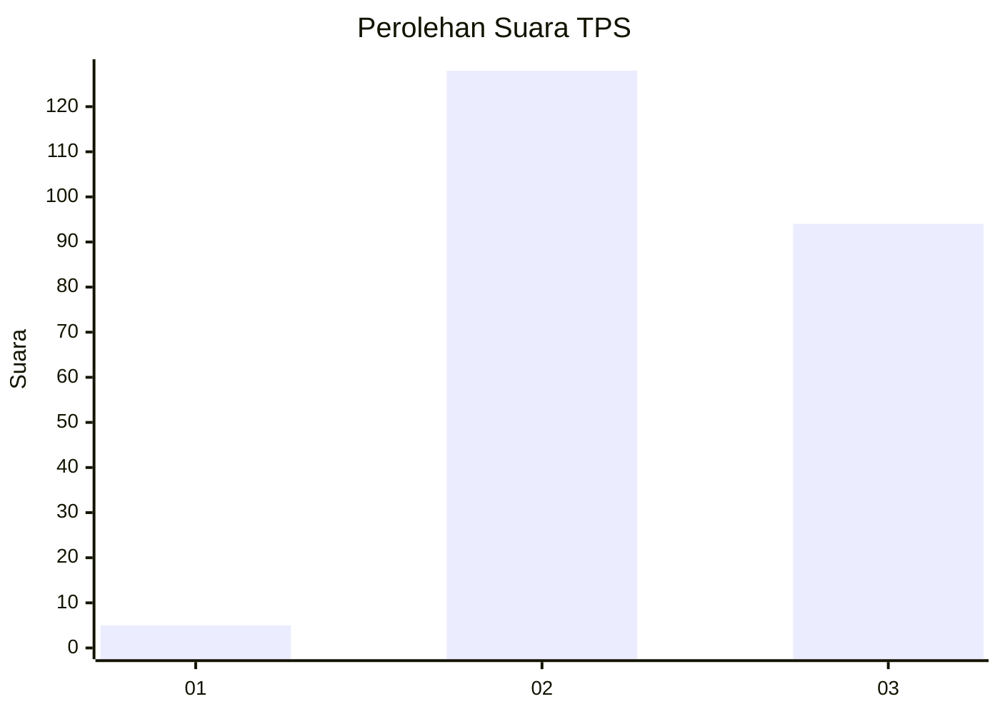
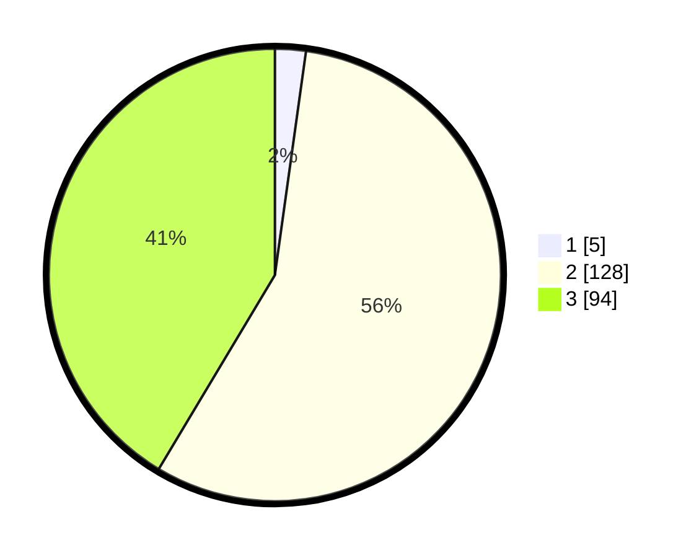

# Hasil

## Grafik

## Tabel

| No. | Nama Paslon    | Suara | Suara (raw) | Persentase |
|:--- |:-------------- | -----:| -----------:| ----------:|
| 1   | ANIES MUHAIMIN | 5     | [5][p-1]    | 2,20       |
| 2   | PRABOWO GIBRAN | 128   | [128][p-2]  | 56,39      |
| 3   | GANJAR MAHFUD  | 94    | [94][p-3]   | 41,41      |

[p-1]: https://github.com/gigit-pemilu/pemilu-2024/blob/main/pilpres/hitung-suara/sub/35-jawa-timur/sub/26-bangkalan/sub/02-socah/sub/2004-parseh/sub/014-tps/sub/paslon-1.txt
[p-2]: https://github.com/gigit-pemilu/pemilu-2024/blob/main/pilpres/hitung-suara/sub/35-jawa-timur/sub/26-bangkalan/sub/02-socah/sub/2004-parseh/sub/014-tps/sub/paslon-2.txt
[p-3]: https://github.com/gigit-pemilu/pemilu-2024/blob/main/pilpres/hitung-suara/sub/35-jawa-timur/sub/26-bangkalan/sub/02-socah/sub/2004-parseh/sub/014-tps/sub/paslon-3.txt

## Foto C Plano

https://sirekap-obj-formc.kpu.go.id/852e/pemilu/ppwp/35/26/02/20/04/3526022004014-20240214-211031--ac7e2232-73d0-438f-88ac-40123c8b0190.jpg

https://sirekap-obj-formc.kpu.go.id/852e/pemilu/ppwp/35/26/02/20/04/3526022004014-20240214-211158--203a277e-bc0c-4c99-a978-40142c7bd8dc.jpg

https://sirekap-obj-formc.kpu.go.id/852e/pemilu/ppwp/35/26/02/20/04/3526022004014-20240214-211253--570c0a0e-1bce-4ffd-825d-b93bed73bb71.jpg

## Metadata

| Key        | Value               |
| ---------- | ------------------- |
| Time Stamp | 2024-02-21 20:00:00 |

