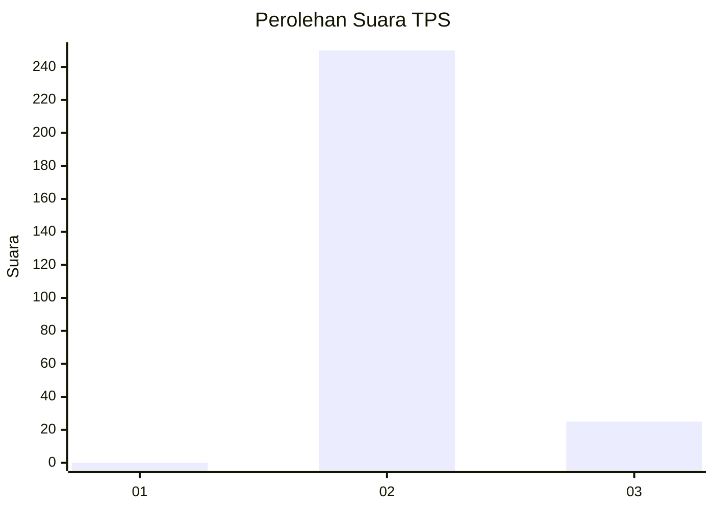
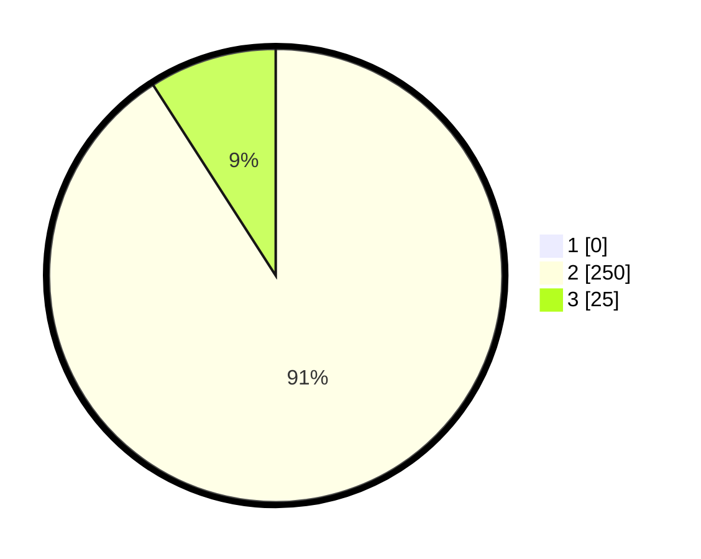

# Hasil

## Grafik

## Tabel

| No. | Nama Paslon    | Suara | Suara (raw) | Persentase |
|:--- |:-------------- | -----:| -----------:| ----------:|
| 1   | ANIES MUHAIMIN | 0     | [0][p-1]    | 0,00       |
| 2   | PRABOWO GIBRAN | 250   | [250][p-2]  | 90,91      |
| 3   | GANJAR MAHFUD  | 25    | [25][p-3]   | 9,09       |

[p-1]: https://github.com/gigit-pemilu/pemilu-2024-35-jawa-timur/blob/main/pilpres/hitung-suara/sub/35-jawa-timur/sub/26-bangkalan/sub/02-socah/sub/2004-parseh/sub/021-tps/sub/paslon-1.txt
[p-2]: https://github.com/gigit-pemilu/pemilu-2024-35-jawa-timur/blob/main/pilpres/hitung-suara/sub/35-jawa-timur/sub/26-bangkalan/sub/02-socah/sub/2004-parseh/sub/021-tps/sub/paslon-2.txt
[p-3]: https://github.com/gigit-pemilu/pemilu-2024-35-jawa-timur/blob/main/pilpres/hitung-suara/sub/35-jawa-timur/sub/26-bangkalan/sub/02-socah/sub/2004-parseh/sub/021-tps/sub/paslon-3.txt

## Foto C Plano

https://sirekap-obj-formc.kpu.go.id/90e8/pemilu/ppwp/35/26/02/20/04/3526022004021-20240214-220142--d8f0d5a0-ece2-4489-8679-64a9ec35eb70.jpg

https://sirekap-obj-formc.kpu.go.id/90e8/pemilu/ppwp/35/26/02/20/04/3526022004021-20240214-220155--11f2fbdf-fddb-4b54-8006-f8c8c56dfe58.jpg

https://sirekap-obj-formc.kpu.go.id/90e8/pemilu/ppwp/35/26/02/20/04/3526022004021-20240214-220052--c9c11992-9195-4e80-a6a5-78b863bc7155.jpg

## Metadata

| Key        | Value               |
| ---------- | ------------------- |
| Time Stamp | 2024-02-21 20:00:00 |

