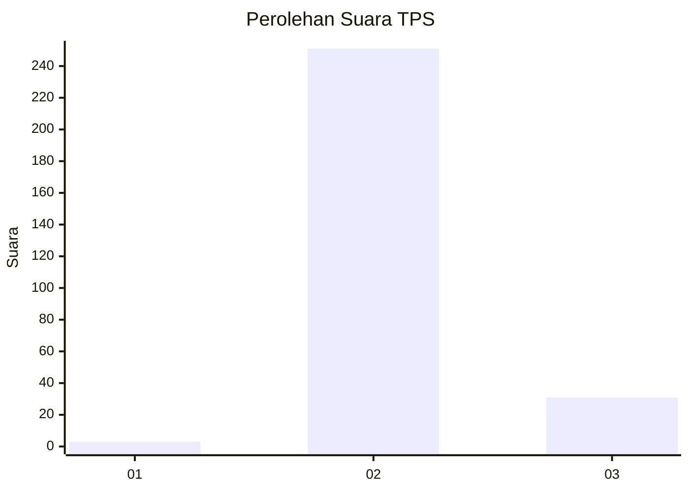
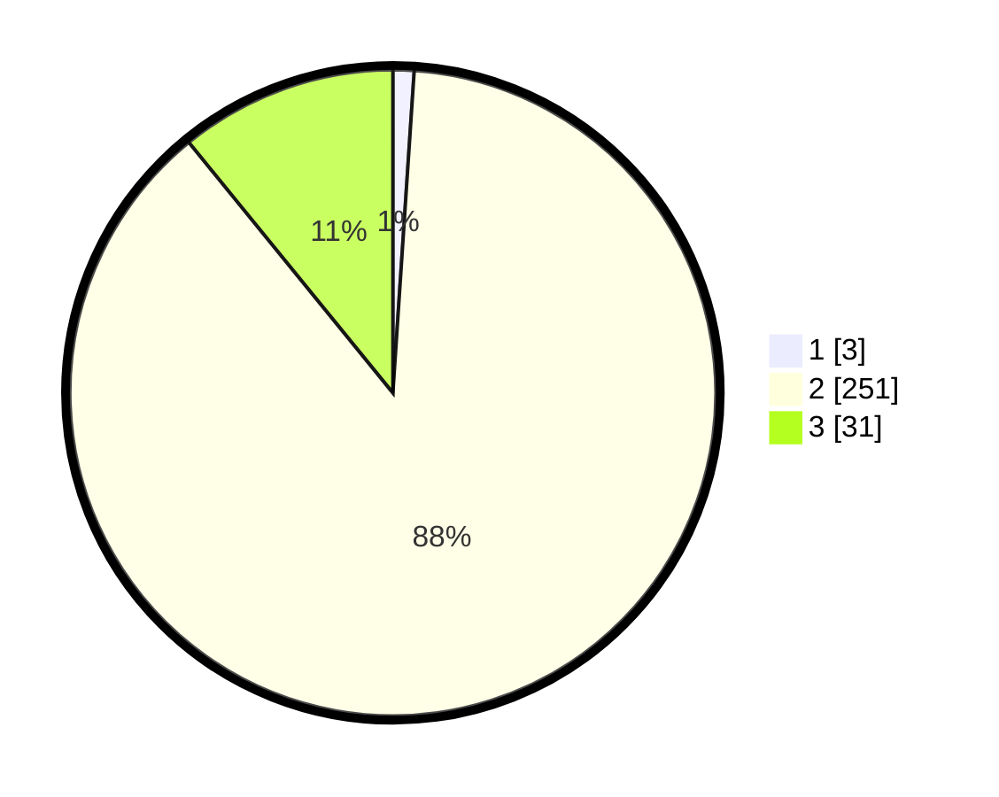

# Hasil

## Grafik

## Tabel

| No. | Nama Paslon    | Suara | Suara (raw) | Persentase |
|:--- |:-------------- | -----:| -----------:| ----------:|
| 1   | ANIES MUHAIMIN | 3     | [3][p-1]    | 1,05       |
| 2   | PRABOWO GIBRAN | 251   | [251][p-2]  | 88,07      |
| 3   | GANJAR MAHFUD  | 31    | [31][p-3]   | 10,88      |

[p-1]: https://github.com/gigit-pemilu/pemilu-2024-35-jawa-timur/blob/main/pilpres/hitung-suara/sub/35-jawa-timur/sub/26-bangkalan/sub/02-socah/sub/2004-parseh/sub/022-tps/sub/paslon-1.txt
[p-2]: https://github.com/gigit-pemilu/pemilu-2024-35-jawa-timur/blob/main/pilpres/hitung-suara/sub/35-jawa-timur/sub/26-bangkalan/sub/02-socah/sub/2004-parseh/sub/022-tps/sub/paslon-2.txt
[p-3]: https://github.com/gigit-pemilu/pemilu-2024-35-jawa-timur/blob/main/pilpres/hitung-suara/sub/35-jawa-timur/sub/26-bangkalan/sub/02-socah/sub/2004-parseh/sub/022-tps/sub/paslon-3.txt

## Foto C Plano

https://sirekap-obj-formc.kpu.go.id/15d6/pemilu/ppwp/35/26/02/20/04/3526022004022-20240214-211916--6d21d77c-de4d-4319-8d0b-a6700c02c2a7.jpg

https://sirekap-obj-formc.kpu.go.id/15d6/pemilu/ppwp/35/26/02/20/04/3526022004022-20240214-212026--3fb276c4-df26-4b01-9c30-c2be89155891.jpg

https://sirekap-obj-formc.kpu.go.id/15d6/pemilu/ppwp/35/26/02/20/04/3526022004022-20240214-212131--b9b0eda0-213d-410c-ad54-242b953beb76.jpg

## Metadata

| Key        | Value               |
| ---------- | ------------------- |
| Time Stamp | 2024-02-21 20:00:00 |

