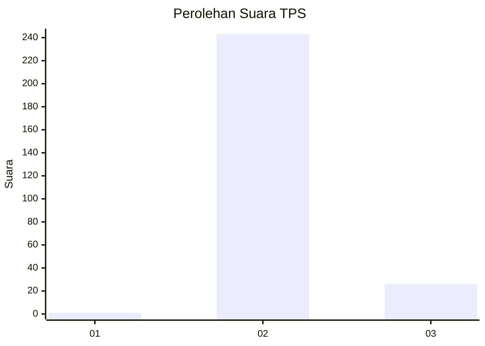
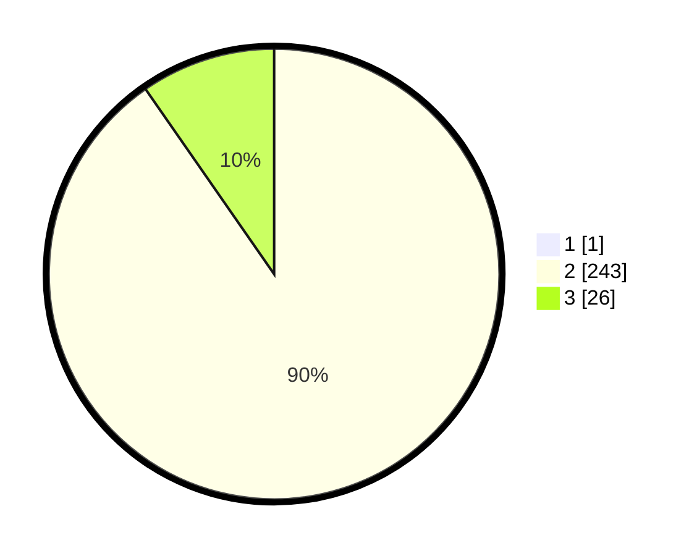

# Hasil

## Grafik

## Tabel

| No. | Nama Paslon    | Suara | Suara (raw) | Persentase |
|:--- |:-------------- | -----:| -----------:| ----------:|
| 1   | ANIES MUHAIMIN | 1     | [1][p-1]    | 0,37       |
| 2   | PRABOWO GIBRAN | 243   | [243][p-2]  | 90,00      |
| 3   | GANJAR MAHFUD  | 26    | [26][p-3]   | 9,63       |

[p-1]: https://github.com/gigit-pemilu/pemilu-2024-35-jawa-timur/blob/main/pilpres/hitung-suara/sub/35-jawa-timur/sub/26-bangkalan/sub/02-socah/sub/2004-parseh/sub/023-tps/sub/paslon-1.txt
[p-2]: https://github.com/gigit-pemilu/pemilu-2024-35-jawa-timur/blob/main/pilpres/hitung-suara/sub/35-jawa-timur/sub/26-bangkalan/sub/02-socah/sub/2004-parseh/sub/023-tps/sub/paslon-2.txt
[p-3]: https://github.com/gigit-pemilu/pemilu-2024-35-jawa-timur/blob/main/pilpres/hitung-suara/sub/35-jawa-timur/sub/26-bangkalan/sub/02-socah/sub/2004-parseh/sub/023-tps/sub/paslon-3.txt

## Foto C Plano

https://sirekap-obj-formc.kpu.go.id/6813/pemilu/ppwp/35/26/02/20/04/3526022004023-20240214-231143--dba74652-43b6-40b2-8c87-6d9dc57afefd.jpg

https://sirekap-obj-formc.kpu.go.id/6813/pemilu/ppwp/35/26/02/20/04/3526022004023-20240214-231428--0a6a8fa2-92df-4da8-88d4-3d79c03fac55.jpg

https://sirekap-obj-formc.kpu.go.id/6813/pemilu/ppwp/35/26/02/20/04/3526022004023-20240214-231540--587fb795-d2b7-41d4-8639-a6ec1626acdd.jpg

## Metadata

| Key        | Value               |
| ---------- | ------------------- |
| Time Stamp | 2024-02-21 20:00:00 |

