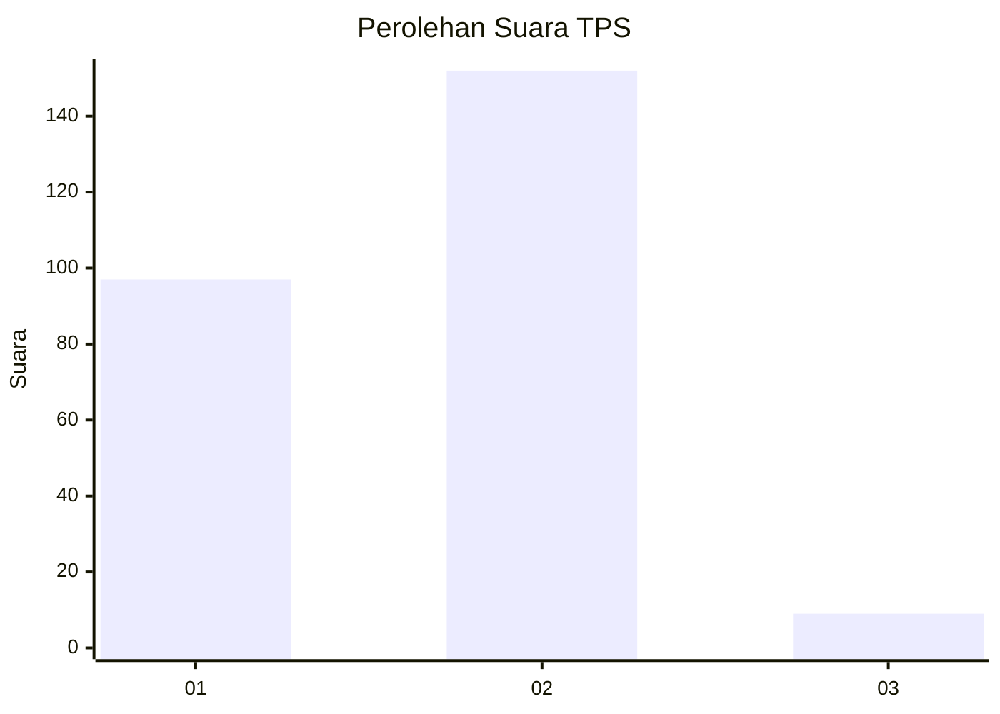
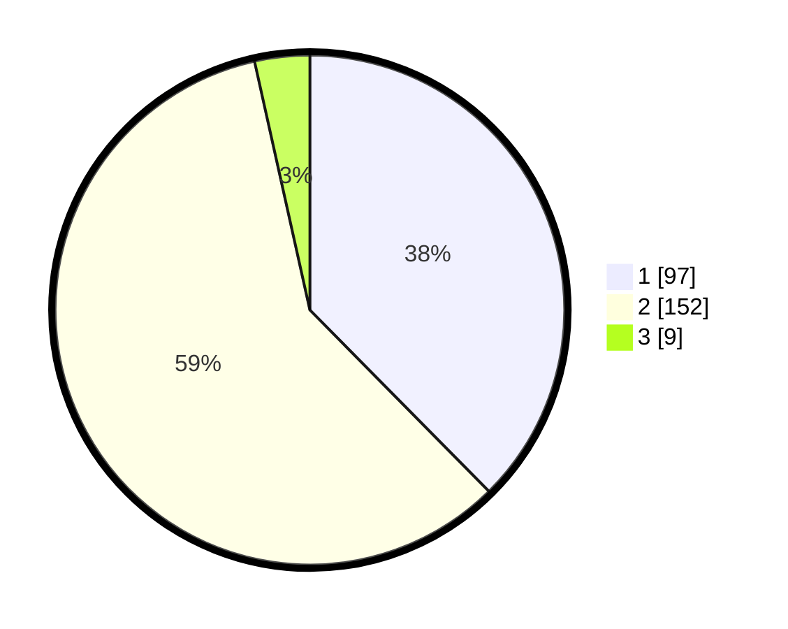

# Hasil

## Grafik

## Tabel

| No. | Nama Paslon    | Suara | Suara (raw) | Persentase |
|:--- |:-------------- | -----:| -----------:| ----------:|
| 1   | ANIES MUHAIMIN | 97    | [97][p-1]   | 37,60      |
| 2   | PRABOWO GIBRAN | 152   | [152][p-2]  | 58,91      |
| 3   | GANJAR MAHFUD  | 9     | [9][p-3]    | 3,49       |

[p-1]: https://github.com/gigit-pemilu/pemilu-2024/blob/main/pilpres/hitung-suara/sub/35-jawa-timur/sub/26-bangkalan/sub/03-burneh/sub/1005-tunjung/sub/008-tps/sub/paslon-1.txt
[p-2]: https://github.com/gigit-pemilu/pemilu-2024/blob/main/pilpres/hitung-suara/sub/35-jawa-timur/sub/26-bangkalan/sub/03-burneh/sub/1005-tunjung/sub/008-tps/sub/paslon-2.txt
[p-3]: https://github.com/gigit-pemilu/pemilu-2024/blob/main/pilpres/hitung-suara/sub/35-jawa-timur/sub/26-bangkalan/sub/03-burneh/sub/1005-tunjung/sub/008-tps/sub/paslon-3.txt

## Foto C Plano

https://sirekap-obj-formc.kpu.go.id/4cb7/pemilu/ppwp/35/26/03/10/05/3526031005008-20240225-092341--593e4ab2-5e17-42d8-8cdb-4712fef42a06.jpg

https://sirekap-obj-formc.kpu.go.id/4cb7/pemilu/ppwp/35/26/03/10/05/3526031005008-20240225-092612--da51bae8-5086-45cd-bc10-f83ffdb94e2d.jpg

https://sirekap-obj-formc.kpu.go.id/4cb7/pemilu/ppwp/35/26/03/10/05/3526031005008-20240225-093443--cf3b43b1-2225-4001-b19f-de1dbb54af4e.jpg

## Metadata

| Key        | Value               |
| ---------- | ------------------- |
| Time Stamp | 2024-02-28 19:00:00 |

