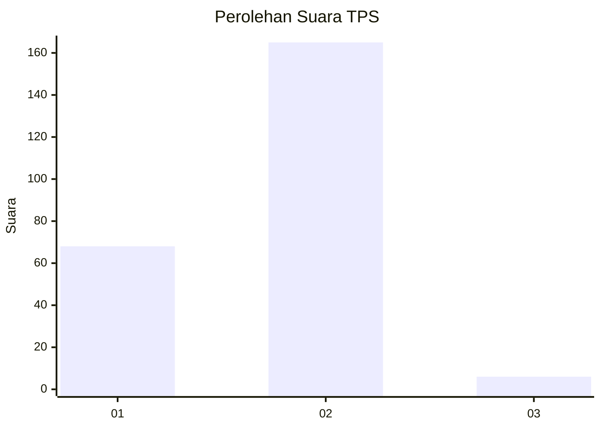
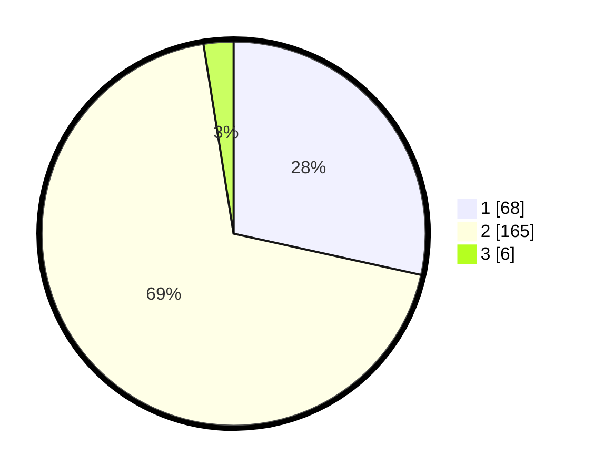

# Hasil

## Grafik

## Tabel

| No. | Nama Paslon    | Suara | Suara (raw) | Persentase |
|:--- |:-------------- | -----:| -----------:| ----------:|
| 1   | ANIES MUHAIMIN | 68    | [68][p-1]   | 28,45      |
| 2   | PRABOWO GIBRAN | 165   | [165][p-2]  | 69,04      |
| 3   | GANJAR MAHFUD  | 6     | [6][p-3]    | 2,51       |

[p-1]: https://github.com/gigit-pemilu/pemilu-2024/blob/main/pilpres/hitung-suara/sub/35-jawa-timur/sub/26-bangkalan/sub/03-burneh/sub/1005-tunjung/sub/010-tps/sub/paslon-1.txt
[p-2]: https://github.com/gigit-pemilu/pemilu-2024/blob/main/pilpres/hitung-suara/sub/35-jawa-timur/sub/26-bangkalan/sub/03-burneh/sub/1005-tunjung/sub/010-tps/sub/paslon-2.txt
[p-3]: https://github.com/gigit-pemilu/pemilu-2024/blob/main/pilpres/hitung-suara/sub/35-jawa-timur/sub/26-bangkalan/sub/03-burneh/sub/1005-tunjung/sub/010-tps/sub/paslon-3.txt

## Foto C Plano

https://sirekap-obj-formc.kpu.go.id/c7e4/pemilu/ppwp/35/26/03/10/05/3526031005010-20240214-155722--fb8f1af4-9477-4b5e-a050-6dd44be7a11d.jpg

https://sirekap-obj-formc.kpu.go.id/c7e4/pemilu/ppwp/35/26/03/10/05/3526031005010-20240214-155820--acdaa7ba-d8f0-4caf-bab5-afdab0a6b1da.jpg

https://sirekap-obj-formc.kpu.go.id/c7e4/pemilu/ppwp/35/26/03/10/05/3526031005010-20240214-155904--008edac5-21f3-4640-a712-e45d36b462a3.jpg

## Metadata

| Key        | Value               |
| ---------- | ------------------- |
| Time Stamp | 2024-02-17 16:36:25 |

