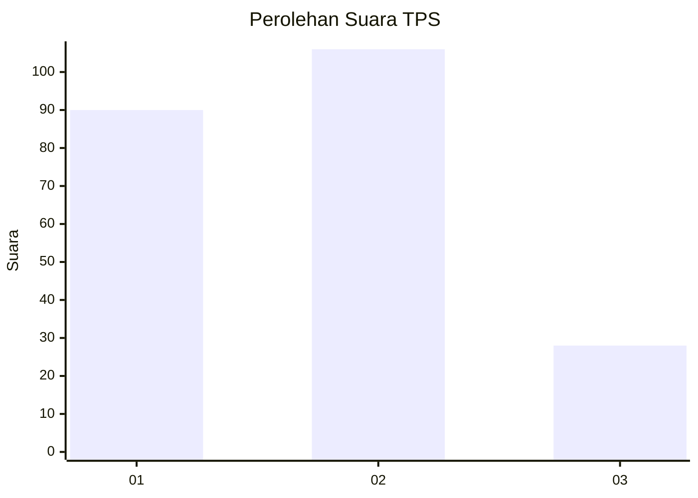
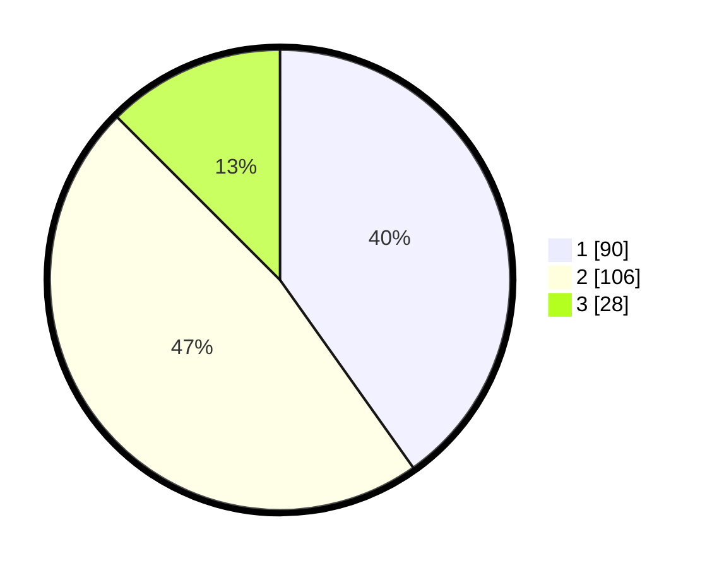

# Hasil

## Grafik

## Tabel

| No. | Nama Paslon    | Suara | Suara (raw) | Persentase |
|:--- |:-------------- | -----:| -----------:| ----------:|
| 1   | ANIES MUHAIMIN | 90    | [90][p-1]   | 40,18      |
| 2   | PRABOWO GIBRAN | 106   | [106][p-2]  | 47,32      |
| 3   | GANJAR MAHFUD  | 28    | [28][p-3]   | 12,50      |

[p-1]: https://github.com/gigit-pemilu/pemilu-2024/blob/main/pilpres/hitung-suara/sub/35-jawa-timur/sub/26-bangkalan/sub/03-burneh/sub/1005-tunjung/sub/024-tps/sub/paslon-1.txt
[p-2]: https://github.com/gigit-pemilu/pemilu-2024/blob/main/pilpres/hitung-suara/sub/35-jawa-timur/sub/26-bangkalan/sub/03-burneh/sub/1005-tunjung/sub/024-tps/sub/paslon-2.txt
[p-3]: https://github.com/gigit-pemilu/pemilu-2024/blob/main/pilpres/hitung-suara/sub/35-jawa-timur/sub/26-bangkalan/sub/03-burneh/sub/1005-tunjung/sub/024-tps/sub/paslon-3.txt

## Foto C Plano

https://sirekap-obj-formc.kpu.go.id/964b/pemilu/ppwp/35/26/03/10/05/3526031005024-20240214-184512--d3461743-c6d4-4c51-ae71-72d46d30aa38.jpg

https://sirekap-obj-formc.kpu.go.id/964b/pemilu/ppwp/35/26/03/10/05/3526031005024-20240214-184518--2a2bc2ec-d63f-427e-8ffa-8d4305c79a51.jpg

https://sirekap-obj-formc.kpu.go.id/964b/pemilu/ppwp/35/26/03/10/05/3526031005024-20240214-184526--f7d85992-5213-46bb-a607-1e7607c38689.jpg

## Metadata

| Key        | Value               |
| ---------- | ------------------- |
| Time Stamp | 2024-02-17 16:36:25 |

