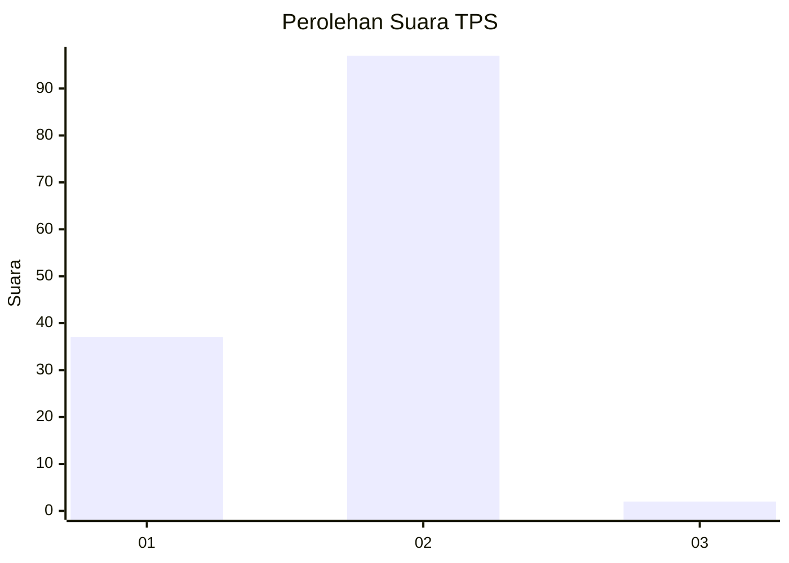
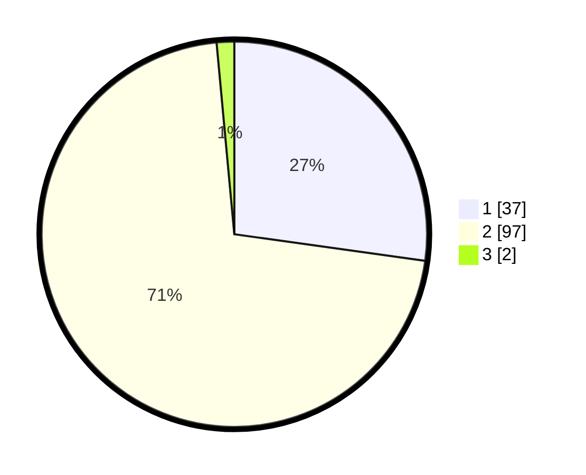

# Hasil

## Grafik

## Tabel

| No. | Nama Paslon    | Suara | Suara (raw) | Persentase |
|:--- |:-------------- | -----:| -----------:| ----------:|
| 1   | ANIES MUHAIMIN | 37    | [37][p-1]   | 27,21      |
| 2   | PRABOWO GIBRAN | 97    | [97][p-2]   | 71,32      |
| 3   | GANJAR MAHFUD  | 2     | [2][p-3]    | 1,47       |

[p-1]: https://github.com/gigit-pemilu/pemilu-2024/blob/main/pilpres/hitung-suara/sub/35-jawa-timur/sub/26-bangkalan/sub/03-burneh/sub/1005-tunjung/sub/037-tps/sub/paslon-1.txt
[p-2]: https://github.com/gigit-pemilu/pemilu-2024/blob/main/pilpres/hitung-suara/sub/35-jawa-timur/sub/26-bangkalan/sub/03-burneh/sub/1005-tunjung/sub/037-tps/sub/paslon-2.txt
[p-3]: https://github.com/gigit-pemilu/pemilu-2024/blob/main/pilpres/hitung-suara/sub/35-jawa-timur/sub/26-bangkalan/sub/03-burneh/sub/1005-tunjung/sub/037-tps/sub/paslon-3.txt

## Foto C Plano

https://sirekap-obj-formc.kpu.go.id/a042/pemilu/ppwp/35/26/03/10/05/3526031005037-20240215-125550--a3f5b1d5-b9d4-4c80-85e4-0fdf3d09c9ad.jpg

https://sirekap-obj-formc.kpu.go.id/a042/pemilu/ppwp/35/26/03/10/05/3526031005037-20240215-130033--8ef91f25-4cf9-452d-a33e-bcfda36c17e3.jpg

https://sirekap-obj-formc.kpu.go.id/a042/pemilu/ppwp/35/26/03/10/05/3526031005037-20240215-130331--bf4b2410-0f4e-43a7-9a93-bb9f539a0fa0.jpg

## Metadata

| Key        | Value               |
| ---------- | ------------------- |
| Time Stamp | 2024-02-21 20:00:00 |

