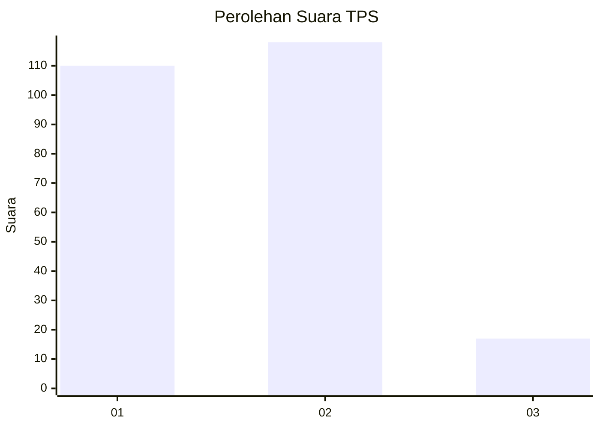
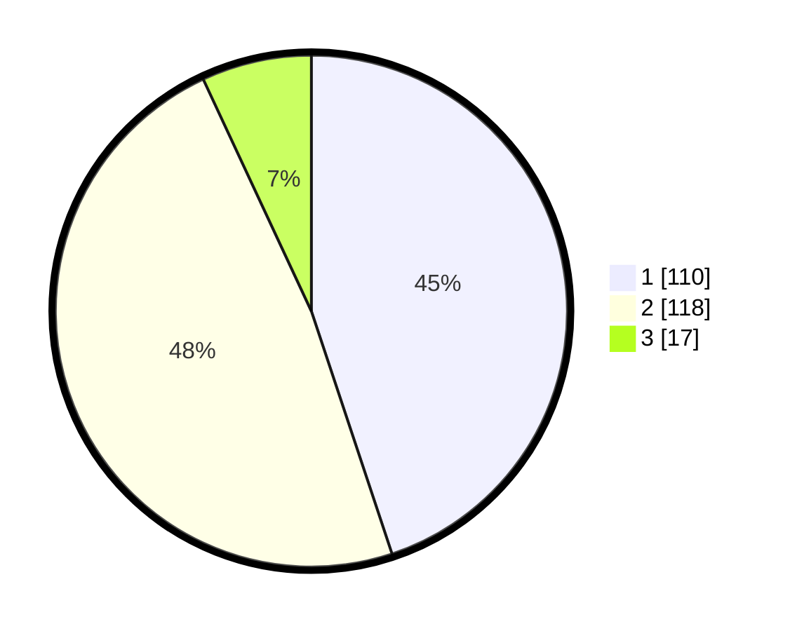

# Hasil

## Grafik

## Tabel

| No. | Nama Paslon    | Suara | Suara (raw) | Persentase |
|:--- |:-------------- | -----:| -----------:| ----------:|
| 1   | ANIES MUHAIMIN | 110   | [110][p-1]  | 44,90      |
| 2   | PRABOWO GIBRAN | 118   | [118][p-2]  | 48,16      |
| 3   | GANJAR MAHFUD  | 17    | [17][p-3]   | 6,94       |

[p-1]: https://github.com/gigit-pemilu/pemilu-2024-35-jawa-timur/blob/main/pilpres/hitung-suara/sub/35-jawa-timur/sub/26-bangkalan/sub/03-burneh/sub/2001-burneh/sub/005-tps/sub/paslon-1.txt
[p-2]: https://github.com/gigit-pemilu/pemilu-2024-35-jawa-timur/blob/main/pilpres/hitung-suara/sub/35-jawa-timur/sub/26-bangkalan/sub/03-burneh/sub/2001-burneh/sub/005-tps/sub/paslon-2.txt
[p-3]: https://github.com/gigit-pemilu/pemilu-2024-35-jawa-timur/blob/main/pilpres/hitung-suara/sub/35-jawa-timur/sub/26-bangkalan/sub/03-burneh/sub/2001-burneh/sub/005-tps/sub/paslon-3.txt

## Foto C Plano

https://sirekap-obj-formc.kpu.go.id/8d77/pemilu/ppwp/35/26/03/20/01/3526032001005-20240214-195721--01e85a2f-8b8f-4e79-812d-f170f26b0aa1.jpg

https://sirekap-obj-formc.kpu.go.id/8d77/pemilu/ppwp/35/26/03/20/01/3526032001005-20240214-195445--7d5b9f09-2eae-4cf3-b8c8-a408e29f53f6.jpg

https://sirekap-obj-formc.kpu.go.id/8d77/pemilu/ppwp/35/26/03/20/01/3526032001005-20240214-195557--b47d39ab-7c14-4ee0-98ee-6bb18dcc2172.jpg

## Metadata

| Key        | Value               |
| ---------- | ------------------- |
| Time Stamp | 2024-02-21 21:00:04 |

