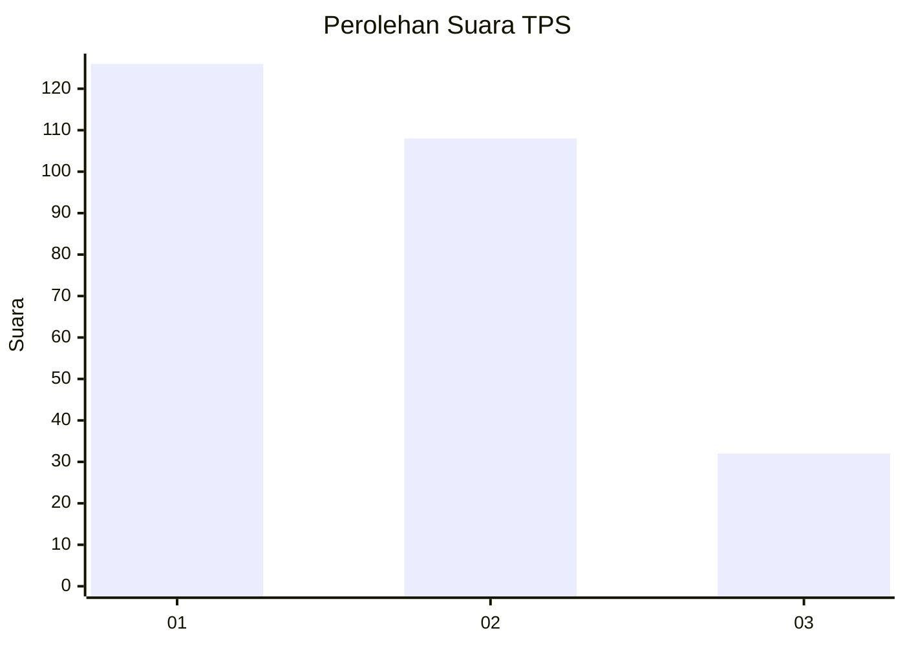
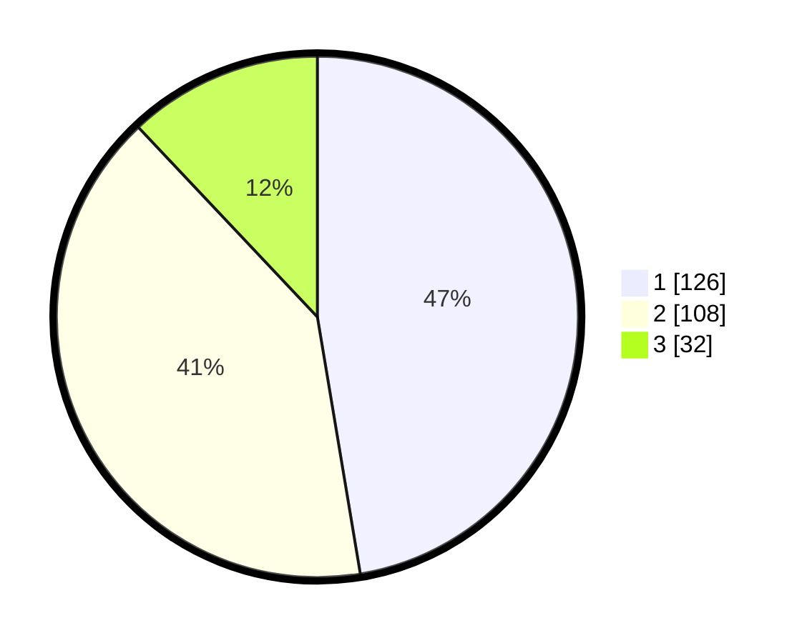

# Hasil

## Grafik

## Tabel

| No. | Nama Paslon    | Suara | Suara (raw) | Persentase |
|:--- |:-------------- | -----:| -----------:| ----------:|
| 1   | ANIES MUHAIMIN | 126   | [126][p-1]  | 47,37      |
| 2   | PRABOWO GIBRAN | 108   | [108][p-2]  | 40,60      |
| 3   | GANJAR MAHFUD  | 32    | [32][p-3]   | 12,03      |

[p-1]: https://github.com/gigit-pemilu/pemilu-2024-35-jawa-timur/blob/main/pilpres/hitung-suara/sub/35-jawa-timur/sub/26-bangkalan/sub/03-burneh/sub/2001-burneh/sub/006-tps/sub/paslon-1.txt
[p-2]: https://github.com/gigit-pemilu/pemilu-2024-35-jawa-timur/blob/main/pilpres/hitung-suara/sub/35-jawa-timur/sub/26-bangkalan/sub/03-burneh/sub/2001-burneh/sub/006-tps/sub/paslon-2.txt
[p-3]: https://github.com/gigit-pemilu/pemilu-2024-35-jawa-timur/blob/main/pilpres/hitung-suara/sub/35-jawa-timur/sub/26-bangkalan/sub/03-burneh/sub/2001-burneh/sub/006-tps/sub/paslon-3.txt

## Foto C Plano

https://sirekap-obj-formc.kpu.go.id/3bdf/pemilu/ppwp/35/26/03/20/01/3526032001006-20240220-202315--d6534b8f-1010-4e81-b403-e44480b7db7f.jpg

https://sirekap-obj-formc.kpu.go.id/3bdf/pemilu/ppwp/35/26/03/20/01/3526032001006-20240220-202324--9def05cc-e61c-4cb9-94bf-003f81fee7e7.jpg

https://sirekap-obj-formc.kpu.go.id/3bdf/pemilu/ppwp/35/26/03/20/01/3526032001006-20240220-202345--447319fc-9927-4da1-b841-90dda58696a1.jpg

## Metadata

| Key        | Value               |
| ---------- | ------------------- |
| Time Stamp | 2024-02-24 22:31:28 |

