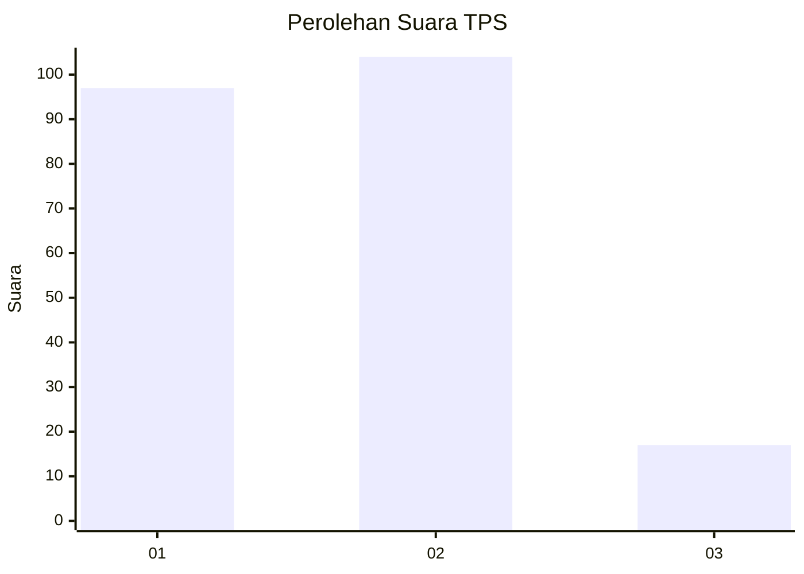
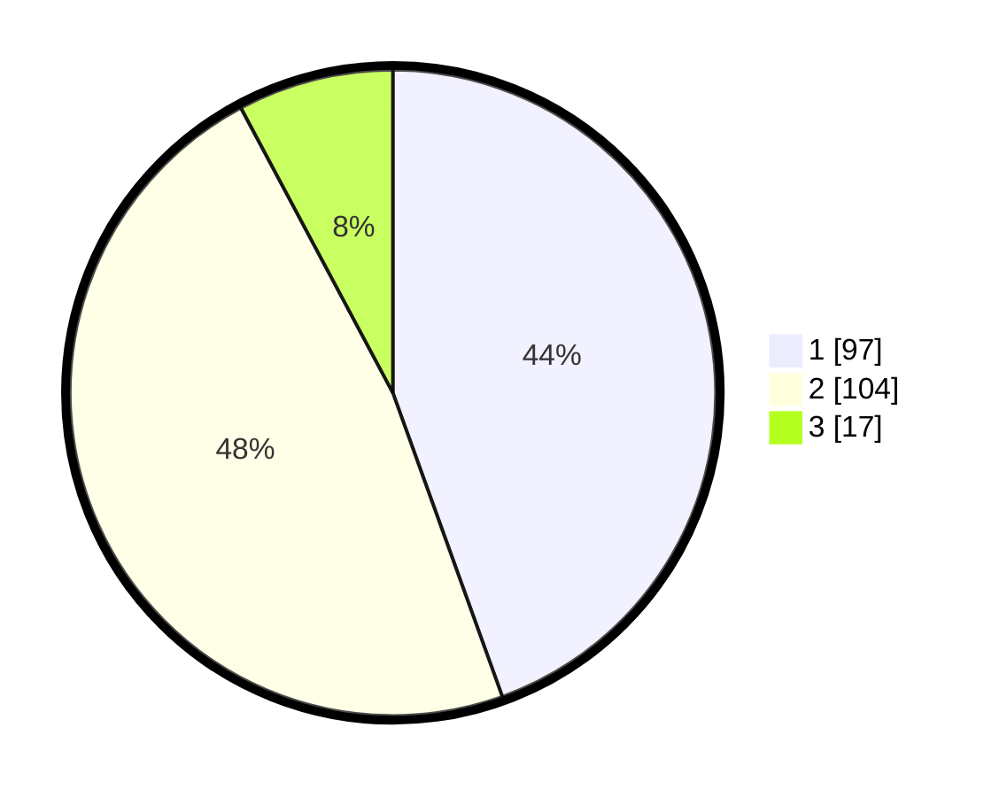

# Hasil

## Grafik

## Tabel

| No. | Nama Paslon    | Suara | Suara (raw) | Persentase |
|:--- |:-------------- | -----:| -----------:| ----------:|
| 1   | ANIES MUHAIMIN | 97    | [97][p-1]   | 44,50      |
| 2   | PRABOWO GIBRAN | 104   | [104][p-2]  | 47,71      |
| 3   | GANJAR MAHFUD  | 17    | [17][p-3]   | 7,80       |

[p-1]: https://github.com/gigit-pemilu/pemilu-2024/blob/main/pilpres/hitung-suara/sub/35-jawa-timur/sub/26-bangkalan/sub/03-burneh/sub/2002-langkap/sub/004-tps/sub/paslon-1.txt
[p-2]: https://github.com/gigit-pemilu/pemilu-2024/blob/main/pilpres/hitung-suara/sub/35-jawa-timur/sub/26-bangkalan/sub/03-burneh/sub/2002-langkap/sub/004-tps/sub/paslon-2.txt
[p-3]: https://github.com/gigit-pemilu/pemilu-2024/blob/main/pilpres/hitung-suara/sub/35-jawa-timur/sub/26-bangkalan/sub/03-burneh/sub/2002-langkap/sub/004-tps/sub/paslon-3.txt

## Foto C Plano

https://sirekap-obj-formc.kpu.go.id/8b0c/pemilu/ppwp/35/26/03/20/02/3526032002004-20240214-232040--073bb476-1c44-42ea-923a-319fc84e0f4e.jpg

https://sirekap-obj-formc.kpu.go.id/8b0c/pemilu/ppwp/35/26/03/20/02/3526032002004-20240214-232614--e9e2925d-24ad-4755-b943-ecab372d3694.jpg

https://sirekap-obj-formc.kpu.go.id/8b0c/pemilu/ppwp/35/26/03/20/02/3526032002004-20240214-232711--15bc0900-7583-4273-a071-abec5a94bcab.jpg

## Metadata

| Key        | Value               |
| ---------- | ------------------- |
| Time Stamp | 2024-02-17 19:30:00 |

