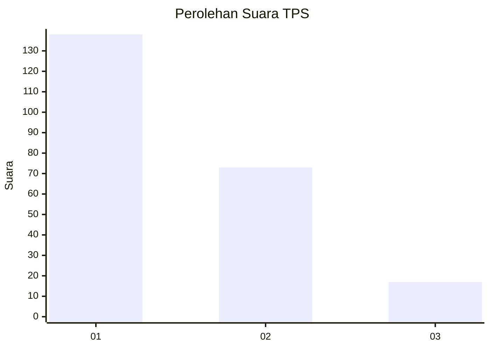
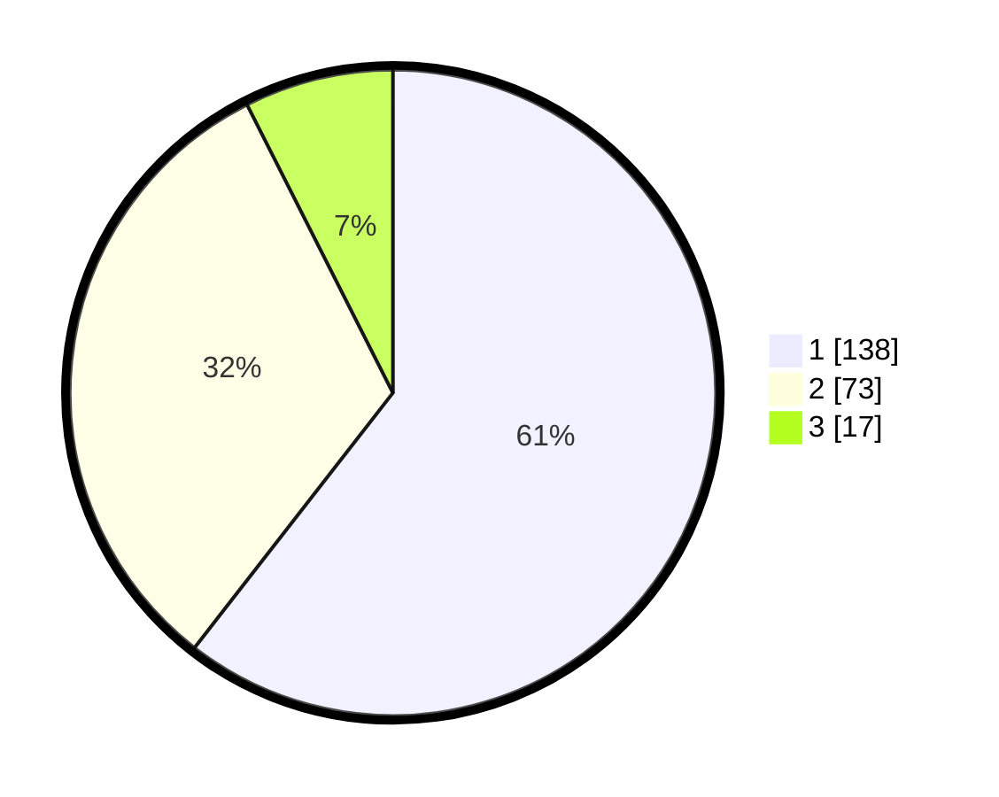

# Hasil

## Grafik

## Tabel

| No. | Nama Paslon    | Suara | Suara (raw) | Persentase |
|:--- |:-------------- | -----:| -----------:| ----------:|
| 1   | ANIES MUHAIMIN | 138   | [138][p-1]  | 60,53      |
| 2   | PRABOWO GIBRAN | 73    | [73][p-2]   | 32,02      |
| 3   | GANJAR MAHFUD  | 17    | [17][p-3]   | 7,46       |

[p-1]: https://github.com/gigit-pemilu/pemilu-2024-35-jawa-timur/blob/main/pilpres/hitung-suara/sub/35-jawa-timur/sub/26-bangkalan/sub/03-burneh/sub/2002-langkap/sub/010-tps/sub/paslon-1.txt
[p-2]: https://github.com/gigit-pemilu/pemilu-2024-35-jawa-timur/blob/main/pilpres/hitung-suara/sub/35-jawa-timur/sub/26-bangkalan/sub/03-burneh/sub/2002-langkap/sub/010-tps/sub/paslon-2.txt
[p-3]: https://github.com/gigit-pemilu/pemilu-2024-35-jawa-timur/blob/main/pilpres/hitung-suara/sub/35-jawa-timur/sub/26-bangkalan/sub/03-burneh/sub/2002-langkap/sub/010-tps/sub/paslon-3.txt

## Foto C Plano

https://sirekap-obj-formc.kpu.go.id/eb1f/pemilu/ppwp/35/26/03/20/02/3526032002010-20240214-195848--f985e4d7-af8a-47b5-a38e-8e509da4669b.jpg

https://sirekap-obj-formc.kpu.go.id/eb1f/pemilu/ppwp/35/26/03/20/02/3526032002010-20240214-195855--ad441256-969f-4bea-9e0e-c4321c2643ca.jpg

https://sirekap-obj-formc.kpu.go.id/eb1f/pemilu/ppwp/35/26/03/20/02/3526032002010-20240214-195902--a54602c4-99ed-45ef-af13-8b7f1b4f7b29.jpg

## Metadata

| Key        | Value               |
| ---------- | ------------------- |
| Time Stamp | 2024-02-17 19:30:00 |

