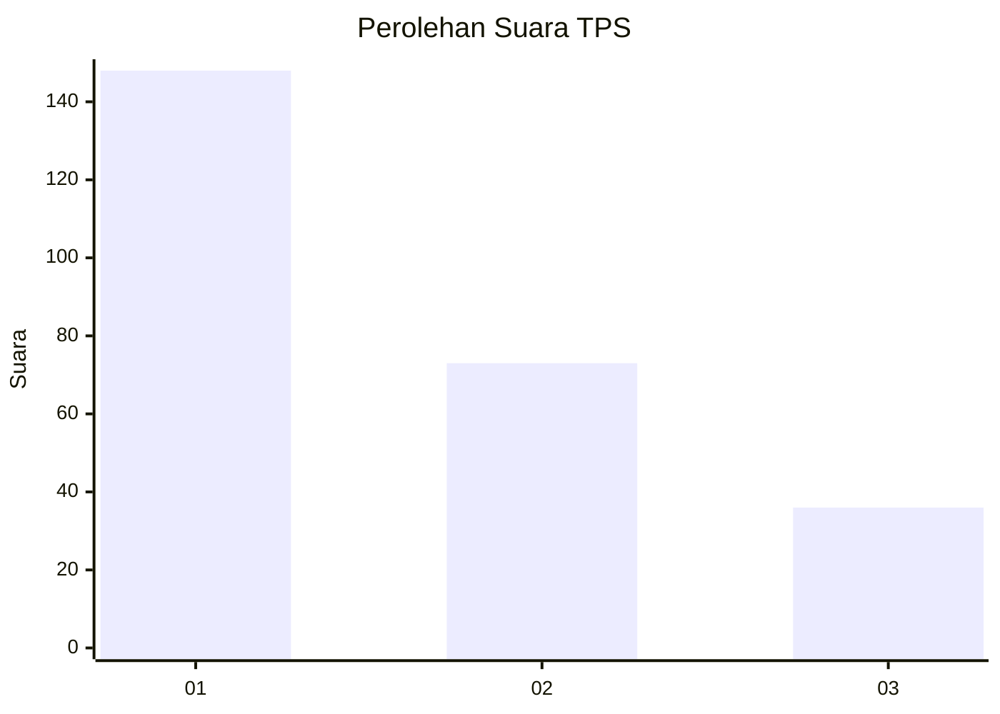
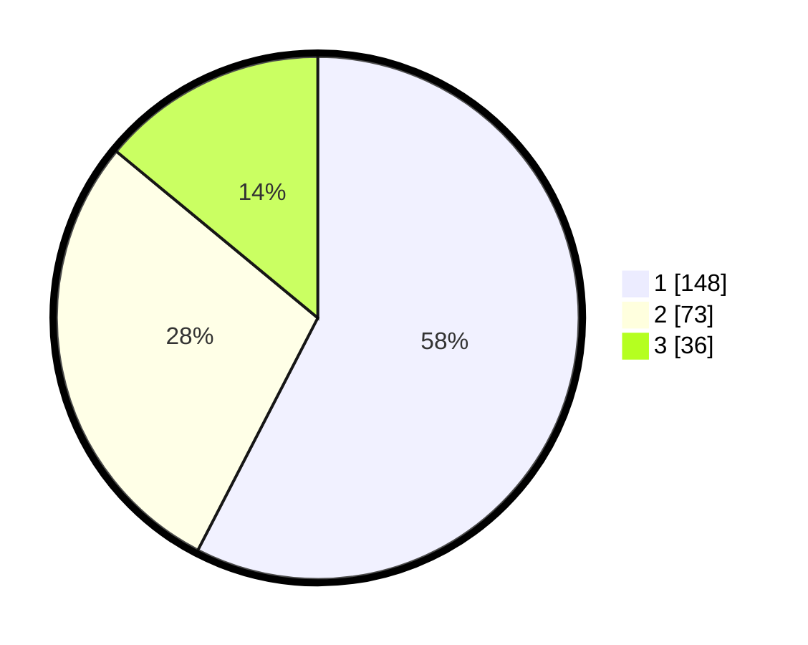

# Hasil

## Grafik

## Tabel

| No. | Nama Paslon    | Suara | Suara (raw) | Persentase |
|:--- |:-------------- | -----:| -----------:| ----------:|
| 1   | ANIES MUHAIMIN | 148   | [148][p-1]  | 57,59      |
| 2   | PRABOWO GIBRAN | 73    | [73][p-2]   | 28,40      |
| 3   | GANJAR MAHFUD  | 36    | [36][p-3]   | 14,01      |

[p-1]: https://github.com/gigit-pemilu/pemilu-2024/blob/main/pilpres/hitung-suara/sub/35-jawa-timur/sub/26-bangkalan/sub/03-burneh/sub/2002-langkap/sub/014-tps/sub/paslon-1.txt
[p-2]: https://github.com/gigit-pemilu/pemilu-2024/blob/main/pilpres/hitung-suara/sub/35-jawa-timur/sub/26-bangkalan/sub/03-burneh/sub/2002-langkap/sub/014-tps/sub/paslon-2.txt
[p-3]: https://github.com/gigit-pemilu/pemilu-2024/blob/main/pilpres/hitung-suara/sub/35-jawa-timur/sub/26-bangkalan/sub/03-burneh/sub/2002-langkap/sub/014-tps/sub/paslon-3.txt

## Foto C Plano

https://sirekap-obj-formc.kpu.go.id/b99c/pemilu/ppwp/35/26/03/20/02/3526032002014-20240214-215626--ec443087-bb2b-455b-9bf0-2453ab837047.jpg

https://sirekap-obj-formc.kpu.go.id/b99c/pemilu/ppwp/35/26/03/20/02/3526032002014-20240214-215718--1350cb7d-5b52-4826-8427-c625dea1f7dd.jpg

https://sirekap-obj-formc.kpu.go.id/b99c/pemilu/ppwp/35/26/03/20/02/3526032002014-20240214-215816--895f9191-6217-4efa-b15c-eb3918a1d757.jpg

## Metadata

| Key        | Value               |
| ---------- | ------------------- |
| Time Stamp | 2024-02-17 19:30:00 |

