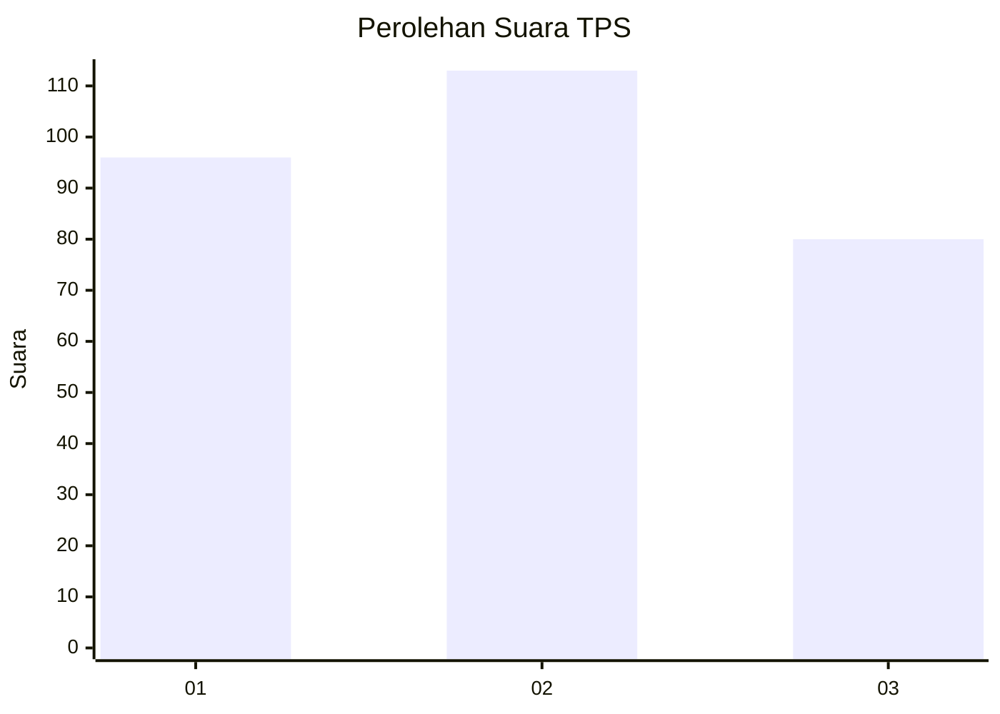
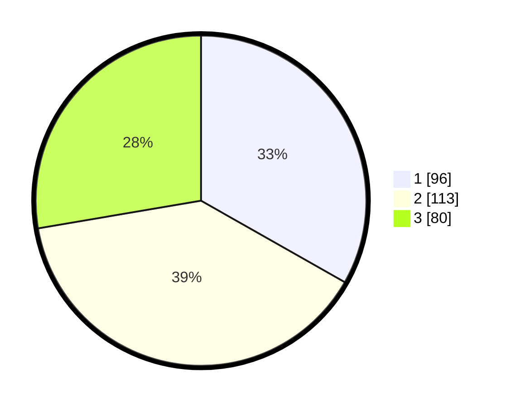

# Hasil

## Grafik

## Tabel

| No. | Nama Paslon    | Suara | Suara (raw) | Persentase |
|:--- |:-------------- | -----:| -----------:| ----------:|
| 1   | ANIES MUHAIMIN | 96    | [96][p-1]   | 33,22      |
| 2   | PRABOWO GIBRAN | 113   | [113][p-2]  | 39,10      |
| 3   | GANJAR MAHFUD  | 80    | [80][p-3]   | 27,68      |

[p-1]: https://github.com/gigit-pemilu/pemilu-2024-35-jawa-timur/blob/main/pilpres/hitung-suara/sub/35-jawa-timur/sub/26-bangkalan/sub/03-burneh/sub/2002-langkap/sub/020-tps/sub/paslon-1.txt
[p-2]: https://github.com/gigit-pemilu/pemilu-2024-35-jawa-timur/blob/main/pilpres/hitung-suara/sub/35-jawa-timur/sub/26-bangkalan/sub/03-burneh/sub/2002-langkap/sub/020-tps/sub/paslon-2.txt
[p-3]: https://github.com/gigit-pemilu/pemilu-2024-35-jawa-timur/blob/main/pilpres/hitung-suara/sub/35-jawa-timur/sub/26-bangkalan/sub/03-burneh/sub/2002-langkap/sub/020-tps/sub/paslon-3.txt

## Foto C Plano

https://sirekap-obj-formc.kpu.go.id/bfdc/pemilu/ppwp/35/26/03/20/02/3526032002020-20240214-234501--55580072-6326-4092-822e-b9661e0679d9.jpg

https://sirekap-obj-formc.kpu.go.id/bfdc/pemilu/ppwp/35/26/03/20/02/3526032002020-20240214-234548--6cb8497d-a391-496e-a9fe-85bfe7145820.jpg

https://sirekap-obj-formc.kpu.go.id/bfdc/pemilu/ppwp/35/26/03/20/02/3526032002020-20240214-234728--c8995bae-4f1b-495e-8115-f6d4e62a02af.jpg

## Metadata

| Key        | Value               |
| ---------- | ------------------- |
| Time Stamp | 2024-02-17 19:30:00 |

