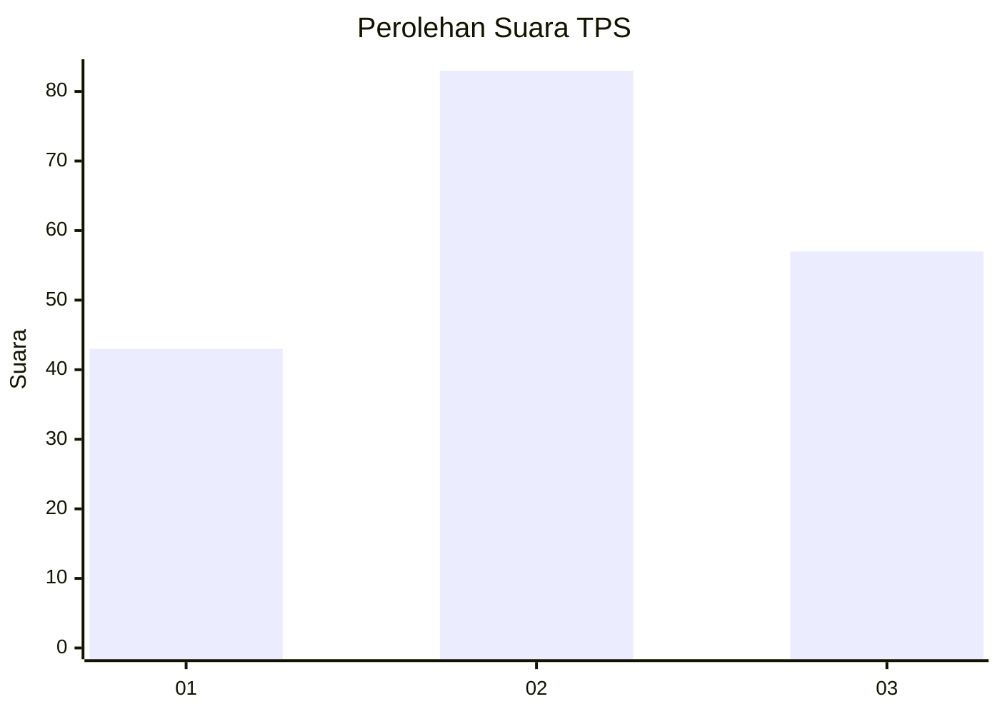
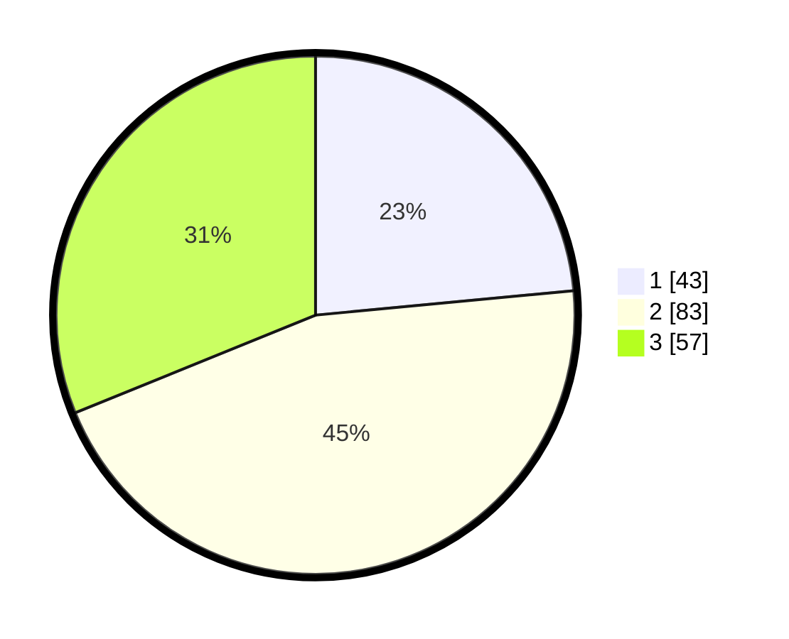

# Hasil

## Grafik

## Tabel

| No. | Nama Paslon    | Suara | Suara (raw) | Persentase |
|:--- |:-------------- | -----:| -----------:| ----------:|
| 1   | ANIES MUHAIMIN | 43    | [43][p-1]   | 23,50      |
| 2   | PRABOWO GIBRAN | 83    | [83][p-2]   | 45,36      |
| 3   | GANJAR MAHFUD  | 57    | [57][p-3]   | 31,15      |

[p-1]: https://github.com/gigit-pemilu/pemilu-2024/blob/main/pilpres/hitung-suara/sub/35-jawa-timur/sub/26-bangkalan/sub/03-burneh/sub/2004-alaskembang/sub/007-tps/sub/paslon-1.txt
[p-2]: https://github.com/gigit-pemilu/pemilu-2024/blob/main/pilpres/hitung-suara/sub/35-jawa-timur/sub/26-bangkalan/sub/03-burneh/sub/2004-alaskembang/sub/007-tps/sub/paslon-2.txt
[p-3]: https://github.com/gigit-pemilu/pemilu-2024/blob/main/pilpres/hitung-suara/sub/35-jawa-timur/sub/26-bangkalan/sub/03-burneh/sub/2004-alaskembang/sub/007-tps/sub/paslon-3.txt

## Foto C Plano

https://sirekap-obj-formc.kpu.go.id/b472/pemilu/ppwp/35/26/03/20/04/3526032004007-20240214-231915--b3644411-13f9-4dd7-9991-de122e341871.jpg

https://sirekap-obj-formc.kpu.go.id/b472/pemilu/ppwp/35/26/03/20/04/3526032004007-20240214-232314--05ff4ad6-0a3a-499e-b39b-2946ac60e542.jpg

https://sirekap-obj-formc.kpu.go.id/b472/pemilu/ppwp/35/26/03/20/04/3526032004007-20240214-232754--1ec75bcf-e720-4686-9bfb-ffab1078625d.jpg

## Metadata

| Key        | Value               |
| ---------- | ------------------- |
| Time Stamp | 2024-02-17 19:30:00 |

