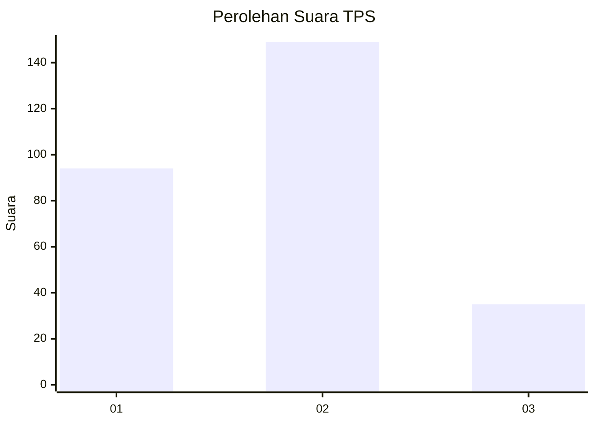
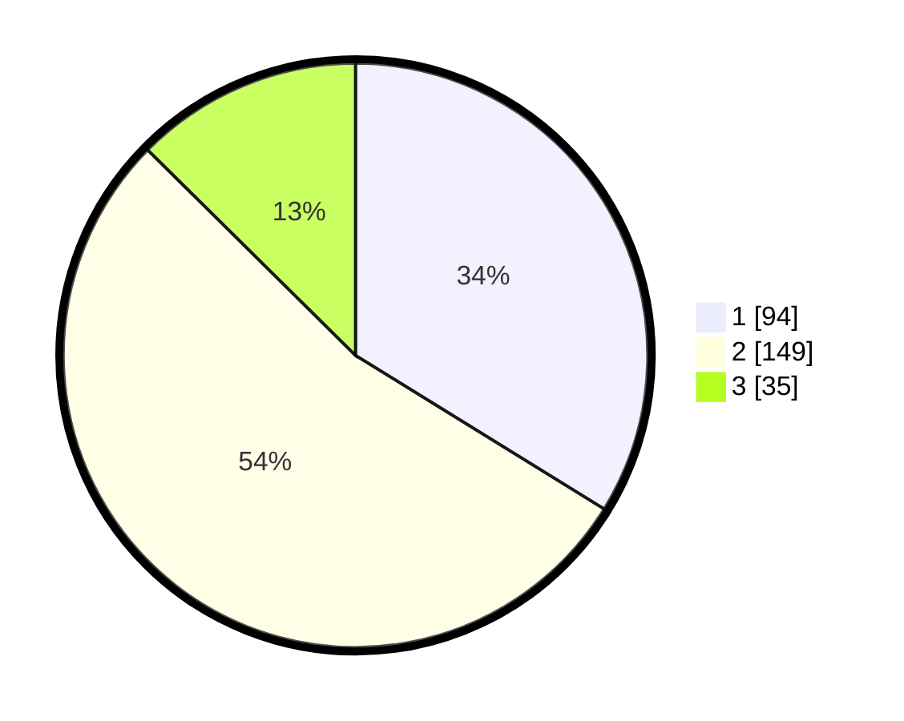

# Hasil

## Grafik

## Tabel

| No. | Nama Paslon    | Suara | Suara (raw) | Persentase |
|:--- |:-------------- | -----:| -----------:| ----------:|
| 1   | ANIES MUHAIMIN | 94    | [94][p-1]   | 33,81      |
| 2   | PRABOWO GIBRAN | 149   | [149][p-2]  | 53,60      |
| 3   | GANJAR MAHFUD  | 35    | [35][p-3]   | 12,59      |

[p-1]: https://github.com/gigit-pemilu/pemilu-2024/blob/main/pilpres/hitung-suara/sub/35-jawa-timur/sub/26-bangkalan/sub/03-burneh/sub/2006-arok/sub/002-tps/sub/paslon-1.txt
[p-2]: https://github.com/gigit-pemilu/pemilu-2024/blob/main/pilpres/hitung-suara/sub/35-jawa-timur/sub/26-bangkalan/sub/03-burneh/sub/2006-arok/sub/002-tps/sub/paslon-2.txt
[p-3]: https://github.com/gigit-pemilu/pemilu-2024/blob/main/pilpres/hitung-suara/sub/35-jawa-timur/sub/26-bangkalan/sub/03-burneh/sub/2006-arok/sub/002-tps/sub/paslon-3.txt

## Foto C Plano

https://sirekap-obj-formc.kpu.go.id/4541/pemilu/ppwp/35/26/03/20/06/3526032006002-20240214-235343--72056a00-9e40-43f5-9407-73ebcc06418b.jpg

https://sirekap-obj-formc.kpu.go.id/4541/pemilu/ppwp/35/26/03/20/06/3526032006002-20240215-020754--2e70bdf7-1e72-4caf-b1cc-f33f40dee75a.jpg

https://sirekap-obj-formc.kpu.go.id/4541/pemilu/ppwp/35/26/03/20/06/3526032006002-20240214-235535--55cc5d75-9c70-4d31-9520-140fc88e8dcc.jpg

## Metadata

| Key        | Value               |
| ---------- | ------------------- |
| Time Stamp | 2024-02-17 19:30:00 |

