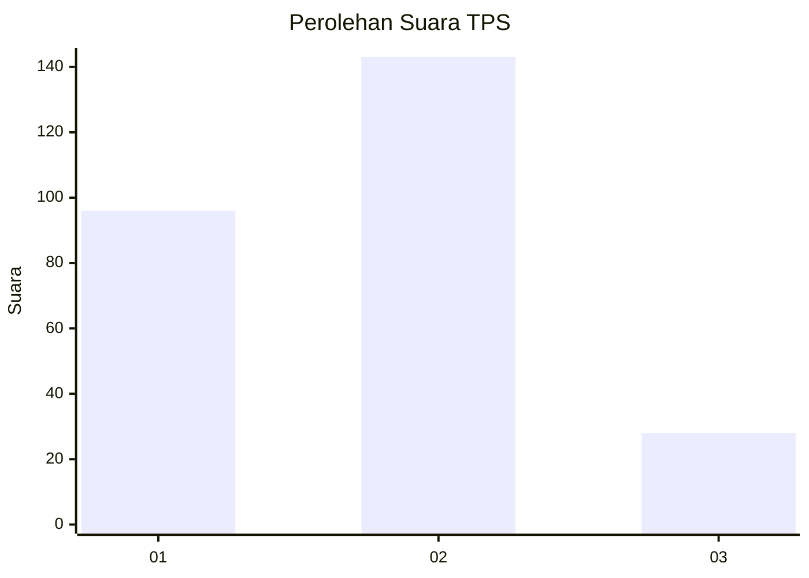
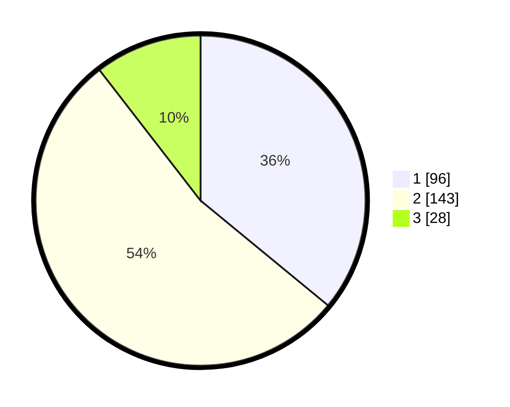

# Hasil

## Grafik

## Tabel

| No. | Nama Paslon    | Suara | Suara (raw) | Persentase |
|:--- |:-------------- | -----:| -----------:| ----------:|
| 1   | ANIES MUHAIMIN | 96    | [96][p-1]   | 35,96      |
| 2   | PRABOWO GIBRAN | 143   | [143][p-2]  | 53,56      |
| 3   | GANJAR MAHFUD  | 28    | [28][p-3]   | 10,49      |

[p-1]: https://github.com/gigit-pemilu/pemilu-2024/blob/main/pilpres/hitung-suara/sub/35-jawa-timur/sub/26-bangkalan/sub/03-burneh/sub/2008-sobih/sub/004-tps/sub/paslon-1.txt
[p-2]: https://github.com/gigit-pemilu/pemilu-2024/blob/main/pilpres/hitung-suara/sub/35-jawa-timur/sub/26-bangkalan/sub/03-burneh/sub/2008-sobih/sub/004-tps/sub/paslon-2.txt
[p-3]: https://github.com/gigit-pemilu/pemilu-2024/blob/main/pilpres/hitung-suara/sub/35-jawa-timur/sub/26-bangkalan/sub/03-burneh/sub/2008-sobih/sub/004-tps/sub/paslon-3.txt

## Foto C Plano

https://sirekap-obj-formc.kpu.go.id/8a37/pemilu/ppwp/35/26/03/20/08/3526032008004-20240214-213920--2455b0e9-3069-4243-b122-b48ea04f30d9.jpg

https://sirekap-obj-formc.kpu.go.id/8a37/pemilu/ppwp/35/26/03/20/08/3526032008004-20240214-214808--1d546b9e-4dd2-4417-a3cd-0ec4953e3e26.jpg

https://sirekap-obj-formc.kpu.go.id/8a37/pemilu/ppwp/35/26/03/20/08/3526032008004-20240214-215022--54207c3b-0dff-4778-aeaa-1af5bdb761c4.jpg

## Metadata

| Key        | Value               |
| ---------- | ------------------- |
| Time Stamp | 2024-02-25 11:00:00 |

