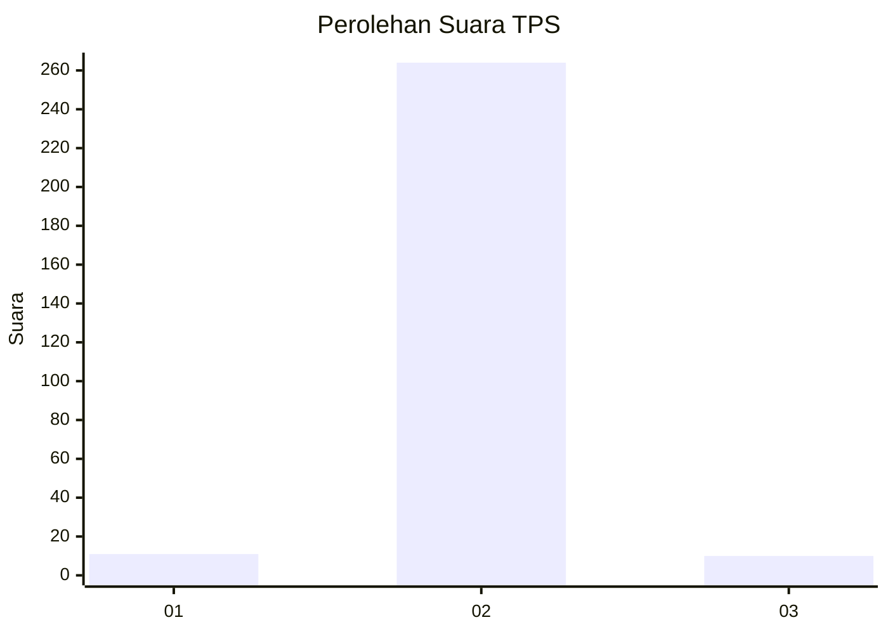
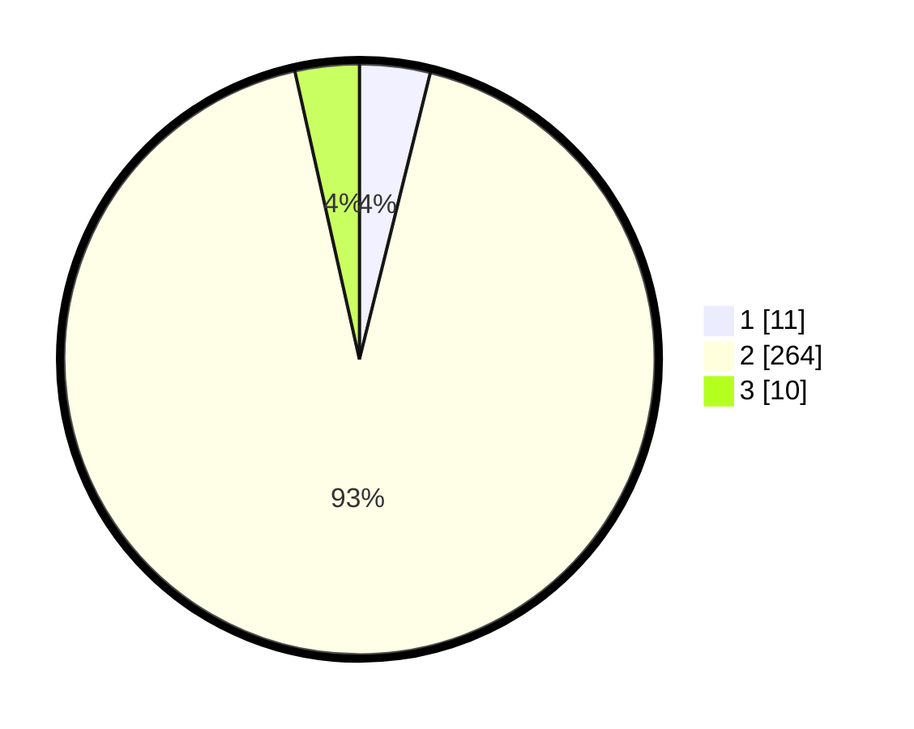

# Hasil

## Grafik

## Tabel

| No. | Nama Paslon    | Suara | Suara (raw) | Persentase |
|:--- |:-------------- | -----:| -----------:| ----------:|
| 1   | ANIES MUHAIMIN | 11    | [11][p-1]   | 3,86       |
| 2   | PRABOWO GIBRAN | 264   | [264][p-2]  | 92,63      |
| 3   | GANJAR MAHFUD  | 10    | [10][p-3]   | 3,51       |

[p-1]: https://github.com/gigit-pemilu/pemilu-2024/blob/main/pilpres/hitung-suara/sub/35-jawa-timur/sub/26-bangkalan/sub/03-burneh/sub/2011-perreng/sub/001-tps/sub/paslon-1.txt
[p-2]: https://github.com/gigit-pemilu/pemilu-2024/blob/main/pilpres/hitung-suara/sub/35-jawa-timur/sub/26-bangkalan/sub/03-burneh/sub/2011-perreng/sub/001-tps/sub/paslon-2.txt
[p-3]: https://github.com/gigit-pemilu/pemilu-2024/blob/main/pilpres/hitung-suara/sub/35-jawa-timur/sub/26-bangkalan/sub/03-burneh/sub/2011-perreng/sub/001-tps/sub/paslon-3.txt

## Foto C Plano

https://sirekap-obj-formc.kpu.go.id/e73b/pemilu/ppwp/35/26/03/20/11/3526032011001-20240214-194159--7131bdeb-3568-4819-81a9-ff96effad1da.jpg

https://sirekap-obj-formc.kpu.go.id/e73b/pemilu/ppwp/35/26/03/20/11/3526032011001-20240214-194209--639b5a5e-c07f-496a-859c-e4356abf0a8a.jpg

https://sirekap-obj-formc.kpu.go.id/e73b/pemilu/ppwp/35/26/03/20/11/3526032011001-20240214-194213--c872185b-3c11-4d0e-bcb2-bfde44630ab1.jpg

## Metadata

| Key        | Value               |
| ---------- | ------------------- |
| Time Stamp | 2024-02-17 19:30:00 |

