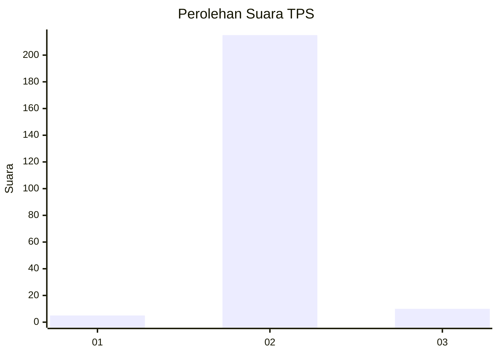
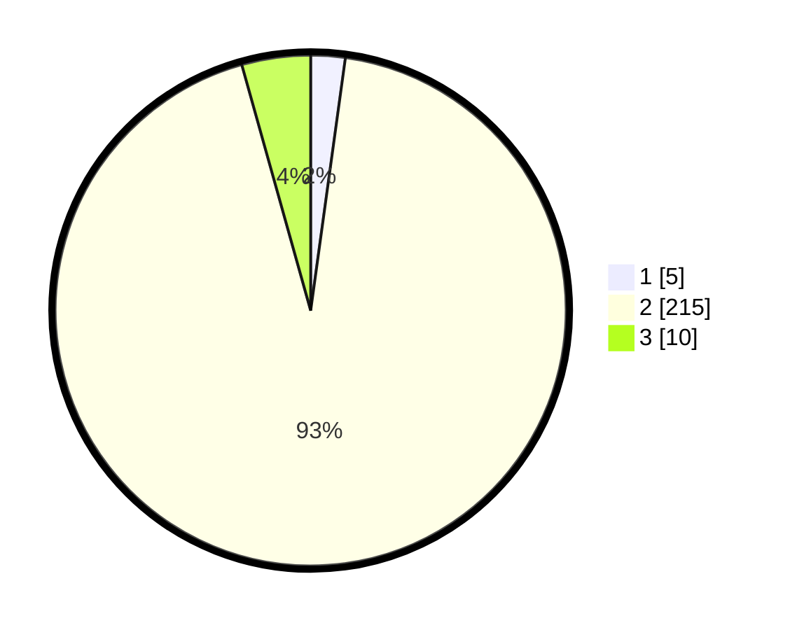

# Hasil

## Grafik

## Tabel

| No. | Nama Paslon    | Suara | Suara (raw) | Persentase |
|:--- |:-------------- | -----:| -----------:| ----------:|
| 1   | ANIES MUHAIMIN | 5     | [5][p-1]    | 2,17       |
| 2   | PRABOWO GIBRAN | 215   | [215][p-2]  | 93,48      |
| 3   | GANJAR MAHFUD  | 10    | [10][p-3]   | 4,35       |

[p-1]: https://github.com/gigit-pemilu/pemilu-2024-35-jawa-timur/blob/main/pilpres/hitung-suara/sub/35-jawa-timur/sub/26-bangkalan/sub/03-burneh/sub/2011-perreng/sub/005-tps/sub/paslon-1.txt
[p-2]: https://github.com/gigit-pemilu/pemilu-2024-35-jawa-timur/blob/main/pilpres/hitung-suara/sub/35-jawa-timur/sub/26-bangkalan/sub/03-burneh/sub/2011-perreng/sub/005-tps/sub/paslon-2.txt
[p-3]: https://github.com/gigit-pemilu/pemilu-2024-35-jawa-timur/blob/main/pilpres/hitung-suara/sub/35-jawa-timur/sub/26-bangkalan/sub/03-burneh/sub/2011-perreng/sub/005-tps/sub/paslon-3.txt

## Foto C Plano

https://sirekap-obj-formc.kpu.go.id/94ab/pemilu/ppwp/35/26/03/20/11/3526032011005-20240215-212050--34c99a31-877d-4dea-9bac-4853375fb16b.jpg

https://sirekap-obj-formc.kpu.go.id/94ab/pemilu/ppwp/35/26/03/20/11/3526032011005-20240215-212131--40727da9-e1bf-4828-a45b-f25a6d445177.jpg

https://sirekap-obj-formc.kpu.go.id/94ab/pemilu/ppwp/35/26/03/20/11/3526032011005-20240215-212159--a97eb83c-aec5-4b79-8379-ca009b8d6e40.jpg

## Metadata

| Key        | Value               |
| ---------- | ------------------- |
| Time Stamp | 2024-02-17 19:30:00 |

