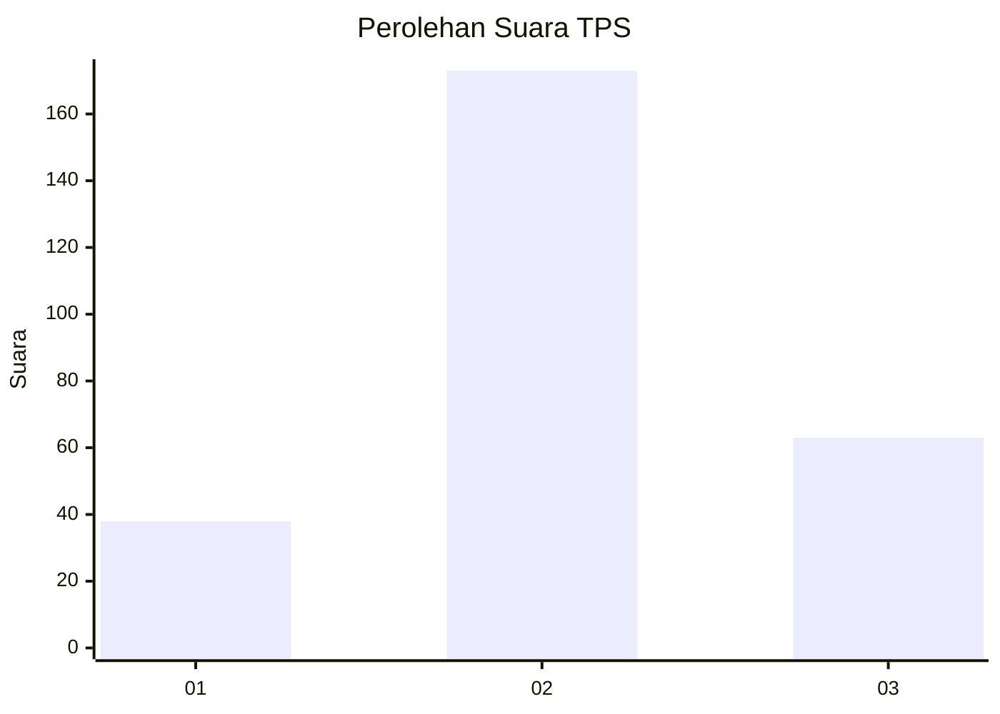
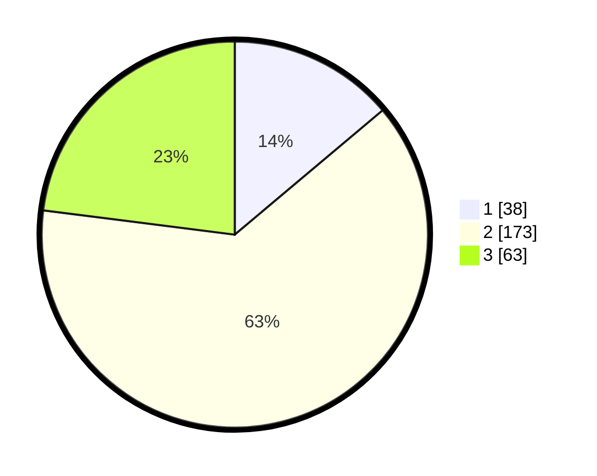

# Hasil

## Grafik

## Tabel

| No. | Nama Paslon    | Suara | Suara (raw) | Persentase |
|:--- |:-------------- | -----:| -----------:| ----------:|
| 1   | ANIES MUHAIMIN | 38    | [38][p-1]   | 13,87      |
| 2   | PRABOWO GIBRAN | 173   | [173][p-2]  | 63,14      |
| 3   | GANJAR MAHFUD  | 63    | [63][p-3]   | 22,99      |

[p-1]: https://github.com/gigit-pemilu/pemilu-2024/blob/main/pilpres/hitung-suara/sub/35-jawa-timur/sub/26-bangkalan/sub/03-burneh/sub/2011-perreng/sub/008-tps/sub/paslon-1.txt
[p-2]: https://github.com/gigit-pemilu/pemilu-2024/blob/main/pilpres/hitung-suara/sub/35-jawa-timur/sub/26-bangkalan/sub/03-burneh/sub/2011-perreng/sub/008-tps/sub/paslon-2.txt
[p-3]: https://github.com/gigit-pemilu/pemilu-2024/blob/main/pilpres/hitung-suara/sub/35-jawa-timur/sub/26-bangkalan/sub/03-burneh/sub/2011-perreng/sub/008-tps/sub/paslon-3.txt

## Foto C Plano

https://sirekap-obj-formc.kpu.go.id/cff2/pemilu/ppwp/35/26/03/20/11/3526032011008-20240214-205850--8ff9c848-5c83-47ec-b2be-1cea464decea.jpg

https://sirekap-obj-formc.kpu.go.id/cff2/pemilu/ppwp/35/26/03/20/11/3526032011008-20240214-210011--6f676369-9e2b-4723-9ba2-6588207bbeb9.jpg

https://sirekap-obj-formc.kpu.go.id/cff2/pemilu/ppwp/35/26/03/20/11/3526032011008-20240214-210107--258a18b6-2b48-421f-8479-a9ecdaa4a5c2.jpg

## Metadata

| Key        | Value               |
| ---------- | ------------------- |
| Time Stamp | 2024-02-17 19:30:00 |

