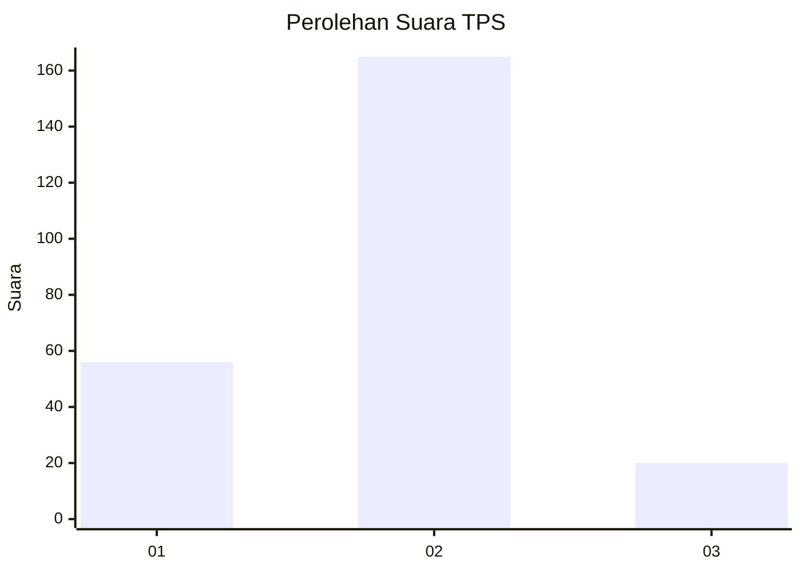
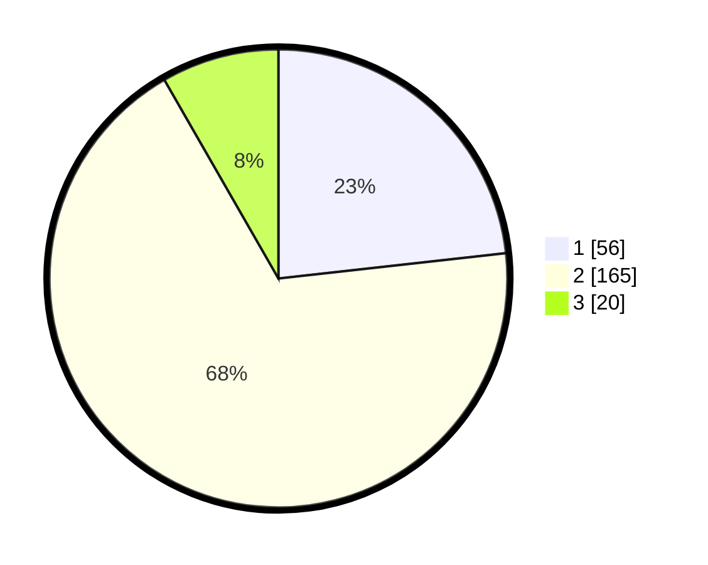

# Hasil

## Grafik

## Tabel

| No. | Nama Paslon    | Suara | Suara (raw) | Persentase |
|:--- |:-------------- | -----:| -----------:| ----------:|
| 1   | ANIES MUHAIMIN | 56    | [56][p-1]   | 23,24      |
| 2   | PRABOWO GIBRAN | 165   | [165][p-2]  | 68,46      |
| 3   | GANJAR MAHFUD  | 20    | [20][p-3]   | 8,30       |

[p-1]: https://github.com/gigit-pemilu/pemilu-2024/blob/main/pilpres/hitung-suara/sub/35-jawa-timur/sub/26-bangkalan/sub/04-kamal/sub/2001-kamal/sub/002-tps/sub/paslon-1.txt
[p-2]: https://github.com/gigit-pemilu/pemilu-2024/blob/main/pilpres/hitung-suara/sub/35-jawa-timur/sub/26-bangkalan/sub/04-kamal/sub/2001-kamal/sub/002-tps/sub/paslon-2.txt
[p-3]: https://github.com/gigit-pemilu/pemilu-2024/blob/main/pilpres/hitung-suara/sub/35-jawa-timur/sub/26-bangkalan/sub/04-kamal/sub/2001-kamal/sub/002-tps/sub/paslon-3.txt

## Foto C Plano

https://sirekap-obj-formc.kpu.go.id/bc92/pemilu/ppwp/35/26/04/20/01/3526042001002-20240215-002851--3505b2b3-73fe-46b6-b9fc-785581a71143.jpg

https://sirekap-obj-formc.kpu.go.id/bc92/pemilu/ppwp/35/26/04/20/01/3526042001002-20240215-003039--cf265289-ac9e-4cad-b305-10613ab27464.jpg

https://sirekap-obj-formc.kpu.go.id/bc92/pemilu/ppwp/35/26/04/20/01/3526042001002-20240215-003159--ff10d326-3072-49c3-8de5-d7e9819685bc.jpg

## Metadata

| Key        | Value               |
| ---------- | ------------------- |
| Time Stamp | 2024-02-21 16:00:00 |

