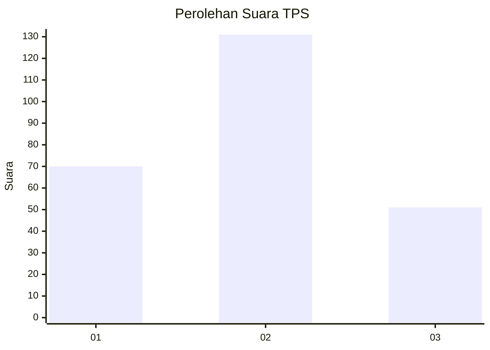
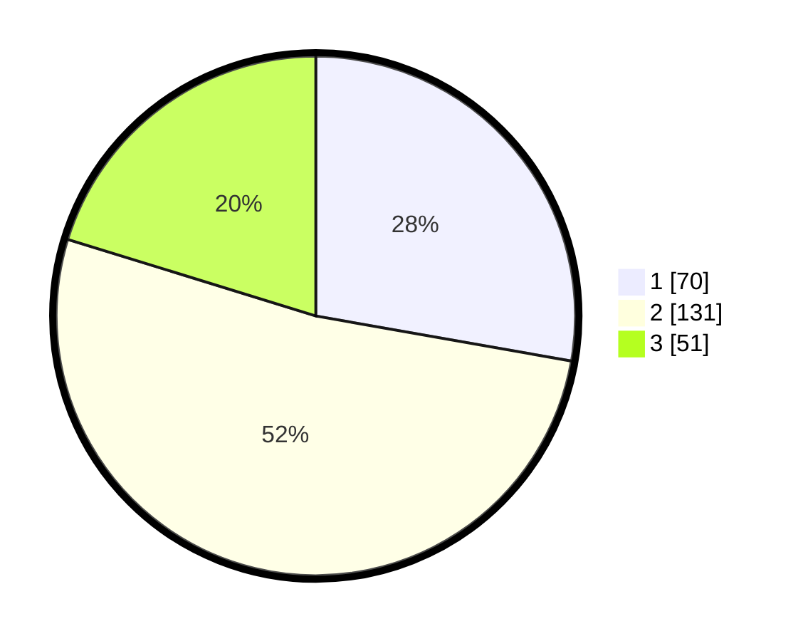

# Hasil

## Grafik

## Tabel

| No. | Nama Paslon    | Suara | Suara (raw) | Persentase |
|:--- |:-------------- | -----:| -----------:| ----------:|
| 1   | ANIES MUHAIMIN | 70    | [70][p-1]   | 27,78      |
| 2   | PRABOWO GIBRAN | 131   | [131][p-2]  | 51,98      |
| 3   | GANJAR MAHFUD  | 51    | [51][p-3]   | 20,24      |

[p-1]: https://github.com/gigit-pemilu/pemilu-2024-35-jawa-timur/blob/main/pilpres/hitung-suara/sub/35-jawa-timur/sub/26-bangkalan/sub/04-kamal/sub/2002-banyuajuh/sub/011-tps/sub/paslon-1.txt
[p-2]: https://github.com/gigit-pemilu/pemilu-2024-35-jawa-timur/blob/main/pilpres/hitung-suara/sub/35-jawa-timur/sub/26-bangkalan/sub/04-kamal/sub/2002-banyuajuh/sub/011-tps/sub/paslon-2.txt
[p-3]: https://github.com/gigit-pemilu/pemilu-2024-35-jawa-timur/blob/main/pilpres/hitung-suara/sub/35-jawa-timur/sub/26-bangkalan/sub/04-kamal/sub/2002-banyuajuh/sub/011-tps/sub/paslon-3.txt

## Foto C Plano

https://sirekap-obj-formc.kpu.go.id/e159/pemilu/ppwp/35/26/04/20/02/3526042002011-20240214-215618--cbe6ffba-db2d-4ff6-a0d1-276de0d0fc05.jpg

https://sirekap-obj-formc.kpu.go.id/e159/pemilu/ppwp/35/26/04/20/02/3526042002011-20240214-215729--aedf92a4-fd61-41ff-8433-86ee25ef602c.jpg

https://sirekap-obj-formc.kpu.go.id/e159/pemilu/ppwp/35/26/04/20/02/3526042002011-20240214-215841--0f50a9d7-40d3-491d-851f-f3e383be37d5.jpg

## Metadata

| Key        | Value               |
| ---------- | ------------------- |
| Time Stamp | 2024-02-17 19:30:00 |

