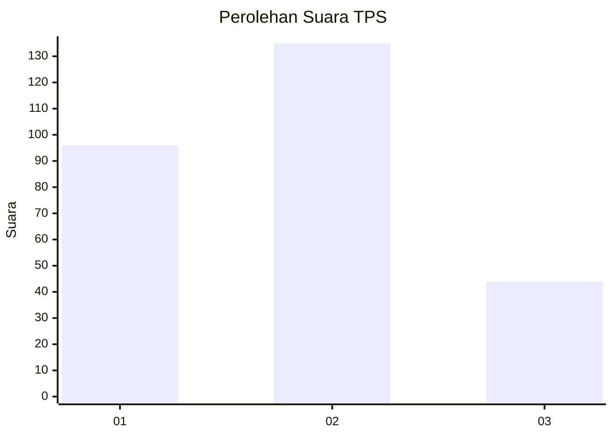
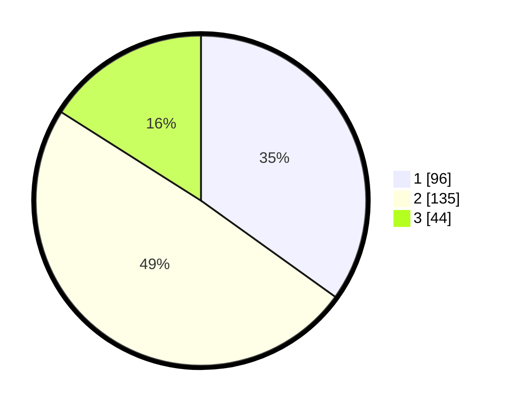

# Hasil

## Grafik

## Tabel

| No. | Nama Paslon    | Suara | Suara (raw) | Persentase |
|:--- |:-------------- | -----:| -----------:| ----------:|
| 1   | ANIES MUHAIMIN | 96    | [96][p-1]   | 34,91      |
| 2   | PRABOWO GIBRAN | 135   | [135][p-2]  | 49,09      |
| 3   | GANJAR MAHFUD  | 44    | [44][p-3]   | 16,00      |

[p-1]: https://github.com/gigit-pemilu/pemilu-2024/blob/main/pilpres/hitung-suara/sub/35-jawa-timur/sub/26-bangkalan/sub/04-kamal/sub/2007-pendabah/sub/007-tps/sub/paslon-1.txt
[p-2]: https://github.com/gigit-pemilu/pemilu-2024/blob/main/pilpres/hitung-suara/sub/35-jawa-timur/sub/26-bangkalan/sub/04-kamal/sub/2007-pendabah/sub/007-tps/sub/paslon-2.txt
[p-3]: https://github.com/gigit-pemilu/pemilu-2024/blob/main/pilpres/hitung-suara/sub/35-jawa-timur/sub/26-bangkalan/sub/04-kamal/sub/2007-pendabah/sub/007-tps/sub/paslon-3.txt

## Foto C Plano

https://sirekap-obj-formc.kpu.go.id/1331/pemilu/ppwp/35/26/04/20/07/3526042007007-20240214-193526--1586f3ca-b178-43f3-a73e-2ff621b08cac.jpg

https://sirekap-obj-formc.kpu.go.id/1331/pemilu/ppwp/35/26/04/20/07/3526042007007-20240214-193702--25de1fdf-6ebe-48fd-9fb5-038cca2375f6.jpg

https://sirekap-obj-formc.kpu.go.id/1331/pemilu/ppwp/35/26/04/20/07/3526042007007-20240214-193840--51fadb99-f349-4b1c-8537-60e6eb06a682.jpg

## Metadata

| Key        | Value               |
| ---------- | ------------------- |
| Time Stamp | 2024-02-19 06:16:00 |

