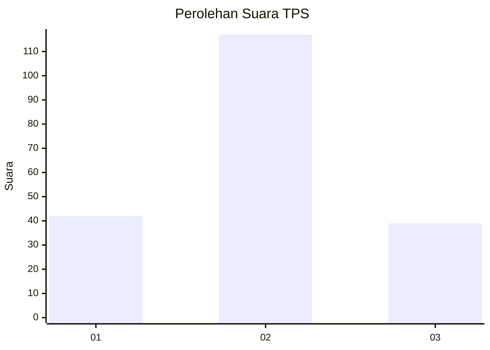
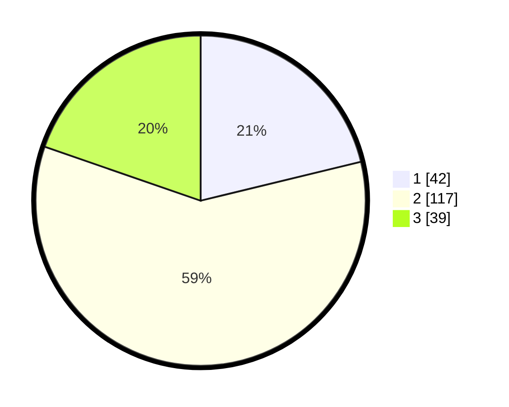

# Hasil

## Grafik

## Tabel

| No. | Nama Paslon    | Suara | Suara (raw) | Persentase |
|:--- |:-------------- | -----:| -----------:| ----------:|
| 1   | ANIES MUHAIMIN | 42    | [42][p-1]   | 21,21      |
| 2   | PRABOWO GIBRAN | 117   | [117][p-2]  | 59,09      |
| 3   | GANJAR MAHFUD  | 39    | [39][p-3]   | 19,70      |

[p-1]: https://github.com/gigit-pemilu/pemilu-2024/blob/main/pilpres/hitung-suara/sub/35-jawa-timur/sub/26-bangkalan/sub/04-kamal/sub/2007-pendabah/sub/008-tps/sub/paslon-1.txt
[p-2]: https://github.com/gigit-pemilu/pemilu-2024/blob/main/pilpres/hitung-suara/sub/35-jawa-timur/sub/26-bangkalan/sub/04-kamal/sub/2007-pendabah/sub/008-tps/sub/paslon-2.txt
[p-3]: https://github.com/gigit-pemilu/pemilu-2024/blob/main/pilpres/hitung-suara/sub/35-jawa-timur/sub/26-bangkalan/sub/04-kamal/sub/2007-pendabah/sub/008-tps/sub/paslon-3.txt

## Foto C Plano

https://sirekap-obj-formc.kpu.go.id/5eaa/pemilu/ppwp/35/26/04/20/07/3526042007008-20240215-063947--4d3d1868-8aec-4cd2-abfd-b18d7eaa1fab.jpg

https://sirekap-obj-formc.kpu.go.id/5eaa/pemilu/ppwp/35/26/04/20/07/3526042007008-20240215-064102--dd926cb5-f08f-4052-a0c1-863517ad3b9a.jpg

https://sirekap-obj-formc.kpu.go.id/5eaa/pemilu/ppwp/35/26/04/20/07/3526042007008-20240215-064221--c0f9e5e3-6eb2-4612-acc7-6640d76ccdd2.jpg

## Metadata

| Key        | Value               |
| ---------- | ------------------- |
| Time Stamp | 2024-02-19 06:16:00 |

